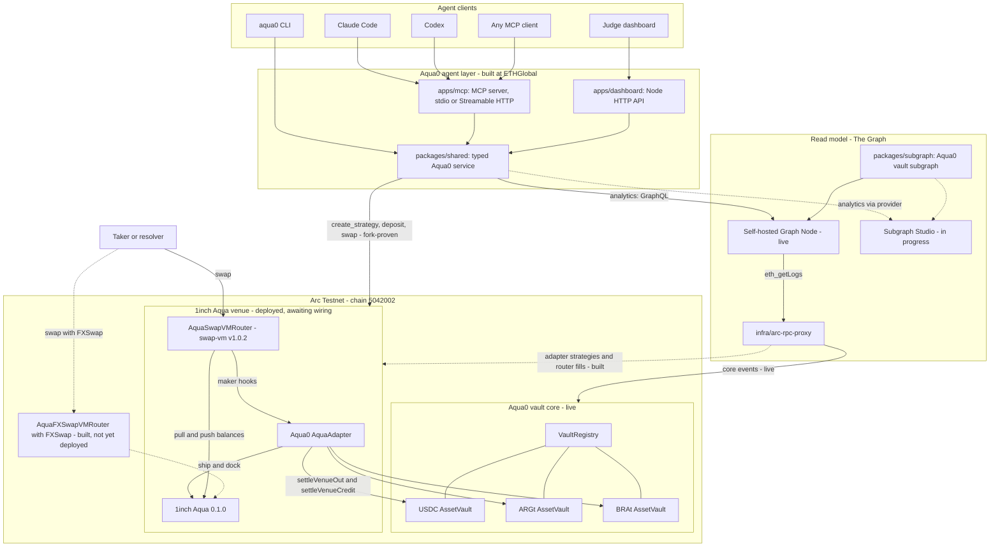
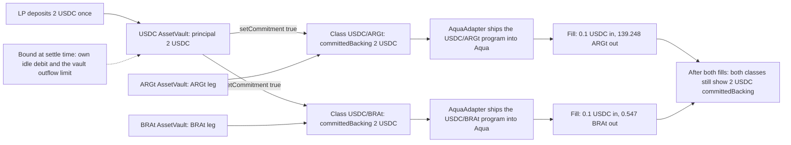
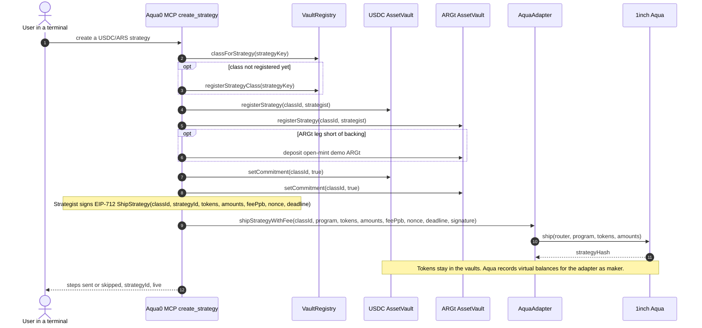
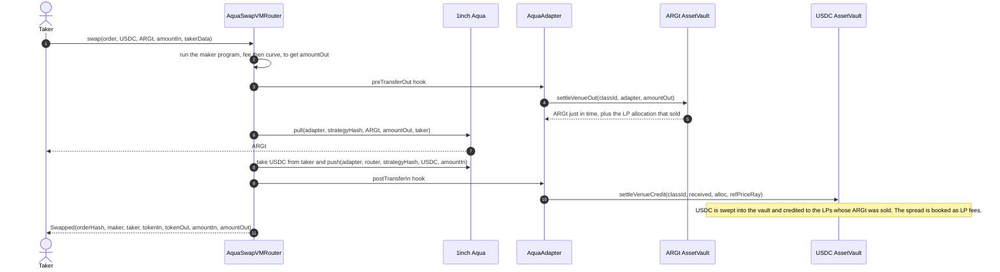
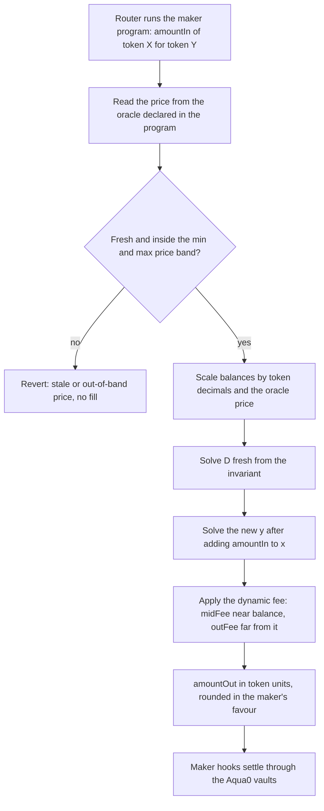

# Aqua0: one USDC deposit, many FX strategies, from your terminal

[](https://testnet.arcscan.app/address/0x9E094b21C4263e0BE5BEffa0f8296B3fd982fFFf)
[](#1inch-build-an-aqua-app-and-continuity)
[](#the-graph-best-ai-tooling-or-ai-use-case)
[](#mcp-tool-reference)
[](#continuity-pre-existing-vs-built-at-ethglobal)

**Aqua0 is shared liquidity for 1inch SwapVM.** An LP deposits once into a per-asset `AssetVault`, and that single principal backs many SwapVM strategies at the same time. Nothing is split between them. Tokens stay in the vault until a swap pulls them just in time.

For ETHGlobal we put Aqua0 on **Arc** and made it agent-native. From Claude Code, Codex or any MCP client, an agent reads state from **The Graph** and ships USDC ↔ Argentine peso and USDC ↔ Brazilian real strategies through **1inch Aqua**, all backed by the same USDC.

<!-- TODO: add demo video link -->

> [!IMPORTANT]
> **What's live right now (2026-09-12)**
> - **Live:** the Aqua0 vault core and the USDC, ARGt and BRAt vaults on Arc Testnet (not yet funded); the Arc subgraph on a self-hosted Graph Node; the public MCP endpoint (earlier prepare-only build) and the judge dashboard.
> - **Deployed, awaiting wiring:** 1inch Aqua, AquaSwapVMRouter and the Aqua0 AquaAdapter on Arc. Four admin transactions stand between them and live swaps.
> - **Fork-proven:** one 2 USDC deposit backs a USDC/ARS and a USDC/BRL SwapVM strategy, and both fill. This was driven twice on a local fork of Arc: once by a Foundry script, once through the service functions behind the new MCP tools.
> - **Built, not yet deployed:** **FXSwap**, an oracle-anchored SwapVM instruction with 46 passing tests; subgraph indexing of Aqua strategies and fills.
> - **In progress:** Subgraph Studio publishing; FXSwap validation against the team's reference vectors.

<kbd>[Demo](#the-demo-in-four-steps)</kbd> <kbd>[How it works](#how-it-works)</kbd> <kbd>[FXSwap](#fxswap-in-brief)</kbd> <kbd>[Prize tracks](#prize-tracks)</kbd> <kbd>[Try it](#try-it)</kbd> <kbd>[Deployments](#deployments)</kbd> <kbd>[Reference](#reference)</kbd>

## The demo in four steps

Everything happens in an agentic terminal. The run below assumes one earlier `deposit` of 2 USDC; the figures come from the Arc-fork run.

```text
you   › What does Aqua0 hold on Arc, and what is my USDC backing?
agent › health · protocol_snapshot · get_balance · get_shared_backing
        Three vaults: USDC, ARGt, BRAt. Your USDC principal is 2 USDC, not committed to any strategy.

you   › Create a USDC to Argentine peso strategy.
agent › create_strategy {"pair":"USDC/ARS"}
        class → vault legs → fund ARGt leg → commit → EIP-712 sign → AquaAdapter.shipStrategyWithFee
        USDC/ARS is live in Aqua, backed by your 2 USDC.

you   › Now the same USDC with Brazilian reais.
agent › create_strategy {"pair":"usdc to brl"}
        USDC/BRL is live in Aqua, backed by the same 2 USDC.

you   › Swap 0.1 USDC on each, then query my backing again.
agent › quote_swap · swap · get_shared_backing
        0.1 USDC → 139.248 ARGt   ·   0.1 USDC → 0.547 BRAt
        Principal 2 USDC, counted once. USDC/ARS: 2 USDC committed. USDC/BRL: 2 USDC committed. Nothing was split.
```

*"One capital, Argentine pesos and Brazilian reais, both live, all from a terminal."*

| # | Step | MCP tools | Status |
| --- | --- | --- | --- |
| 1 | Query state | `health`, `protocol_snapshot`, `get_balance`, `get_strategies` (The Graph); `get_shared_backing` (on-chain reads) | **Live** for Graph reads |
| 2 | Create USDC ↔ ARS strategy | `deposit`, `create_strategy` | **Fork-proven**; on Arc Testnet once the venue is wired |
| 3 | Create USDC ↔ BRL on the same USDC | `create_strategy` | **Fork-proven** |
| 4 | Query again, one swap each | `quote_swap`, `swap`, `get_shared_backing` | **Fork-proven** |

Proof: [`scripts/test-arc-fork-strategies.sh`](scripts/test-arc-fork-strategies.sh) forks Arc and runs exactly these steps through the CLI, which calls the same service functions as the MCP tools. It then asserts the fills, idempotency and shared backing.

> [!NOTE]
> **Seeing 2 USDC twice is correct.** Aqua0 commitments are *non-subtractive*: each committed class counts the LP's full principal as backing. Real outflow is still bounded when a swap settles, by the class's own idle debit and the vault's outflow limit. A vault can never pay out more than it holds.

> [!TIP]
> **Pegged today, FXSwap next.** `create_strategy` defaults to `opcode:"pegged"`, a `[FlatFeeAmountIn 30 bps][PeggedSwap]` program pinned at a fixed FX price. The fork proofs used it. `opcode:"fxswap"` is refused until `FXSWAP_ROUTER_ADDRESS` points at a deployed FXSwap router. Apart from that, the flow is identical.

## How it works



`packages/shared` is the one typed service behind the MCP, CLI and dashboard. The Graph is the read model for analytics. The Aqua0 vaults hold capital, and the AquaAdapter is the Aqua *maker* for every Aqua0 strategy. More: [`docs/ARCHITECTURE.md`](docs/ARCHITECTURE.md).

### Shared backing



Figures from the **fork-proven** runs. Class ids are assigned at registration, so they vary per strategist and chain.

### Creating a strategy

A single idempotent `create_strategy` call walks the whole sequence and reports steps that are already done as skipped. No tokens move when a strategy ships.

<details>
<summary><b>Sequence: <code>create_strategy</code> from class registration to Aqua ship</b></summary>



- **Strategy key** is `keccak256(abi.encode(strategist, chainId, sorted token0/token1, keccak256(trimmed label)))`, so a class id is never guessed.
- **Program** is `maker = AquaAdapter` with maker traits `useAqua | postTransferIn | preTransferOut`, the only combination the adapter accepts.
- **Signature** uses EIP-712 domain `AquaAdapter` v`1`, is ERC-1271-aware and nonce-protected. In prepare mode the tool returns the calldata and typed data instead of sending.

</details>

### A swap through the maker hooks

The router runs the maker program, pulls the output just in time from the vault, and sweeps the taker's input back into the counter vault. The LPs that sold are credited, and the spread is booked as LP fees.

<details>
<summary><b>Sequence: exact-in swap settled through <code>preTransferOut</code> and <code>postTransferIn</code></b></summary>



The adapter handles either transfer order; whichever hook runs second performs the counter vault's `settleVenueCredit`. The `swap` tool quotes first and enforces a minimum output on-chain (default 50 bps slippage).

</details>

## FXSwap in brief

**Why.** swap-vm's `PeggedSwap` centres liquidity at a fixed ratio, but FX rates float. A pegged curve leaves liquidity at a stale price, and arbitrageurs take the difference from LPs.

**What.** FXSwap is a new SwapVM instruction that adapts Curve CryptoSwap to two tokens, anchored to an oracle and fully **stateless**. It has no `price_scale`, EMA, `tweak_price` or `xcp_profit`. On every swap it:

- reads the oracle the maker declared in its program;
- checks staleness and a min/max price band;
- rescales balances by the oracle price;
- solves `D` and `y` from scratch.

The spread widens as inventory drifts off balance.

| | Status |
| --- | --- |
| Instruction index **34** in [`AquaFXSwapVMRouter`](packages/contracts/src/routers/AquaFXSwapVMRouter.sol), a modified swap-vm v1.0.2 router (EIP-712 name `AquaSwapVMRouter`, version `1.0.2-fx`, 24,434 bytes, under EIP-170) | **Built, not yet deployed** |
| 46 Foundry tests pass. On an Arc fork, moving the ARS/USD feed from 1400 to 1500 moves execution from 1397.88 to 1497.06. Gas is about 202k per exact-in swap. | **Built, not yet deployed** |
| Formula validation against the team's reference vectors ([`fxswap-vectors.json`](packages/contracts/test/fixtures/fxswap-vectors.json)) | **In progress** |
| Deploy script [`DeployFXVenue.s.sol`](packages/contracts/script/DeployFXVenue.s.sol) (router plus demo `ManualFxOracle` feeds); MCP `opcode:"fxswap"` switches on once it is deployed | **Built, not yet deployed** |

<details>
<summary><b>The maths: invariant, solver and dynamic fee</b></summary>

```text
K · D^(n−1) · Σx  +  Πx  =  K · D^n  +  (D/n)^n        with n = 2
K   = A · K₀ · γ² / (γ + 1 − K₀)²
K₀  = Πx · n^n / D^n

fee = midFee · g + outFee · (1 − g)
g   = feeGamma / (feeGamma + 1 − K₀)
```

- **Balances** are scaled to 18 decimals (`rate = 10^(18 − decimals)`) and priced with the oracle answer, so the curve sits centred at the live FX rate.
- **Solver.** `D` and `y` are solved with Newton-Raphson inside a bracket, with a bisection fallback, exact to 1 wei. Rounding always favours the maker.
- **Fee.** `K₀` is 1 at perfect balance, so the fee is `midFee` there and rises towards `outFee` as the pool tips.
- **Oracle kinds.** `0` is a Chainlink-style `latestRoundData` feed (`ManualFxOracle` for the demo). `1` is reserved for Pyth pull updates, and parsing rejects it today.

| | Curve CryptoSwap pool | FXSwap instruction |
| --- | --- | --- |
| Price reference | Internal `price_scale`, moved by an EMA | Oracle read on every swap, from the feed the maker declares |
| Repricing | `tweak_price`, gated by `xcp_profit` | None to maintain; `D` is solved fresh each swap |
| Stale-price protection | Repeg only when profitable | Maker-set max staleness and price band; the swap reverts outside them |
| One-sided flow | Pool fee schedule | Spread that widens with inventory imbalance |



</details>

<details>
<summary><b>Program arguments: the 115-byte layout</b></summary>

Big-endian and packed. Source: [`FXSwap.sol`](packages/contracts/src/instructions/FXSwap.sol).

| Offset | Size | Field | Meaning |
| --- | --- | --- | --- |
| 0 | 1 | `oracleKind` | `0` = Chainlink-style feed; `1` = reserved (Pyth pull) |
| 1 | 1 | `flags` | bit 0 = invert price (the feed quotes the lower-address token per 1 greater-address token) |
| 2 | 20 | `oracle` | Price feed address |
| 22 | 1 | `oracleDecimals` | Feed decimals; `0` = read `decimals()` every swap |
| 23 | 4 | `maxStaleness` | Max answer age in seconds, `> 0` |
| 27 | 16 | `minPrice` | Lowest accepted answer, WAD, in the feed's orientation |
| 43 | 16 | `maxPrice` | Highest accepted answer, WAD |
| 59 | 8 | `A` | `A × 1e4` |
| 67 | 8 | `γ` | WAD |
| 75 | 8 | `midFee` | Fee at balance, WAD |
| 83 | 8 | `outFee` | Fee far from balance, WAD, `≥ midFee` |
| 91 | 8 | `feeGamma` | Fee transition width, WAD |
| 99 | 8 | `rateLt` | Decimals multiplier of the lower-address token |
| 107 | 8 | `rateGt` | Decimals multiplier of the greater-address token |

`AquaFXSwapVMRouter` keeps every other swap-vm v1.0.2 `AquaOpcodes` index (FlatFeeAmountIn 21, PeggedSwap 31, XYCSwap 17). XYCConcentrate, Decay and the protocol-fee opcodes were removed to fit under EIP-170, and their slots are kept as no-ops.

</details>

## Prize tracks

Aqua0 is registered in the **Continuity** track. We target Arc, 1inch and The Graph. Only work built during the event is submitted for judging ([what pre-existed](#continuity-pre-existing-vs-built-at-ethglobal)).

| Prize | Pool | Fit today | Main gap |
| --- | --- | --- | --- |
| [The Graph: Best AI Tooling or AI Use Case](#the-graph-best-ai-tooling-or-ai-use-case) (Continuity pool) | $2,500 / $1,500 / $1,000 | Reusable Graph-backed MCP server plus an agent that acts on the data | Live Graph provider: Studio publishing **In progress** |
| [The Graph: Composable or Standardized Graph Products](#the-graph-composable-or-standardized-graph-products) | $2,500 / $1,500 / $1,000 | Stretch; not met | One subgraph, no composition: **Planned** |
| [Arc: Best DeFi / Onchain Finance Application](#arc-best-defi--onchain-finance-application) | $3,500 ($2,500 mainnet-conditional) | USDC-quoted shared FX liquidity on Arc | Testnet only; no Circle products beyond Arc and USDC yet |
| [Arc: Best Agentic Economy Application with Circle Agent Stack](#arc-best-agentic-economy-application-with-circle-agent-stack) | $3,500 ($2,500 mainnet-conditional) | Partial: the agent transacts in execute mode | No Agent Stack or Circle Wallets |
| [Arc: Best DeFi or Agentic Application (Continuity)](#arc-best-defi-or-agentic-application-continuity) | $3,000 ($2,000 mainnet-conditional) | Entered as the DeFi application | Same as the DeFi prize |
| [1inch: Build an Aqua App (and Continuity)](#1inch-build-an-aqua-app-and-continuity) | $2,500 / $1,500 / $1,000; Continuity $1,500 / $500 | Official Aqua and SwapVM, a new SwapVM instruction, fills on an Arc fork | Arc venue wiring; FXSwap not deployed |

### The Graph: Best AI Tooling or AI Use Case

**What they're looking for**
- **Tooling** that makes The Graph easier to use from AI environments (MCP servers, agent SKILLs, x402, A2A, framework plugins, client configs), **or** AI agents and apps that use The Graph as their live source of blockchain data.
- The Graph must be **load-bearing**: Subgraphs, the Subgraph MCP or Substreams are the data source.
- **Live data from a Graph provider**, such as a Subgraph Studio endpoint with an API key. Mocked, local-only or static data doesn't qualify.
- **Meaningful work** with the data (reasoning, decisions, automation, natural language), not just printing query results.
- Tooling must be **reusable infrastructure**, open source with a clear README or SKILL.md, a public repo and a 2–4 minute video.
- Continuity pool: document pre-existing work; only event work is judged.

**How Aqua0 delivers**
- [x] **Reusable MCP infrastructure.** Tools are exposed over stdio or Streamable HTTP, sit on a typed service package with a CLI on top, and ship with an Arc manifest generator and an Arc RPC proxy that any Graph Node can reuse. [`apps/mcp`](apps/mcp), [`packages/shared`](packages/shared), [`infra/arc-rpc-proxy`](infra/arc-rpc-proxy) · **Live**
- [x] **The Graph is load-bearing.** `health`, `get_balance`, `get_strategies`, `get_fees`, `list_opportunities`, `protocol_snapshot` and `graph_query` read subgraph entities. A Graph failure is surfaced as an error, with no silent RPC fallback. [`graph.ts`](packages/shared/src/graph.ts), [`packages/subgraph`](packages/subgraph) · **Live**
- [x] **Meaningful work.** The agent maps a loose request ("usdc to brl") to a pair, decides whether a class already exists, runs a multi-step strategy setup idempotently, and explains what changed after mining. [`index.ts`](apps/mcp/src/index.ts) · **Live** (reads), **Fork-proven** (writes)
- [ ] **Aqua venue in the read model.** The subgraph indexes `AquaStrategy`, `AquaOrder` and `AquaFill` entities, plus per-LP fill stats and fees. [`packages/subgraph`](packages/subgraph/README.md) · **Built, not yet deployed**
- [ ] **Live provider data.** Today the MCP reads a self-hosted Graph Node, which does not count. `NETWORK=arc ./scripts/deploy-graph-studio.sh` is ready and needs the team's Studio key. [`docs/THE_GRAPH_TRACK.md`](docs/THE_GRAPH_TRACK.md) · **In progress**
- [x] **Open source, runnable from docs.** This README, [`docs/`](docs), [`.env.example`](.env.example), `pnpm check-env` and CI. · **Live** (a SKILL.md is **Planned**)
- [ ] **2–4 minute demo video.** · **In progress**
- [x] **Continuity documented.** [Pre-existing vs built at ETHGlobal](#continuity-pre-existing-vs-built-at-ethglobal), [`docs/CONTINUITY.md`](docs/CONTINUITY.md) · **Live**

> [!WARNING]
> **Gaps / next:**
> 1. Publish the Arc subgraph, including the Aqua venue entities, to Subgraph Studio.
> 2. Point the public MCP's `GRAPH_ENDPOINT` at it and redeploy the endpoint with the SwapVM tools.
> 3. Have `get_shared_backing` read the indexed Aqua entities; today it uses on-chain reads, and says so in its response.
> 4. Add a SKILL.md.

### The Graph: Composable or Standardized Graph Products

**What they're looking for:** a project that composes **two or more** Graph products (Subgraphs, Substreams, the Subgraph MCP) or builds meaningfully on a **standardized schema**, such as Messari Standardized Subgraphs. It must use live provider data and make clear what the standard or composition made easier. Querying one subgraph doesn't qualify. Public repo and a 2–4 minute video.

**How Aqua0 delivers**
- [ ] **Two or more Graph products, or a standardized schema.** Aqua0 queries one custom subgraph today. · **Planned**
- [ ] **Live provider data.** Same Studio dependency as above. · **In progress**

> [!WARNING]
> **Gaps / next:** an MCP tool that composes the Aqua0 subgraph with the Subgraph MCP or a standardized DEX subgraph. It would benchmark an Aqua0 strategy's fills and fees against the same pair on other venues, so the agent can recommend where to commit shared capital.

### Arc: Best DeFi / Onchain Finance Application

**What they're looking for**
- **Stablecoin-native DeFi on Arc**: lending, swaps, liquidity, FX, yield, payments or treasury, built on Arc and USDC.
- **Advanced programmable money flows**: conditional payments, onchain automation, multi-step settlement.
- App Kits where relevant, and a clear case for why stablecoin-native infrastructure changes what's possible.
- Core products: Arc, USDC, App Kits, Circle Wallets, Circle Contracts, CCTP, Gateway, StableFX.
- $2,500 of the prize requires deployment to Arc Mainnet by September 30.

> [!NOTE]
> **All Arc prizes require:**
> - a functional MVP with a working frontend, a backend and an architecture diagram;
> - a video demo and presentation of the core functions and the use of Circle's developer tools, backed by detailed documentation;
> - a GitHub or Replit repo link.

**How Aqua0 delivers**
- [x] **Stablecoin-native FX liquidity on Arc.** Arc's native USDC is the shared quote asset, and one USDC balance makes markets in several local currencies. Principal, fees and gas are all USDC. [Deployments](#deployments) · **Live** (vault core), **Deployed, awaiting wiring** (venue)
- [x] **Multi-step atomic settlement.** One swap runs the maker program, pulls output from the vault just in time, pushes the taker's input into Aqua, sweeps it into the counter vault, credits the LPs that sold and books the spread as fees. [Swap sequence](#a-swap-through-the-maker-hooks) · **Fork-proven**
- [ ] **Conditional fills.** FXSwap refuses to fill on a stale or out-of-band oracle price. [FXSwap](#fxswap-in-brief) · **Built, not yet deployed**
- [x] **Working frontend and backend.** The [judge dashboard](https://ethglobal-demo.18-207-103-187.nip.io/) reads and prepares only; the backend is its Node API, the MCP server and the contracts. [`apps/dashboard`](apps/dashboard) · **Live**
- [x] **Architecture diagram and detailed documentation.** [How it works](#how-it-works), [`docs/ARCHITECTURE.md`](docs/ARCHITECTURE.md), [`docs/ARC_DEPLOYMENT.md`](docs/ARC_DEPLOYMENT.md) · **Live**
- [ ] **App Kits, Circle Wallets, Circle Contracts, CCTP, Gateway, StableFX.** Not integrated. [`docs/ARC_TRACK.md`](docs/ARC_TRACK.md) · **Planned**
- [ ] **Video demo.** · **In progress**
- [ ] **Arc Mainnet by September 30** (conditional share). · **Planned**

> [!WARNING]
> **Gaps / next:**
> 1. Land the four wiring transactions and run the demo on Arc Testnet.
> 2. Deploy FXSwap.
> 3. Evaluate StableFX as an FX price source and CCTP or Gateway for USDC onboarding.
> 4. Deploy to Arc Mainnet only after a security review.

### Arc: Best Agentic Economy Application with Circle Agent Stack

**What they're looking for**
- **Autonomous agents that transact on Arc**: they hold wallets, make payments, manage risk, settle jobs or trade with other agents in USDC.
- Clear **decision logic tied to real signals**.
- **Agent Stack** connecting agents to wallets, USDC payments and onchain actions, plus Nanopayments, Paymaster or App Kits where relevant.
- Core products: Arc, USDC, Agent Stack, App Kits, Circle Wallets, Circle Contracts, Nanopayments, Paymaster.
- Same mainnet condition and common Arc requirements as above.

**How Aqua0 delivers**
- [x] **Agent transacts on Arc.** With `MCP_WRITE_MODE=execute`, `deposit`, `create_strategy` and `swap` send transactions, restricted to Arc Testnet or a local fork. The public endpoint is prepare-only. [Execute mode](#connect-the-mcp) · **Fork-proven**
- [x] **Decisions tied to real signals.** Indexed vault capital and commitments, `classForStrategy`, and an on-chain quote before every swap with an enforced minimum output. FXSwap adds oracle staleness and band checks. · **Live** (Graph signals), **Fork-proven** (quote and min-out)
- [ ] **Agent-held wallet via Circle Wallets or Agent Stack.** Execution uses a locally configured key, and the agent acts on user instructions rather than autonomously. · **Planned**
- [ ] **Nanopayments, Paymaster or App Kits.** Candidates: per-quote USDC nanopayments and sponsored LP transactions. · **Planned**

> [!WARNING]
> **Gaps / next:** Aqua0 does not use Agent Stack today and we don't claim it. Our entry targets the DeFi prize; the Agent Stack steps are in [`docs/ARC_TRACK.md`](docs/ARC_TRACK.md).

### Arc: Best DeFi or Agentic Application (Continuity)

**What they're looking for:** either of the two Arc applications above, from a project registered in the Continuity track. $3,000, of which $2,000 is mainnet-conditional.

**How Aqua0 delivers**
- [x] **Entered as the DeFi application**, with the checklist above. · see statuses above
- [x] **Continuity split documented.** The Aqua0 vault contracts and AquaAdapter pre-exist. Everything in the [continuity table](#continuity-pre-existing-vs-built-at-ethglobal) was built during the event. · **Live**

### 1inch: Build an Aqua App (and Continuity)

**What they're looking for**
- A **custom Aqua app** implementing a **sophisticated DeFi position**, demonstrated through test scripts or a UI.
- **SwapVM use scores higher.** You may modify opcodes and define your own instructions.
- **Official Aqua and SwapVM contracts** must be used; redeploying a modified SwapVM contract is allowed.
- **On-chain token transfers** in the final demo; local forks are fine.
- **Proper git history**, not a single final-day commit.

**How Aqua0 delivers**
- [x] **Sophisticated position: shared-backing FX market making.** One vault deposit backs several SwapVM strategies that the AquaAdapter ships into Aqua as maker, settled just in time through maker hooks. [How it works](#how-it-works) · **Fork-proven**
- [x] **SwapVM programs.** A `[FlatFeeAmountIn][PeggedSwap]` program per strategy (opcodes 21 and 31). [`ArcFxStrategies.s.sol`](packages/contracts/script/ArcFxStrategies.s.sol), [`fx.ts`](packages/shared/src/fx.ts) · **Fork-proven**
- [x] **A new SwapVM instruction.** FXSwap at index 34 in a modified router, with 46 tests including an Arc fork run. [`packages/contracts/src`](packages/contracts/src), [`FXSwapArcFork.t.sol`](packages/contracts/test/fork/FXSwapArcFork.t.sol) · **Built, not yet deployed**
- [x] **Official contracts.** aqua 0.1.0 `AquaRouter` and swap-vm v1.0.2 `AquaSwapVMRouter`, built from unmodified upstream source, are on Arc Testnet. [`DeployAquaVenue.s.sol`](packages/contracts/script/DeployAquaVenue.s.sol), [broadcast](packages/contracts/broadcast/DeployAquaVenue.s.sol/5042002/run-latest.json) · **Deployed, awaiting wiring**
- [x] **On-chain token transfers.** On an Arc fork the router moves real ARGt and BRAt out of Aqua and USDC in, with the hooks moving tokens out of and into the vaults: 0.1 USDC → 139.248 ARGt and 0.1 USDC → 0.547 BRAt. · **Fork-proven**
- [x] **Positions via test scripts.** [`run-arc-fx-strategies.sh`](packages/contracts/script/run-arc-fx-strategies.sh) (Foundry) and [`test-arc-fork-strategies.sh`](scripts/test-arc-fork-strategies.sh) (MCP service path, with assertions). · **Fork-proven**
- [x] **Proper git history.** 50+ commits from the whole team across 2026-09-05, 09-08 and 09-12. · **Live**
- [x] **Continuity split.** The AquaAdapter and vaults pre-exist; the Arc venue, strategy scripts, MCP SwapVM tools and FXSwap are event work. [`docs/CONTINUITY.md`](docs/CONTINUITY.md) · **Live**

> [!WARNING]
> **Gaps / next:**
> 1. Four admin wiring transactions before swaps can run on Arc Testnet itself (until then the proof is fork-only).
> 2. Deploy `AquaFXSwapVMRouter` and finish FXSwap validation against the reference vectors.

<details>
<summary><b>SwapVM wire facts (swap-vm v1.0.2 <code>AquaSwapVMRouter</code>)</b></summary>

| Item | Value |
| --- | --- |
| `FlatFeeAmountIn` opcode | 21 (`uint32` fee, 1e9 = 100%) |
| `PeggedSwap` opcode | 31 (`x0, y0, linearWidth, rateLt, rateGt`, 5 × `uint256`) |
| `FXSwap` opcode (`AquaFXSwapVMRouter` only) | 34 (115-byte args, [layout](#fxswap-in-brief)) |
| Maker traits accepted by AquaAdapter | `useAqua (1<<254) \| postTransferIn (1<<251) \| preTransferOut (1<<250)` |
| Taker data for an exact-in swap | 22-byte header `uint160(0) ++ uint16(0x0041)` (isExactIn, transferFrom + Aqua push) |
| Taker approval target | The router (it pulls tokenIn and pushes it into Aqua) |

</details>

## Try it

Requirements: Node 22 and pnpm 9. Foundry (`forge`, `anvil`, `cast`) is needed for the contracts and fork proofs.

### Connect the MCP

**Public endpoint (no install):**

```bash
claude mcp add --transport http aqua0 https://ethglobal-mcp.18-207-103-187.nip.io/mcp
```

> [!NOTE]
> The public endpoint is **Live** but still runs the earlier prepare-only build: 12 tools (reads plus `prepare_*`) and no signer. Run the server locally to use `create_strategy`, `deposit`, `quote_swap`, `swap` and `get_shared_backing` today.

**Local stdio build**, for Claude Code or Codex:

```bash
pnpm install && pnpm build

claude mcp add aqua0 \
  -e GRAPH_ENDPOINT=<url> \
  -e WRITE_RPC_URL=https://rpc.testnet.arc.network \
  -e WRITE_CHAIN_ID=5042002 \
  -e MCP_WRITE_MODE=prepare \
  -- node <repo>/apps/mcp/dist/index.js

codex mcp add aqua0 \
  --env GRAPH_ENDPOINT=<url> \
  --env WRITE_RPC_URL=https://rpc.testnet.arc.network \
  --env WRITE_CHAIN_ID=5042002 \
  --env MCP_WRITE_MODE=prepare \
  -- node <repo>/apps/mcp/dist/index.js
```

In prepare mode every write tool returns ordered calldata and EIP-712 typed data for a wallet to sign. Then try:

```text
Check Aqua0 health, show the protocol snapshot, and tell me which data came from The Graph.
Create a USDC/ARS strategy on Arc as a dry run and walk me through each step.
How many Brazilian reais would 0.1 USDC buy right now?
```

<details>
<summary><b>Execute mode, Codex HTTP config, stdio-only clients, CLI</b></summary>

**Execute mode** sends transactions itself. It needs:
- `MCP_WRITE_MODE=execute`;
- `WRITE_PRIVATE_KEY` for an address **without contract code**: an EIP-7702-delegated address is checked through ERC-1271 and rejected;
- `OPERATOR_ROLE` for that address on the AquaAdapter.

The guard only allows Arc Testnet (`5042002`) or a local fork URL, refuses Ethereum and Base mainnet, and fails on reverted receipts. `dryRun: true` always returns calldata instead of sending.

> [!WARNING]
> Use a throwaway testnet key. Never give a key to the public endpoint; it holds none by design.

**Codex over HTTP** (`~/.codex/config.toml`):

```toml
[mcp_servers.aqua0]
url = "https://ethglobal-mcp.18-207-103-187.nip.io/mcp"
```

**Stdio-only clients** can bridge to HTTP with `mcp-remote`:

```json
{ "mcpServers": { "aqua0": { "command": "npx", "args": ["-y", "mcp-remote", "https://ethglobal-mcp.18-207-103-187.nip.io/mcp"] } } }
```

**Serve over HTTP locally:** `MCP_TRANSPORT=http HOST=127.0.0.1 PORT=3000 pnpm --filter @aqua0/mcp dev` serves `http://127.0.0.1:3000/mcp`, with `/health` alongside.

**The CLI mirrors the MCP** and honours the same `MCP_WRITE_MODE` guard:

```bash
pnpm --filter @aqua0/cli dev snapshot
pnpm --filter @aqua0/cli dev deposit --token USDC --amount 2
pnpm --filter @aqua0/cli dev create-strategy --pair USDC/ARS
pnpm --filter @aqua0/cli dev quote --pair USDC/BRL --amount 0.1
pnpm --filter @aqua0/cli dev swap --pair USDC/BRL --amount 0.1 --slippage-bps 50
pnpm --filter @aqua0/cli dev shared-backing 0x...
```

</details>

### Run the fork proofs

```bash
pnpm install
./scripts/test-arc-fork-strategies.sh
```

This forks Arc on `127.0.0.1:8579` and wires the adapter as impersonated admins, on the fork only. It then runs deposit → two strategies → quote and swap each → shared backing, through the MCP service path with a throwaway key, and asserts the result. Only USDC is stubbed, because Arc's USDC calls native precompiles that a local fork lacks.

<details>
<summary><b>Foundry path, FXSwap tests, contracts setup</b></summary>

```bash
git submodule update --init packages/contracts/lib/swap-vm
(cd packages/contracts/lib/swap-vm && npm install --ignore-scripts)
(cd packages/contracts && forge build)

# FXSwap: unit, maths, vector and Arc-fork tests (FXSWAP_SKIP_FORK=true skips the fork test)
(cd packages/contracts && forge test)
```

The AquaAdapter is pre-existing Aqua0 code, compiled from a local Aqua0 contracts checkout (`AQUA0_CONTRACTS_DIR`).

```bash
cd packages/contracts

# 1. Venue + adapter on a local Arc fork (impersonates the core admin for wiring)
anvil --fork-url https://rpc.testnet.arc.network --port 8577
MODE=fork AQUA0_CONTRACTS_DIR=<path> DEPLOYER=<address> ./script/deploy-arc-aqua-venue.sh

# 2. One USDC deposit, two FX strategies, one swap each
MODE=fork DEPLOYER=<address> KEYSTORE_ACCOUNT=<account> KEYSTORE_PASSWORD_FILE=<file> \
AQUA_ADAPTER=<from step 1> AQUA_SWAPVM_ROUTER=<from step 1> ./script/run-arc-fx-strategies.sh

# Same flow on Arc Testnet once the wiring lands (reads deployments/arc-testnet.json)
MODE=arc DEPLOYER=<address> KEYSTORE_ACCOUNT=<account> KEYSTORE_PASSWORD_FILE=<file> ./script/run-arc-fx-strategies.sh
```

Tunables: `USDC_DEPOSIT`, `USDC_SHIP`, `USDC_SWAP_IN`, `FEE_PPB`, `LINEAR_WIDTH`, `ARS_PER_USDC_E2`, `BRL_PER_USDC_E2`. Both scripts refuse any chain id other than `5042002`. More detail: [`packages/contracts/README.md`](packages/contracts/README.md).

</details>

<details>
<summary><b>Subgraph: build, Arc manifest, Subgraph Studio</b></summary>

```bash
pnpm --filter @aqua0/subgraph test:required-events
pnpm --filter @aqua0/subgraph codegen && pnpm --filter @aqua0/subgraph graph:build

# Arc manifest: vault core plus Aqua venue (adapter strategies, router fills)
PUBLIC_ARC_VAULT_FACTORY=0x879C0c90205172a8DD66afB8124994D866372FBa \
PUBLIC_ARC_VAULT_REGISTRY=0x9E094b21C4263e0BE5BEffa0f8296B3fd982fFFf \
PUBLIC_ARC_COMPOSER=0x656F28021a624aDfA0d92dDFdBb20577674aFEC7 \
PUBLIC_ARC_FILLER_REGISTRY=0xa8e08346DD7b6809C47A920c365bCC987Ea91297 \
PUBLIC_ARC_START_BLOCK=60613306 \
PUBLIC_ARC_AQUA_ADAPTER=0xbF72D34b804636496c3308796908152b82624Ca5 \
PUBLIC_ARC_AQUA_ADAPTER_START_BLOCK=61679229 \
PUBLIC_ARC_AQUA_SWAPVM_ROUTER=0xb20bc70b485eC1352C190d26fCaB1959d219F763 \
PUBLIC_ARC_AQUA_SWAPVM_ROUTER_START_BLOCK=61679223 \
pnpm --filter @aqua0/subgraph generate:arc

# Subgraph Studio (DRY_RUN=1 builds and prints the command without a key)
NETWORK=arc GRAPH_STUDIO_SLUG=<slug> GRAPH_STUDIO_DEPLOY_KEY=<deploy-key> ./scripts/deploy-graph-studio.sh
```

Arc's public RPC limits topic-OR lists in `eth_getLogs`, so the Graph Node indexes through [`infra/arc-rpc-proxy`](infra/arc-rpc-proxy). Entities and details: [`packages/subgraph/README.md`](packages/subgraph/README.md), [`docs/THE_GRAPH_TRACK.md`](docs/THE_GRAPH_TRACK.md).

</details>

## Deployments

Arc Testnet, chain id `5042002`. Full records are in [`deployments/arc-testnet.json`](deployments/arc-testnet.json) and [`docs/ARC_DEPLOYMENT.md`](docs/ARC_DEPLOYMENT.md).

| Contract | Address | Status |
| --- | --- | --- |
| VaultRegistry | [`0x9E09…fFFf`](https://testnet.arcscan.app/address/0x9E094b21C4263e0BE5BEffa0f8296B3fd982fFFf) | **Live** |
| VaultFactory | [`0x879C…2FBa`](https://testnet.arcscan.app/address/0x879C0c90205172a8DD66afB8124994D866372FBa) | **Live** |
| Composer | [`0x656F…FEC7`](https://testnet.arcscan.app/address/0x656F28021a624aDfA0d92dDFdBb20577674aFEC7) | **Live** |
| FillerRegistry | [`0xa8e0…1297`](https://testnet.arcscan.app/address/0xa8e08346DD7b6809C47A920c365bCC987Ea91297) | **Live** |
| USDC AssetVault | [`0x99c2…4429`](https://testnet.arcscan.app/address/0x99c2ab427b29dB1Cc14D228d970596015d1C4429) | **Live**, unfunded |
| ARGt AssetVault | [`0x8a3d…F460`](https://testnet.arcscan.app/address/0x8a3d6188C58d7877499592E179DfE3bd80c4F460) | **Live**, unfunded |
| BRAt AssetVault | [`0xEcB1…0785`](https://testnet.arcscan.app/address/0xEcB132648B781ec5742b582c526243Eeef900785) | **Live**, unfunded |
| Aqua (`AquaRouter`, 1inch aqua 0.1.0) | [`0x490d…20D4`](https://testnet.arcscan.app/address/0x490d2eceD9aCF99e1db6090f820775bFa70020D4) | **Deployed, awaiting wiring** |
| `AquaSwapVMRouter` (1inch swap-vm v1.0.2) | [`0xb20b…F763`](https://testnet.arcscan.app/address/0xb20bc70b485eC1352C190d26fCaB1959d219F763) | **Deployed, awaiting wiring** |
| Aqua0 `AquaAdapter` | [`0xbF72…4Ca5`](https://testnet.arcscan.app/address/0xbF72D34b804636496c3308796908152b82624Ca5) ([deploy tx](https://testnet.arcscan.app/tx/0x24a8f224e81b86c1f1827e3247912ff5dde01e7f47108521b6ac73581e4188d9)) | **Deployed, awaiting wiring** |
| `AquaFXSwapVMRouter` + demo FX feeds | Not deployed | **Built, not yet deployed** |

| Token | Address | Decimals |
| --- | --- | --- |
| USDC (Arc native, ERC-20 interface) | [`0x3600000000000000000000000000000000000000`](https://testnet.arcscan.app/address/0x3600000000000000000000000000000000000000) | 6 |
| ARGt, an open-mint **testnet demo token** standing in for an ARS stablecoin | [`0xd8dE250970842A581f89E885dA0F5165037714Ef`](https://testnet.arcscan.app/address/0xd8dE250970842A581f89E885dA0F5165037714Ef) | 18 |
| BRAt, an open-mint **testnet demo token** standing in for a BRL stablecoin | [`0xa9482a878A3784663512f0Bf8d0be17aD6DEA38E`](https://testnet.arcscan.app/address/0xa9482a878A3784663512f0Bf8d0be17aD6DEA38E) | 18 |

| Endpoint | URL | Status |
| --- | --- | --- |
| MCP (Streamable HTTP) | `https://ethglobal-mcp.18-207-103-187.nip.io/mcp` | **Live**, earlier prepare-only build (12 tools, no signer) |
| MCP health | `https://ethglobal-mcp.18-207-103-187.nip.io/health` | **Live** (Graph `_meta` query) |
| Judge dashboard | `https://ethglobal-demo.18-207-103-187.nip.io/` | **Live**, read-only and prepare-only |
| Graph data source | Self-hosted Graph Node | **Live**; Subgraph Studio **In progress** |

<details>
<summary><b>The four pending wiring transactions, and what "verified" means</b></summary>

The core admin must send these before the adapter can settle swaps:

1. `VaultRegistry.setAdapterAllowed(0xbF72D34b804636496c3308796908152b82624Ca5, true)`
2. `grantRole(keccak256("VENUE_SETTLER_ROLE"), adapter)` on the USDC AssetVault
3. The same on the ARGt AssetVault
4. The same on the BRAt AssetVault

"Verified" means the post-deploy checks passed on-chain: the router is bound to Aqua, the adapter is bound to the registry and router, and `oneStrategyPerToken` is off, so one token can back several strategies. It does **not** mean source verification on arcscan.

</details>

## Reference

<a id="mcp-tool-reference"></a>

<details>
<summary><b>MCP tool reference (17 tools)</b></summary>

All write tools send only when the server runs with `MCP_WRITE_MODE=execute` and `dryRun` isn't true. Otherwise they return calldata and typed data. `authorize_strategy` is additionally registered in execute mode.

| Tool | Kind | What it does |
| --- | --- | --- |
| `health` | Graph | `_meta` query; configured vs reachable |
| `info` | Config | Public chain and write config, secrets redacted |
| `get_balance` | Graph | LP vault positions: principal, credit, deployed and free units |
| `get_strategies` | Graph | LP strategy positions joined with strategy-vault legs |
| `get_fees` | Graph | LP fee accrual history, optionally over a window |
| `list_opportunities` | Graph | Live strategy vaults and recent lifecycle events |
| `protocol_snapshot` | Graph | Vault and strategy counts and totals |
| `graph_query` | Graph | Raw GraphQL escape hatch |
| `prepare_create_strategy` | RPC read + ABI | Strategy key, `classForStrategy`, next-stage calldata |
| `prepare_authorize_strategy` | ABI | `AssetVault.setCommitment` calldata |
| `prepare_deposit` | ABI | `AssetVault.deposit` calldata, raw units |
| `prepare_withdraw` | ABI | `AssetVault.withdraw` calldata, raw units |
| `create_strategy` | Write | `{pair, chain?, opcode?, params?, strategist?, fundFxLeg?, dryRun?}`: class → vault legs → FX funding → commitments → EIP-712 sign → `AquaAdapter.shipStrategyWithFee`. Idempotent. Accepts loose pairs ("usdc to brl", "argentine pesos"). `opcode` is `"pegged"` (default) or `"fxswap"` (refused until `FXSWAP_ROUTER_ADDRESS` is set). |
| `deposit` | Write | Deposit USDC, ARS (ARGt) or BRL (BRAt) in human units; approves when needed |
| `quote_swap` | RPC read | Exact-in quote via `AquaSwapVMRouter.quote`; sends nothing |
| `swap` | Write | Quotes, enforces min out on-chain (`slippageBps` default 50, or `minAmountOut`), approves, swaps |
| `get_shared_backing` | RPC read | Principal counted once, every committed class, backing and availability per vault, shipped strategies. Labelled as on-chain reads. |

Source: [`apps/mcp/src/index.ts`](apps/mcp/src/index.ts). Graph reads return raw integer units as strings and never invent decimals.

</details>

<details>
<summary><b>Environment variables</b></summary>

| Variable | Purpose |
| --- | --- |
| `GRAPH_ENDPOINT` | **Required.** GraphQL endpoint for the Aqua0 subgraph |
| `GRAPH_AUTH_TOKEN` | Optional bearer token (for example a Studio query key); never returned by `info` |
| `GRAPH_NETWORK` | Network label for health and info, for example `arc-testnet` |
| `WRITE_RPC_URL` | RPC for on-chain reads and guarded writes |
| `WRITE_CHAIN_ID` | Chain id for strategy keys and the execution guard (`5042002`) |
| `VAULT_REGISTRY_ADDRESS` | Aqua0 `VaultRegistry` (Arc default for pair commands) |
| `AQUA_ADAPTER_ADDRESS`, `AQUA_SWAPVM_ROUTER_ADDRESS` | Venue overrides; empty falls back to `deployments/arc-testnet.json` |
| `FXSWAP_ROUTER_ADDRESS` | FXSwap router; `opcode:"fxswap"` is refused while empty |
| `MCP_WRITE_MODE` | `prepare` (default) or `execute` |
| `WRITE_PRIVATE_KEY` | Secret, execute mode only; never logged or returned |
| `MCP_TRANSPORT`, `HOST`, `PORT` | `stdio` (default) or `http`, and HTTP bind settings |

See [`.env.example`](.env.example); `pnpm check-env` validates it.

</details>

<details>
<summary><b>Repository layout</b></summary>

```text
apps/
  mcp/              MCP server (stdio + Streamable HTTP)
  cli/              aqua0 CLI mirroring the MCP tools
  dashboard/        Judge dashboard: static UI + Node JSON API, read-only and prepare-only
packages/
  shared/           Graph client, analytics, strategy keys, SwapVM programs, calldata, execution guard
  subgraph/         Aqua0 vault subgraph: schema, mappings, Base manifest, Arc manifest generator
  contracts/        Foundry: Aqua + SwapVM venue on Arc, FX strategy scripts, FXSwap instruction and router
deployments/        Public Arc Testnet addresses and strategy records (JSON)
infra/arc-rpc-proxy eth_getLogs topic-splitting proxy for Graph Node on Arc
deploy/aws/         Docker compose and Caddy examples for the public MCP and dashboard
scripts/            Env check, Arc and Base fork proofs, Arc USDC demo tx printer, Studio deploy
docs/               Architecture, Arc deployment, track notes, demo runbook, continuity scope
```

</details>

<a id="continuity-pre-existing-vs-built-at-ethglobal"></a>

<details>
<summary><b>Continuity: pre-existing vs built at ETHGlobal</b></summary>

Aqua0 and its vault contracts, including the AquaAdapter, pre-exist in the private Aqua0 contracts repository. Only the right-hand column is submitted for judging. This repo's history starts on 2026-09-05.

| Pre-existing Aqua0 work | Built during ETHGlobal |
| --- | --- |
| Vault contracts: VaultRegistry, VaultFactory, Composer, FillerRegistry, AssetVault with non-subtractive commitments and venue settlement | Aqua0 vault subgraph, required-events check, Arc manifest generator; Aqua venue indexing (**Built, not yet deployed**) |
| `AquaAdapter`: maker hooks, `shipStrategyWithFee`, EIP-712 strategist signatures | Graph-backed typed service, MCP server with public deployment, CLI, judge dashboard |
| Base mainnet Aqua0 deployment | Arc Testnet deployment of the vault core and USDC/ARGt/BRAt vaults |
| Strategy-key derivation in the Aqua0 web app | Arc RPC proxy for Graph Node |
| 1inch Aqua and SwapVM (official sources) | Aqua 0.1.0, AquaSwapVMRouter and AquaAdapter deployed on Arc; Arc strategy scripts |
| | MCP SwapVM tools: `create_strategy`, `deposit`, `quote_swap`, `swap`, `get_shared_backing` (**Fork-proven**) |
| | FXSwap instruction and `AquaFXSwapVMRouter` (**Built, not yet deployed**) |

Details: [`docs/CONTINUITY.md`](docs/CONTINUITY.md).

</details>

## Team and roadmap

| Member | Role |
| --- | --- |
| Rithik | The Graph subgraph and indexer, MCP server, terminal interface |
| Yudhishthra | FXSwap opcode, Arc SwapVM integration |
| Tomás | Arc deployment, FX formulas |

**Next**
- [ ] Land the four admin wiring transactions and run the demo on Arc Testnet · **Planned**
- [ ] Publish the Arc subgraph to Subgraph Studio; redeploy the public MCP with the SwapVM tools · **In progress**
- [ ] Validate FXSwap against the reference vectors, then deploy `AquaFXSwapVMRouter` · **In progress**
- [ ] SKILL.md for agent clients; a composable Graph tool · **Planned**
- [ ] Circle Wallets or Agent Stack, Paymaster, Nanopayments; StableFX as an FX source; CCTP or Gateway onboarding · **Planned**
- [ ] Security review of FXSwap, then Arc Mainnet · **Planned**
