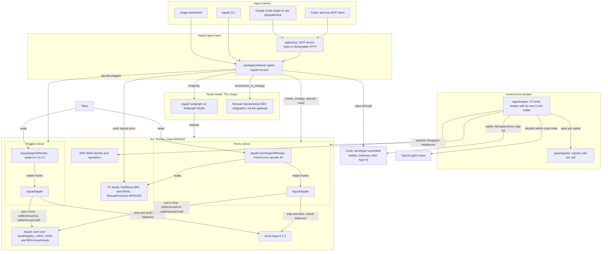
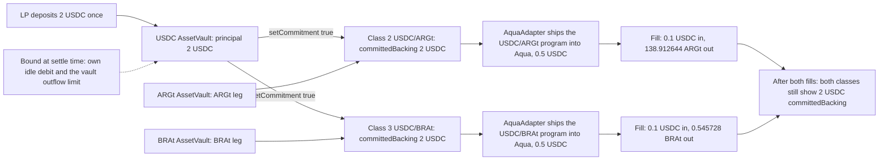
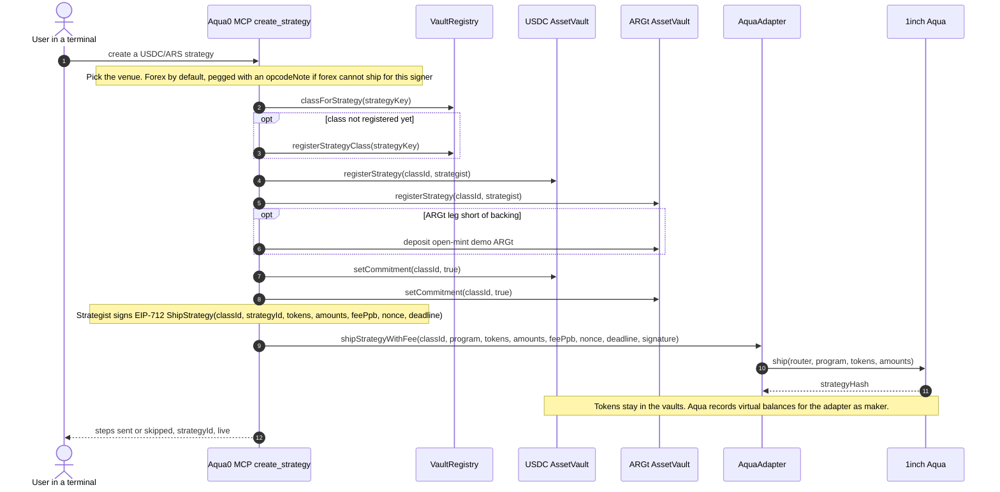
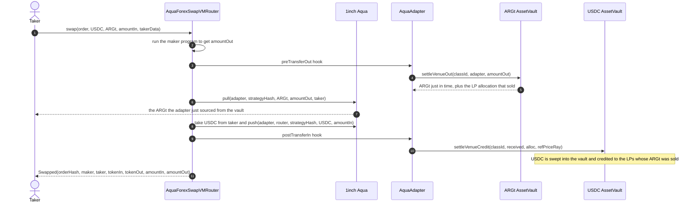

# Aqua0: one USDC deposit, many FX strategies, from your terminal

[](https://testnet.arcscan.app/address/0x9E094b21C4263e0BE5BEffa0f8296B3fd982fFFf)
[](#1inch-build-an-aqua-app-and-continuity)
[](#the-graph-best-ai-tooling-or-ai-use-case)
[](https://www.npmjs.com/package/@aqua0/mcp)
[](#mcp-tool-reference)
[](#connect-the-mcp)
[](skills/aqua0/SKILL.md)
[](#continuity-pre-existing-vs-built-at-ethglobal)
[](LICENSE)

**Aqua0 is shared liquidity for 1inch SwapVM.** An LP deposits once into a per-asset `AssetVault`, and that single principal backs many SwapVM strategies at the same time. Nothing is split between them. Tokens stay in the vault until a swap pulls them just in time.

For ETHGlobal we put Aqua0 on **Arc** and made it agent-native. From Claude Code, Codex or any MCP client, an agent reads Aqua0 from **The Graph** and ships USDC ↔ Argentine peso and USDC ↔ Brazilian real strategies through **1inch Aqua** on an oracle-priced forex curve, all backed by the same USDC. An autonomous keeper with its own **Circle** wallet buys market signals with Nanopayments and keeps those books balanced.

<!-- TODO: add demo video link -->

Paste-ready submission copy: [`docs/ETHGLOBAL_SUBMISSION.md`](docs/ETHGLOBAL_SUBMISSION.md).

## What's live

On Arc Testnet (chain `5042002`) and the public endpoints:

- **Aqua0 vault core:** USDC, ARGt and BRAt `AssetVault`s.
- **Two 1inch Aqua venues on the same vaults:** pegged (`AquaSwapVMRouter`) and forex (`AquaForexSwapVMRouter`, which runs the new `ForexCurve` SwapVM instruction, opcode 34), each with its Aqua0 AquaAdapter, wired into the vaults and verified on Arcscan.
- **Forex strategies** for USDC/ARS and USDC/BRL, created by default and filling at the oracle price less 30 bps inside the flat band. One 1 USDC principal backs three strategy classes at once.
- **FX prices:** RedStone signed BRL and MXNe feeds, pushed on-chain right before a swap, and a hand-set ARS `ManualFxOracle`.
- **Circle developer-controlled wallets** with Privy sign-in. A shared Circle operator wallet sends the strategy ships users sign and tops up new users.
- **Autonomous FX book keeper:** wakes on swaps, pays per signal with Circle Nanopayments, decides with OpenAI `gpt-5-nano` inside limits enforced in code, rebalances from its own Circle wallet, and is ERC-8004 agent #894559.
- **The Graph:** the Aqua0 subgraph on Subgraph Studio indexes both venues, and `benchmark_fx_strategy` composes it with Messari standardized DEX subgraphs through The Graph Network gateway.
- **Install anywhere:** a Claude Code plugin, the `@aqua0/mcp` npm package, and a hosted prepare-only MCP server and dashboard, deployed from `main` after CI.

<kbd>[Demo](#the-demo-in-four-steps)</kbd> <kbd>[On-chain](#see-it-on-chain)</kbd> <kbd>[How it works](#how-it-works)</kbd> <kbd>[Keeper](#autonomous-fx-book-keeper)</kbd> <kbd>[Forex curve](#forex-curve-in-brief)</kbd> <kbd>[Prize tracks](#prize-tracks)</kbd> <kbd>[Gaps](#known-gaps)</kbd> <kbd>[Try it](#try-it)</kbd> <kbd>[Deployments](#deployments)</kbd> <kbd>[Reference](#reference)</kbd>

## The demo in four steps

Everything happens in an agentic terminal. The figures come from the live forex run on Arc Testnet on 2026-09-12: the `aqua0` CLI ran in execute mode with `SIGNER=circle`, signing with the demo Circle wallet `0xb0c0…d952`, and the shared Circle operator sent the strategy ships. The CLI calls the same service functions as the MCP tools.

```text
you   › What does Aqua0 hold on Arc, and what is my USDC backing?
agent › health · protocol_snapshot · get_balance · get_shared_backing
        Three vaults: USDC, ARGt, BRAt. Your USDC principal is 1 USDC.

you   › Create a USDC to Argentine peso strategy that follows the oracle.
agent › create_strategy {"pair":"USDC/ARS"}
        opcode: forex (the default), a ForexCurve program on AquaForexSwapVMRouter
        class → vault legs → fund ARGt leg → commit → EIP-712 sign → AquaAdapter.shipStrategyWithFee
        USDC/ARS is live in Aqua (class 6), backed by your 1 USDC.

you   › Now the same USDC with Brazilian reais.
agent › create_strategy {"pair":"usdc to brl"}
        USDC/BRL is live in Aqua (class 7), priced from RedStone, backed by the same 1 USDC.

you   › Swap 0.1 USDC on each, then query my backing again.
agent › quote_swap · swap · get_shared_backing
        0.1 USDC → 139.58 ARGt (oracle 1400)   ·   0.1 USDC → 0.513598 BRAt (RedStone 5.15143)
        About 30 bps on each: the curve's fee, inside the flat band.
        Principal 1 USDC, counted once, committed to class 4 (pegged USDC/BRL), 6 and 7. Nothing was split.
```

*"One capital, Argentine pesos and Brazilian reais, both live, all from a terminal."*

Then the keeper, running by itself in a second terminal ([two-session runbook](docs/DEMO.md#two-session-demo-autonomous-keeper)):

```text
you    › Swap 0.1 USDC to BRL.
agent  › swap → 0.1 USDC → 0.513568 BRAt at 29.99 bps. The book is now USDC-heavy.

keeper   wake=swap · bought the book signal for 0.001 USDC with a Nanopayment
         gpt-5-nano: rebalance USDC/BRL, spread 265.53 bps is above 150
         swapped 0.515515 BRAt → 0.099781 USDC from its Circle wallet · spread 265.53 → 29.99 bps

you    › Did the keeper rebalance my book?
agent  › keeper_status → USDC/BRL 265.53 → 29.99 bps. Spent 0.006 USDC on 8 signals and $0.000112 on the model.
```

| # | Step | MCP tools |
| --- | --- | --- |
| 1 | Query state | `health`, `protocol_snapshot`, `get_balance`, `get_strategies` (The Graph); `get_shared_backing` (on-chain reads) |
| 2 | Create a USDC ↔ ARS strategy | `deposit`, `create_strategy` |
| 3 | Create USDC ↔ BRL on the same USDC | `create_strategy` |
| 4 | Swap on each, query again | `quote_swap`, `swap`, `get_shared_backing` |
| + | The same flow at a fixed price | `create_strategy {"opcode":"pegged"}`, `quote_swap`, `swap` |
| + | The real BRL rate from signed RedStone prices | `get_fx_prices` |
| + | Book health and what the keeper did | `get_signals`, `keeper_status` |
| + | Compare a strategy with the onchain market | `benchmark_fx_strategy` |

Repeatable proofs: [`scripts/test-arc-fork-strategies.sh`](scripts/test-arc-fork-strategies.sh) (pegged) and [`scripts/test-arc-fork-forex.sh`](scripts/test-arc-fork-forex.sh) (forex) fork Arc, run these steps through the CLI and assert the fills, idempotency and shared backing. The forex script also drives the curve past its flat band, into the halt band and through an oracle move, which small live swaps do not reach.

### See it on-chain

Every hash is in [`deployments/arc-testnet-strategies.json`](deployments/arc-testnet-strategies.json) under `forexLiveRun`, `keeperRun`, `liveVenueRun` and `circleSignInRun`.

**Forex venue** (demo Circle wallet `0xb0c0…d952`, default opcode):

- [Ship the forex USDC/ARS strategy (class 6), sent by the Circle operator](https://testnet.arcscan.app/tx/0xc74849a497ff73207e70872d3d83ed9d5cbc1babaa8f161ee716f444a9b7071e)
- [Ship the forex USDC/BRL strategy (class 7) on the same USDC](https://testnet.arcscan.app/tx/0xb1d40beb277fda1516f39e59eacfd535c9199c0670d78d8181420289f88406b4)
- [Swap 0.1 USDC → 139.58 ARGt at oracle 1400, spread 29.99 bps](https://testnet.arcscan.app/tx/0x54f61cb5ddbeea9ea6cdeef75346aba69fe08c9f59f1d2f0eea4dd89e3ef7554)
- [Push the signed RedStone BRL price](https://testnet.arcscan.app/tx/0x46dbaaa5685b7365c30c0b815a32e0cb3f5efd856283993c6f11698d74d28bed), then [swap 0.1 USDC → 0.513598 BRAt at oracle 5.15143, spread 29.99 bps](https://testnet.arcscan.app/tx/0xe28f401465a86dd8557ddd8de548366b0ad5e1fe20db74f71e56cd4a6bcc172a)

**Keeper** (its own Circle wallet `0x5214…4d87`):

- [A user's 0.1 USDC swap tilts USDC/BRL to 265.53 bps](https://testnet.arcscan.app/tx/0xa1ed7419b56c1888ce80b60af125579e82877d247f38dcd366cacc61d3b80e1c)
- [The keeper's rebalance, 0.515515 BRAt → 0.099781 USDC, back to 29.99 bps](https://testnet.arcscan.app/tx/0xa3a786f86937bb03ab6f5bc6dbb5745b7f22ab3cbf03a8dca164362a4ea165e4)
- [ERC-8004 feedback from the operator](https://testnet.arcscan.app/tx/0x76f1b72bde3dedea7ab054ed60cfb30208902c033a7f38287aa8735299c657c2), [ERC-8004 registration as agent 894559](https://testnet.arcscan.app/tx/0x149d5e54c40c5d48bc912383cf341525dea93e84df7f905c6e58a2cbe03797ff)
- [App Kit `send` funds the keeper wallet with 3 USDC](https://testnet.arcscan.app/tx/0x3fdc1d70e7aee510d345b1d168cdf635d136b33d0a80a64530f231e8f643b3d0), [Gateway deposit that backs its Nanopayments](https://testnet.arcscan.app/tx/0x651eeac424758a02fa3c651c9d09091424a88166863e9381aa662b818bb3c122)

**Pegged venue** (demo wallet `0xAFF7…b02c`):

- [Deposit 2 USDC into the USDC AssetVault](https://testnet.arcscan.app/tx/0x088fb34b8147f936b7c10ac8066de4a59773f7d393f33eda64a4defeb8f6c6bd)
- [Ship USDC/ARS (class 2)](https://testnet.arcscan.app/tx/0x97d5fea443f9090f6b9dd2432036bdfbc2ed58d636e8ac802742d2e499968471) and [USDC/BRL (class 3) on the same USDC](https://testnet.arcscan.app/tx/0x7571eea087df535b0a4391a48d510abeb9ed0084cc3816946040c05214aa2293)
- [Swap 0.1 USDC → 138.912644 ARGt](https://testnet.arcscan.app/tx/0x24d95d61c83e3dfdf5ffa8530350635eb9c9b5f71b51835f31b98eb61c5102fb) and [0.1 USDC → 0.545728 BRAt](https://testnet.arcscan.app/tx/0x811e5fd474e554e7a3330f09f34edb09f40ca50475028be89c4de3e6cfd32539)

> [!NOTE]
> **Seeing the same USDC on every class is correct.** Aqua0 commitments are *non-subtractive*: each committed class counts the LP's full principal as backing. In the forex run the same 1 USDC is committed to classes 4, 6 and 7; in the pegged run the same 2 USDC backs classes 2 and 3. Each strategy ships only virtual balances into Aqua. Real outflow is bounded when a swap settles, by the class's own idle debit and the vault's outflow limit, so a vault never pays out more than it holds.

> [!TIP]
> **Forex by default, pegged on request.** `create_strategy` ships `opcode:"forex"`, the oracle-priced forex curve. Pass `opcode:"pegged"` for a `[FlatFeeAmountIn 30 bps][PeggedSwap]` program at a fixed FX price. If the forex venue cannot ship for a signer (for example it lacks `OPERATOR_ROLE`), `create_strategy` uses pegged and says why in `opcodeNote`.

## How it works



`packages/shared` is the one typed service behind the MCP, CLI, dashboard and keeper. The Graph is the read model. The Aqua0 vaults hold capital, and each AquaAdapter is the Aqua *maker* for the strategies on its router.

> [!NOTE]
> **Every fill has one liquidity path: the vaults, just in time.** On a USDC → BRL swap, the adapter's `preTransferOut` hook sources the BRL from the BRL AssetVault, and `postTransferIn` sweeps the taker's USDC into the USDC AssetVault and credits the LPs who sold. Aqua only records each strategy's virtual balances; no liquidity sits in Aqua or in the adapter. The two routers differ only in the pricing program (fixed price or oracle curve), and both draw from the same vaults and strategy classes.

More: [`docs/ARCHITECTURE.md`](docs/ARCHITECTURE.md).

### Shared backing



Figures from the live pegged run; the live forex run shows the same pattern, with one 1 USDC principal behind three classes. Class ids are assigned at registration, so they vary per strategist and chain.

### Creating a strategy

A single idempotent `create_strategy` call walks the whole sequence and reports steps that are already done as skipped. No tokens move when a strategy ships.

<details>
<summary><b>Sequence: <code>create_strategy</code> from class registration to Aqua ship</b></summary>



- **Strategy key** is `keccak256(abi.encode(strategist, chainId, sorted token0/token1, keccak256(trimmed label)))`, so a class id is never guessed.
- **Program** is `maker = AquaAdapter` with maker traits `useAqua | postTransferIn | preTransferOut`, the only combination the adapter accepts. Forex ships a `[ForexCurve]` program, which charges its own fee, to `AquaForexSwapVMRouter`; pegged ships `[FlatFeeAmountIn][PeggedSwap]` to `AquaSwapVMRouter`.
- **Signature** uses EIP-712 domain `AquaAdapter` v`1`, is ERC-1271-aware and nonce-protected. In prepare mode the tool returns the calldata and typed data instead of sending.

</details>

### A swap through the maker hooks

The router runs the maker program, pulls the output just in time from the vault, and sweeps the taker's input into the counter vault, credited to the LPs that sold.

<details>
<summary><b>Sequence: exact-in swap settled through <code>preTransferOut</code> and <code>postTransferIn</code></b></summary>



The adapter handles either transfer order; whichever hook runs second performs the counter vault's `settleVenueCredit`. The `swap` tool quotes first and enforces a minimum output on-chain (default 50 bps slippage). `quote_swap` and `swap` report the oracle price (or the fixed price for pegged), the execution price and the effective spread.

</details>

### Autonomous FX book keeper

[`apps/keeper`](apps/keeper) keeps the live forex books near an even split, so traders get the flat oracle price (about 30 bps) instead of the inventory fee.

- **Wakes on its own.** It polls the forex router's `Swapped` logs every few seconds and runs a heartbeat that checks oracles and balances.
- **Pays for data.** It buys oracle, book and vault signals ($0.0005 to $0.001 each) from [`apps/signals`](apps/signals) with **Circle Nanopayments**: x402 payments batched by Circle Gateway on Arc Testnet, each signed by its Circle developer-controlled wallet.
- **Decides.** OpenAI `gpt-5-nano` picks one action from a closed set (rebalance, wait, recommend_dock, top_up_usdc, top_up_gateway) and gives a reason, about $0.0001 a decision. Invalid, late or out-of-limit answers fall back to a deterministic rules policy.
- **Stays inside limits enforced in code:** hourly data budget, max trade size, per-strategy cooldown, allowed actions, daily top-up and model spend caps, dry-run.
- **Acts on mined state.** It re-reads the book right before trading and swaps through the same `executeFxSwap` as the MCP tool, with an on-chain minimum output.
- **Has an identity.** **App Kit** `send` funds its wallet, and it is **ERC-8004** agent 894559; the operator rates each executed rebalance.
- **Reports to your agent.** `get_signals` reads the same book signals for free, and `keeper_status` summarizes the keeper's journal: last rebalance, spreads before and after, spend.

Details: [`docs/ARC_TRACK.md`](docs/ARC_TRACK.md#autonomous-fx-book-keeper). Runbook: [`docs/DEMO.md`](docs/DEMO.md#two-session-demo-autonomous-keeper).

## Forex curve in brief

**Why.** swap-vm's `PeggedSwap` centres liquidity at a fixed ratio, but FX rates float. A pegged curve leaves liquidity at a stale price, and arbitrageurs take the difference from LPs.

**What.** `ForexCurve` is a new SwapVM instruction, opcode 34 on `AquaForexSwapVMRouter`. It is Tomás's forex curve: the Shell v1 curve with an oracle, as DFX v2 runs it, solved in closed form and fully **stateless**. On every swap it:

- reads the oracle the maker declared in its program, and checks staleness and a min/max price band;
- values both Aqua balances in USDC at the oracle price;
- prices the trade at exactly the oracle price while the book stays within the flat band `β` of an even value split; past it, charges an inventory fee (slope `δ`, capped at `maxFee`, which must be below 0.5), of which a share `λ` goes back to a trade that rebalances the book;
- reverts a swap that would push the book past the halt band `α`;
- charges a proportional fee `ε`.

**On Arc.**

- [`AquaForexSwapVMRouter`](packages/contracts/src/routers/AquaForexSwapVMRouter.sol) at [`0x475d…187e`](https://testnet.arcscan.app/address/0x475d0E487779743Fb52c8E7729A1718934D4187e) (a modified swap-vm v1.0.2 router, 24,418 bytes, under EIP-170) and its AquaAdapter at [`0xc9cD…0EfB`](https://testnet.arcscan.app/address/0xc9cD056FCF2EF46116259fb094BD897c7E7C0EfB), both verified on Arcscan and wired into the three vaults.
- Live swaps fill inside the flat band at 29.99 bps. When a swap tilted the USDC/BRL book, a live quote showed the inventory fee at 265.53 bps, and the keeper's rebalance brought it back to 29.99 bps.
- The instruction matches all 979 reference vectors (Tomás's 968 plus the live DFX EURC/USDC pool) within a few wei of a 100-digit re-solve ([`ForexCurveVectors.t.sol`](packages/contracts/test/ForexCurveVectors.t.sol)), alongside unit, invariant and Arc-fork Foundry tests. A swap costs about 108k gas inside the flat band and 133k leaving it.
- [`test-arc-fork-forex.sh`](scripts/test-arc-fork-forex.sh) covers fills in every regime on an Arc fork: 30 bps inside the flat band, 666 bps past it, `ForexCurveUpperHalt()` past the halt band, and a +5% ARS/USD move that moves the quote by exactly 5%. Its quotes agree with the reference [`fxforex_math.py`](scripts/fxforex_math.py) to about 1e-16.

**MCP defaults:** `α` 0.5, `β` 0.15, `δ` 0.5, `maxFee` 0.25, `λ` 0.3, `ε` 30 bps. A strategy ships 1 USDC plus its value in FX at the live oracle price, so the book starts balanced. USDC/ARS: price band half to double 1400 ARS per USD, max feed age 7 days (the feed is set by hand). USDC/BRL: band 0.0909 to 0.3636 USD per BRL, max feed age 1 hour (`swap` refreshes the RedStone price first).

**Prices.** USDC/BRL prices from **RedStone** signed market data: free gateways, no API key, and an on-chain adapter that stores a price only when 3 of RedStone's 5 primary-prod signers agree. `quote_swap` applies the latest signed price as an `eth_call` state override, and `swap` pushes it on-chain first. USDC/ARS uses a hand-set `ManualFxOracle`, because RedStone has no ARS feed. Pyth's free tier excludes FX feeds, Chainlink Data Feeds exist only on Arc mainnet, and Circle StableFX covers only USDC/EURC. Mechanics: [`docs/ARC_DEPLOYMENT.md`](docs/ARC_DEPLOYMENT.md#6-redstone-price-feeds-live).

The maths, a per-swap flowchart and the 123-byte program layout: [`packages/contracts/README.md`](packages/contracts/README.md#forexcurve-maths).

## Prize tracks

Aqua0 is registered in the **Continuity** track and targets Arc, 1inch and The Graph. Only work built during the event is submitted for judging ([what pre-existed](#continuity-pre-existing-vs-built-at-ethglobal)).

| Prize | Pool | What Aqua0 shows |
| --- | --- | --- |
| [The Graph: Best AI Tooling or AI Use Case](#the-graph-best-ai-tooling-or-ai-use-case) (Continuity pool) | $2,500 / $1,500 / $1,000 | A reusable Graph-backed MCP server (npm, Claude Code plugin, hosted) and agent skill; agents read live Subgraph Studio data and act on it |
| [The Graph: Composable or Standardized Graph Products](#the-graph-composable-or-standardized-graph-products) | $2,500 / $1,500 / $1,000 | `benchmark_fx_strategy`: one Messari standardized DEX query pattern across 4 protocols on 6 chains, composed with the Aqua0 subgraph |
| [Arc: Best DeFi / Onchain Finance Application](#arc-best-defi--onchain-finance-application) | $3,500 ($2,500 mainnet-conditional) | USDC-quoted shared FX liquidity on an oracle-priced curve, traded through Circle developer-controlled wallets |
| [Arc: Best Agentic Economy Application with Circle Agent Stack](#arc-best-agentic-economy-application-with-circle-agent-stack) | $3,500 ($2,500 mainnet-conditional) | An autonomous FX book keeper: its own Circle wallet, Nanopayments for signals, App Kit, ERC-8004, model decisions inside code limits |
| [Arc: Best DeFi or Agentic Application (Continuity)](#arc-best-defi-or-agentic-application-continuity) | $3,000 ($2,000 mainnet-conditional) | The DeFi application and its keeper, on the continuity split below |
| [1inch: Build an Aqua App (and Continuity)](#1inch-build-an-aqua-app-and-continuity) | $2,500 / $1,500 / $1,000; Continuity $1,500 / $500 | Official Aqua and SwapVM, a new SwapVM instruction, live fills on Arc Testnet |

### The Graph: Best AI Tooling or AI Use Case

**Looking for:** reusable tooling that makes The Graph easier to use from AI environments, or agents that use The Graph as their live data source, with The Graph load-bearing and the agent doing meaningful work.

- **Reusable MCP infrastructure.** 25 tools over stdio or Streamable HTTP on a typed service package, with a CLI on top, published as [`@aqua0/mcp`](https://www.npmjs.com/package/@aqua0/mcp), a Claude Code plugin ([`.claude-plugin`](.claude-plugin)) and a hosted endpoint. The Arc manifest generator and [`infra/arc-rpc-proxy`](infra/arc-rpc-proxy) are reusable by any Graph Node. [`apps/mcp`](apps/mcp), [`packages/shared`](packages/shared)
- **Agent skill.** [`skills/aqua0/SKILL.md`](skills/aqua0/SKILL.md) tells Claude Code, Codex and similar agents when to use Aqua0, which tool answers which job, and how to stay safe. The plugin installs it.
- **Live provider data.** The Arc subgraph is on [Subgraph Studio](https://thegraph.com/studio/subgraph/aqua-0-ethglobal-arc-testnet) with no indexing errors; the hosted MCP and dashboard read it.
- **The Graph is load-bearing.** `health`, `get_balance`, `get_strategies`, `get_fees`, `list_opportunities`, `protocol_snapshot`, `graph_query` and `benchmark_fx_strategy` read subgraph entities. A Graph failure is surfaced as an error, with no silent RPC fallback. [`graph.ts`](packages/shared/src/graph.ts)
- **Meaningful work.** The agent maps a loose request ("usdc to brl") to a pair, checks whether a class exists and which venue can ship, runs a multi-step setup idempotently, explains what changed after mining, and turns market data into a verdict.
- **Aqua venues in the read model.** Both venues are indexed as `AquaStrategy`, `AquaOrder` and `AquaFill` with a `venue` label, plus per-LP fill stats. [`packages/subgraph`](packages/subgraph/README.md)
- **Open source, runnable from docs.** MIT, this README, [`docs/`](docs), [`.env.example`](.env.example), `pnpm check-env` and CI.

### The Graph: Composable or Standardized Graph Products

**Looking for:** a project that composes two or more Graph products or builds on a standardized schema such as Messari Standardized Subgraphs, and makes clear what that made easier.

- **A standardized schema across protocols and chains.** `benchmark_fx_strategy` sends one Messari DEX AMM query pattern (`liquidityPools`, then `dailySnapshots` and `hourlySnapshots`) unchanged through The Graph Network gateway to 12 standardized subgraphs: Uniswap v3 on six chains, Curve on Ethereum, SushiSwap on four chains, Velodrome v2 on Optimism. It finds every pool holding USDC and a pinned EUR, BRL, MXN, ARS, SGD or CAD stablecoin. [`graph-benchmark.ts`](packages/shared/src/graph-benchmark.ts)
- **Composed with the Aqua0 subgraph.** The same call reads Aqua0's live forex strategies and indexed fills from Subgraph Studio next to the market pools, and for USDC/ARS and USDC/BRL adds a live Arc Testnet router quote.
- **What the standard made easier.** One query and one parser cover four protocols on six chains; adding a protocol or chain is a subgraph id and token addresses. Aerodrome on Base has no standardized subgraph, so it runs only as a labelled fallback.
- **Decisions from the data.** A verdict (liquid, thin or none) with the numbers behind it, naming every source that failed. In the 2026-09-12 run EUR came back liquid (a 30 bps strategy is not price-competitive against 5 bps pools), BRL thin, MXN and ARS none. [Full results](docs/THE_GRAPH_TRACK.md#composable-and-standardized-graph-products)

The Aqua0 MCP can also run next to The Graph's Subgraph MCP in the same client; the two servers are not integrated in code.

### Arc: Best DeFi / Onchain Finance Application

**Looking for:** stablecoin-native DeFi on Arc with advanced programmable money flows and Circle products where relevant. Every Arc prize needs a functional MVP with a frontend, backend and architecture diagram, a video demo, documentation and a repo; part of each prize requires Arc Mainnet by September 30.

- **Stablecoin-native FX liquidity.** Arc's native USDC is the shared quote asset, and one USDC balance makes markets in several local currencies. Principal, fees and gas are all USDC. [See it on-chain](#see-it-on-chain)
- **Multi-step atomic settlement.** One swap runs the maker program, pulls the output from the vault just in time, pushes the taker's input into Aqua, sweeps it into the counter vault and credits the LPs that sold. [Swap sequence](#a-swap-through-the-maker-hooks)
- **Conditional fills.** The forex curve refuses a stale or out-of-band oracle price and reverts a swap that would push the book past its halt band. [Forex curve](#forex-curve-in-brief)
- **Real FX market data.** RedStone BRL and MXNe feeds on Arc Testnet accept only prices signed by 3 of RedStone's 5 primary-prod signers.
- **Circle Wallets.** A user signs in with Privy and trades through a Circle developer-controlled wallet; a shared Circle operator wallet sends the strategies users sign and tops up new wallets. [Sign in](#sign-in-with-privy-trade-with-a-circle-wallet)
- **Working frontend and backend.** The [judge dashboard](https://ethglobal-demo.18-207-103-187.nip.io/) reads and prepares; the backend is its Node API, the MCP server and the contracts. [`apps/dashboard`](apps/dashboard)
- **Architecture diagram and documentation.** [How it works](#how-it-works), [`docs/ARCHITECTURE.md`](docs/ARCHITECTURE.md), [`docs/ARC_DEPLOYMENT.md`](docs/ARC_DEPLOYMENT.md), [`docs/ARC_TRACK.md`](docs/ARC_TRACK.md)

### Arc: Best Agentic Economy Application with Circle Agent Stack

**Looking for:** autonomous agents that hold wallets, pay, manage risk and trade in USDC on Arc, with decision logic tied to real signals.

- **An autonomous agent that transacts.** The [FX book keeper](#autonomous-fx-book-keeper) rebalances a tilted book from its own Circle wallet with no human in the loop. Live: a 0.1 USDC swap tilted USDC/BRL to 265.53 bps and the keeper brought it back to 29.99 bps ([rebalance](https://testnet.arcscan.app/tx/0xa3a786f86937bb03ab6f5bc6dbb5745b7f22ab3cbf03a8dca164362a4ea165e4)).
- **Decisions tied to real signals.** Book tilt and oracle age from the router and feeds, balances from the chain. `gpt-5-nano` chooses from a closed set of actions; budget, trade size, cooldown, allowed actions and spend caps are enforced in code, with a rules policy as fallback.
- **Nanopayments.** The keeper pays per signal ($0.0005 to $0.001) through Circle Gateway batched x402 on Arc Testnet, signed by its Circle developer-controlled wallet. The seller is [`apps/signals`](apps/signals).
- **Circle Wallets and App Kit.** The keeper, the demo user and the operator are Circle developer-controlled wallets; App Kit `send` funded the keeper and handles its capped top-ups.
- **ERC-8004.** The keeper is agent 894559, and the operator records reputation feedback after each rebalance.
- **Agent tooling for people too.** In execute mode `deposit`, `create_strategy` and `swap` send through the user's Circle wallet, and `get_signals` and `keeper_status` let a person's agent check the book and the keeper.

### Arc: Best DeFi or Agentic Application (Continuity)

The DeFi application and its keeper agent, as above. The Aqua0 vault contracts and AquaAdapter pre-exist; everything in the [continuity table](#continuity-pre-existing-vs-built-at-ethglobal) was built during the event.

### 1inch: Build an Aqua App (and Continuity)

**Looking for:** a custom Aqua app with a sophisticated DeFi position, scored higher for SwapVM use and new instructions, on the official Aqua and SwapVM contracts, with on-chain token transfers and proper git history.

- **Sophisticated position: shared-backing FX market making.** One vault deposit backs several SwapVM strategies that the AquaAdapter ships into Aqua as maker, settled just in time through maker hooks. [How it works](#how-it-works)
- **A new SwapVM instruction.** `ForexCurve` at index 34 in a modified router, matching all 979 reference vectors within a few wei and running live strategies on Arc. [`packages/contracts`](packages/contracts/README.md), [`ForexCurveArcFork.t.sol`](packages/contracts/test/fork/ForexCurveArcFork.t.sol)
- **SwapVM programs.** `[ForexCurve]` (opcode 34) and `[FlatFeeAmountIn][PeggedSwap]` (opcodes 21 and 31) both run live strategies. [`fx.ts`](packages/shared/src/fx.ts), [`swapvm.ts`](packages/shared/src/swapvm.ts)
- **Official contracts.** aqua 0.1.0 `AquaRouter` and swap-vm v1.0.2 `AquaSwapVMRouter`, built from unmodified upstream source. [`DeployAquaVenue.s.sol`](packages/contracts/script/DeployAquaVenue.s.sol), [broadcast](packages/contracts/broadcast/DeployAquaVenue.s.sol/5042002/run-latest.json)
- **On-chain token transfers.** Real ARGt, BRAt and USDC move out of and into the vaults on every fill: [forex USDC → ARGt](https://testnet.arcscan.app/tx/0x54f61cb5ddbeea9ea6cdeef75346aba69fe08c9f59f1d2f0eea4dd89e3ef7554), [forex USDC → BRAt](https://testnet.arcscan.app/tx/0xe28f401465a86dd8557ddd8de548366b0ad5e1fe20db74f71e56cd4a6bcc172a), [keeper BRAt → USDC](https://testnet.arcscan.app/tx/0xa3a786f86937bb03ab6f5bc6dbb5745b7f22ab3cbf03a8dca164362a4ea165e4), [pegged USDC → ARGt](https://testnet.arcscan.app/tx/0x24d95d61c83e3dfdf5ffa8530350635eb9c9b5f71b51835f31b98eb61c5102fb).
- **Positions via test scripts.** [`run-arc-fx-strategies.sh`](packages/contracts/script/run-arc-fx-strategies.sh) (Foundry), [`test-arc-fork-strategies.sh`](scripts/test-arc-fork-strategies.sh) and [`test-arc-fork-forex.sh`](scripts/test-arc-fork-forex.sh) (MCP service path), all with assertions. SwapVM wire facts: [`packages/contracts/README.md`](packages/contracts/README.md#wire-facts-swap-vm-v102-aquaswapvmrouter).
- **Proper git history.** 150+ commits from the whole team since 2026-09-05.

## Known gaps

- **Demo video:** the link is added at submission.
- **Arc Testnet only.** Aqua0 is not deployed to Arc Mainnet, which the mainnet-conditional share of each Arc prize requires by September 30.
- **Circle Agent Stack starter kits and Paymaster are not used.** Paymaster is not available on Arc.
- **Docking or pausing strategies is not automated.** The keeper recommends docking a strategy with a stale or out-of-band oracle; docking needs the strategist's signature.
- **Indexed fees show a 1-wei remainder.** The AquaAdapter books the curve's embedded spread as swap proceeds, so `feesCredited` on indexed fills is 1 wei. LPs still receive the full input, and `effectiveSpreadBps` from `quote_swap` and `swap` shows the real cost.
- **The keeper and its signals seller run locally**, not hosted.

## Try it

Installing needs Claude Code or Codex, plus Node 20 or newer for the local server. Building from source needs Node 22, pnpm 9, and Foundry for the contracts and fork proofs.

### Connect the MCP

**1. Claude Code plugin: hosted, prepare-only.** Installs the [Aqua0 agent skill](skills/aqua0/SKILL.md) and connects the hosted MCP server:

```text
/plugin marketplace add Aqua0-fi/aqua0-ethglobal
/plugin install aqua0@aqua0
```

From a shell: `claude plugin marketplace add Aqua0-fi/aqua0-ethglobal`, then `claude plugin install aqua0@aqua0`. The hosted server runs the current build in prepare mode: all 25 tools, Graph data from Subgraph Studio, `benchmark_fx_strategy` included, and no signing key, so write tools return calldata and EIP-712 typed data for your wallet. From another client: `claude mcp add --transport http aqua0 https://ethglobal-mcp.18-207-103-187.nip.io/mcp`, or in `~/.codex/config.toml`, `[mcp_servers.aqua0]` with `url = "https://ethglobal-mcp.18-207-103-187.nip.io/mcp"`.

**2. npm package: local stdio.** Runs on your machine through npx, with no clone or build:

```bash
claude mcp add aqua0 -- npx -y @aqua0/mcp
codex mcp add aqua0 -- npx -y @aqua0/mcp
```

It starts in prepare mode on Arc Testnet and reads the public Studio subgraph, so no variables are needed. Run it locally to send transactions, to sign in with Privy, or to read a keeper journal on your machine. `benchmark_fx_strategy` needs `GRAPH_GATEWAY_API_KEY` in the local server's environment.

**Execute mode with your own Arc Testnet key.** The local server sends the transactions itself:

```bash
claude mcp add aqua0 \
  -e MCP_WRITE_MODE=execute \
  -e WRITE_PRIVATE_KEY=0x...throwaway-arc-testnet-key \
  -- npx -y @aqua0/mcp
```

The key's address needs testnet USDC on Arc, which pays gas, and must have no contract code (an EIP-7702-delegated address is rejected). Creating strategies also needs `OPERATOR_ROLE` on the AquaAdapter, or a Circle operator wallet that holds it (below). The guard only allows Arc Testnet or a local fork, fails on reverted receipts, and `dryRun: true` always returns calldata. Use a throwaway key, set only in the server's environment, never in chat.

Variables default to the Arc deployment; override them only for another subgraph or a fork (`FXSWAP_ROUTER_ADDRESS` and `FXSWAP_AQUA_ADAPTER_ADDRESS` name the forex router and its adapter). Then try:

```text
Check Aqua0 health, show the protocol snapshot, and tell me which data came from The Graph.
Is 0xAFF7Da673820fAA38289de8B03984A9cf20fb02c's USDC backing both FX strategies?
How many Argentine pesos would 0.1 USDC buy right now? Show the execution price and spread.
What's the real BRL rate right now, and what value is stored on-chain?
Create a USDC/BRL forex strategy as a dry run and walk me through each step.
Is the BRL book healthy, and did the keeper rebalance it?
Is a 30 bps euro FX strategy competitive onchain? How deep is BRL liquidity?
```

### Sign in with Privy, trade with a Circle wallet

A local MCP (or `aqua0 login`) can act for a signed-in person without holding their key:

1. `login` opens `http://localhost:8787/login`, where the user signs in with any method the Privy app enables.
2. The server verifies the Privy token against Privy's public keys and uses the Privy user id as the `refId` of a **Circle developer-controlled EOA on Arc Testnet**, created on first sign-in. Only the user id and wallet address are saved (`~/.aqua0/session.json`, mode 600).
3. A shared **Aqua0 operator wallet** (a Circle EOA holding `OPERATOR_ROLE`) tops up a new wallet holding under 1 USDC.
4. `deposit`, `create_strategy` and `swap` then run as that user. The user's wallet signs each strategy (EIP-712) and the operator only sends it, so no per-user role is needed.

```bash
claude mcp add aqua0 \
  -e MCP_WRITE_MODE=execute \
  -e SIGNER=circle -e CIRCLE_API_KEY=... -e CIRCLE_ENTITY_SECRET=... \
  -e CIRCLE_WALLET_SET_ID=... -e CIRCLE_OPERATOR_WALLET_ID=... \
  -e PRIVY_APP_ID=... -e PRIVY_CLIENT_ID=... \
  -- npx -y @aqua0/mcp
```

Then: *"Log me in to Aqua0"* → *"Deposit 2 USDC"* → *"Create a USDC/BRL strategy"* → *"Swap 0.1 USDC to BRL"*. Allow `http://localhost:8787` on the Privy app client. Local sign-in picks which Circle wallet the server signs with; it is not isolation between users, because whoever runs the server holds the Circle secrets.

### Run the keeper

```bash
pnpm install && pnpm build
alias aqua0="node $PWD/apps/cli/dist/index.js"
# In the environment, never in chat: CIRCLE_API_KEY, CIRCLE_ENTITY_SECRET, CIRCLE_WALLET_SET_ID,
# CIRCLE_OPERATOR_WALLET_ID, and OPENAI_API_KEY for the model policy (the rules policy decides without it).
aqua0 keeper setup                        # keeper Circle wallet, App Kit funding, Gateway deposit, ERC-8004 identity
aqua0 signals serve                       # signals seller on http://127.0.0.1:8402
aqua0 keeper run --interval 90 --poll 4   # second tab; or both in one process: aqua0 keeper demo
```

Each tick prints what woke it, the signals bought, each book's spread, who decided and why, and Arcscan links. Full runbook: [`docs/DEMO.md`](docs/DEMO.md#two-session-demo-autonomous-keeper).

### Run the fork proofs

```bash
pnpm install
./scripts/test-arc-fork-strategies.sh   # pegged venue, fork on 127.0.0.1:8579
./scripts/test-arc-fork-forex.sh        # forex curve, fork on 127.0.0.1:8580
```

Both fork Arc, wire any missing adapter roles as impersonated admins on the fork only, then run deposit → two strategies → quote and swap each → shared backing through the MCP service path and assert the result. The forex script first deploys the forex router and adapter, and also fills past the flat band, hits the halt band and moves the ARS/USD feed. Only USDC is stubbed, because Arc's USDC calls native precompiles that a local fork lacks.

The CLI mirrors every MCP tool under the same `MCP_WRITE_MODE` guard (`pnpm --filter @aqua0/cli dev help`). Contracts and Foundry tests: [`packages/contracts/README.md`](packages/contracts/README.md). Subgraph build, Arc manifest and Studio deploy: [`packages/subgraph/README.md`](packages/subgraph/README.md) and [`docs/THE_GRAPH_TRACK.md`](docs/THE_GRAPH_TRACK.md).

## Deployments

Arc Testnet, chain id `5042002`. Full records: [`deployments/arc-testnet.json`](deployments/arc-testnet.json) and [`docs/ARC_DEPLOYMENT.md`](docs/ARC_DEPLOYMENT.md).

| Contract | Address | Notes |
| --- | --- | --- |
| VaultRegistry | [`0x9E09…fFFf`](https://testnet.arcscan.app/address/0x9E094b21C4263e0BE5BEffa0f8296B3fd982fFFf) | Aqua0 vault core |
| VaultFactory | [`0x879C…2FBa`](https://testnet.arcscan.app/address/0x879C0c90205172a8DD66afB8124994D866372FBa) | |
| Composer | [`0x656F…FEC7`](https://testnet.arcscan.app/address/0x656F28021a624aDfA0d92dDFdBb20577674aFEC7) | |
| FillerRegistry | [`0xa8e0…1297`](https://testnet.arcscan.app/address/0xa8e08346DD7b6809C47A920c365bCC987Ea91297) | |
| USDC AssetVault | [`0x99c2…4429`](https://testnet.arcscan.app/address/0x99c2ab427b29dB1Cc14D228d970596015d1C4429) | |
| ARGt AssetVault | [`0x8a3d…F460`](https://testnet.arcscan.app/address/0x8a3d6188C58d7877499592E179DfE3bd80c4F460) | |
| BRAt AssetVault | [`0xEcB1…0785`](https://testnet.arcscan.app/address/0xEcB132648B781ec5742b582c526243Eeef900785) | |
| Aqua (`AquaRouter`, 1inch aqua 0.1.0) | [`0x490d…20D4`](https://testnet.arcscan.app/address/0x490d2eceD9aCF99e1db6090f820775bFa70020D4) | Verified on Arcscan |
| `AquaForexSwapVMRouter` (ForexCurve, opcode 34) | [`0x475d…187e`](https://testnet.arcscan.app/address/0x475d0E487779743Fb52c8E7729A1718934D4187e) | Forex venue; verified on Arcscan |
| Aqua0 `AquaAdapter`, forex venue | [`0xc9cD…0EfB`](https://testnet.arcscan.app/address/0xc9cD056FCF2EF46116259fb094BD897c7E7C0EfB) | Allowlisted, `VENUE_SETTLER_ROLE` on all 3 vaults, `OPERATOR_ROLE` for the Circle operator; verified on Arcscan |
| `AquaSwapVMRouter` (1inch swap-vm v1.0.2) | [`0xb20b…F763`](https://testnet.arcscan.app/address/0xb20bc70b485eC1352C190d26fCaB1959d219F763) | Pegged venue; verified on Arcscan |
| Aqua0 `AquaAdapter`, pegged venue | [`0xbF72…4Ca5`](https://testnet.arcscan.app/address/0xbF72D34b804636496c3308796908152b82624Ca5) | Allowlisted, `VENUE_SETTLER_ROLE` on all 3 vaults; verified on Arcscan |
| `AquaRedStoneMultiFeedAdapter` | [`0x1a3f…3ea0`](https://testnet.arcscan.app/address/0x1a3fff65628048e4188C40dd5cf55A27Fb513ea0) | RedStone primary-prod, no owner |
| `AquaRedStonePriceFeed` BRL (USD per 1 BRL, 8 dp) | [`0xac4D…1796`](https://testnet.arcscan.app/address/0xac4D10eE7FF790c2E505fBBD6A72d15D7Cbc1796) | Default USDC/BRL feed |
| `AquaRedStonePriceFeed` MXNe (MXN per 1 USD, 8 dp) | [`0xc7cD…07ad`](https://testnet.arcscan.app/address/0xc7cDEfF4e7534dAdeEBFc701c80d8C65b91807ad) | Readable with `get_fx_prices` |
| `ManualFxOracle` ARS/USD (1400) | [`0xc05A…E70C`](https://testnet.arcscan.app/address/0xc05A3Fb016f973C82b0232EF50336d4C0466E70C) | Prices forex USDC/ARS |
| `ManualFxOracle` BRL/USD (5.50) | [`0x1AE6…5e71`](https://testnet.arcscan.app/address/0x1AE6542b9da89Ed2AEf00600710Bba75DbFF5e71) | Optional BRL override (`FX_ORACLE_BRL_USD`) |

| Agent and Circle | Address | Notes |
| --- | --- | --- |
| Keeper Circle wallet | [`0x5214…4d87`](https://testnet.arcscan.app/address/0x5214daeb80b07340bac9060559d660e905564d87) | refId `aqua0-keeper`, ERC-8004 agent 894559 |
| Circle operator wallet | [`0xcdbd…d404`](https://testnet.arcscan.app/address/0xcdbd43edb8292def7e8ac99c77860a689cc6d404) | `OPERATOR_ROLE` on both adapters; signals payee |
| Demo Circle wallet | [`0xb0c0…d952`](https://testnet.arcscan.app/address/0xb0c0687eb013a5ffde4d23a89398a11bc424d952) | Strategist of the forex strategies |
| ERC-8004 IdentityRegistry | [`0x8004…BD9e`](https://testnet.arcscan.app/address/0x8004A818BFB912233c491871b3d84c89A494BD9e) | |
| ERC-8004 ReputationRegistry | [`0x8004…8713`](https://testnet.arcscan.app/address/0x8004B663056A597Dffe9eCcC1965A193B7388713) | |
| Circle GatewayWallet | [`0x0077…19B9`](https://testnet.arcscan.app/address/0x0077777d7EBA4688BDeF3E311b846F25870A19B9) | Holds the keeper's Nanopayments balance |

| Token | Address | Decimals |
| --- | --- | --- |
| USDC (Arc native, ERC-20 interface) | [`0x3600000000000000000000000000000000000000`](https://testnet.arcscan.app/address/0x3600000000000000000000000000000000000000) | 6 |
| ARGt, an open-mint **testnet demo token** standing in for an ARS stablecoin | [`0xd8dE250970842A581f89E885dA0F5165037714Ef`](https://testnet.arcscan.app/address/0xd8dE250970842A581f89E885dA0F5165037714Ef) | 18 |
| BRAt, an open-mint **testnet demo token** standing in for a BRL stablecoin | [`0xa9482a878A3784663512f0Bf8d0be17aD6DEA38E`](https://testnet.arcscan.app/address/0xa9482a878A3784663512f0Bf8d0be17aD6DEA38E) | 18 |

| Endpoint | URL | Notes |
| --- | --- | --- |
| Subgraph Studio query | `https://api.studio.thegraph.com/query/1760183/aqua-0-ethglobal-arc-testnet/version/latest` | Version `ethglobal-arc-3d0b9ef`, both venues |
| Subgraph Studio project | [`aqua-0-ethglobal-arc-testnet`](https://thegraph.com/studio/subgraph/aqua-0-ethglobal-arc-testnet) | |
| Hosted MCP (Streamable HTTP) | `https://ethglobal-mcp.18-207-103-187.nip.io/mcp` | 25 tools, prepare-only, no signer; deployed from `main` after CI ([`deploy.yml`](.github/workflows/deploy.yml)) |
| MCP health | `https://ethglobal-mcp.18-207-103-187.nip.io/health` | Graph `_meta` query |
| Judge dashboard | `https://ethglobal-demo.18-207-103-187.nip.io/` | Read-only and prepare-only |
| npm | [`@aqua0/mcp`](https://www.npmjs.com/package/@aqua0/mcp) | Local stdio server |

Each AquaAdapter is wired with `VaultRegistry.setAdapterAllowed` and `VENUE_SETTLER_ROLE` on the three vaults, and has `oneStrategyPerToken` off so one token can back several strategies. The forex adapter's wiring transactions are under `forexVenue.coreWiring` in [`arc-testnet.json`](deployments/arc-testnet.json).

## Reference

<a id="mcp-tool-reference"></a>

<details>
<summary><b>MCP tool reference (25 tools; 26 in execute mode)</b></summary>

Write tools send only when the server runs with `MCP_WRITE_MODE=execute` and `dryRun` isn't true; otherwise they return calldata and typed data. `authorize_strategy` is registered only in execute mode.

| Tool | Kind | What it does |
| --- | --- | --- |
| `health` | Graph | `_meta` query; configured vs reachable |
| `info` | Config | Public chain and write config, secrets redacted |
| `login`, `whoami`, `logout` | Sign-in | Privy sign-in to a Circle developer-controlled wallet; the sign-in page runs on the local server |
| `get_balance` | Graph | LP vault positions: principal, credit, deployed and free units |
| `get_strategies` | Graph | LP strategy positions joined with strategy-vault legs |
| `get_fees` | Graph | LP fee accrual history, optionally over a window |
| `list_opportunities` | Graph | Live strategy vaults and recent lifecycle events |
| `protocol_snapshot` | Graph | Vault and strategy counts and totals |
| `graph_query` | Graph | Raw GraphQL escape hatch |
| `prepare_create_strategy` | RPC read + ABI | Strategy key, `classForStrategy`, next-stage calldata |
| `prepare_authorize_strategy` | ABI | `AssetVault.setCommitment` calldata |
| `prepare_deposit`, `prepare_withdraw` | ABI | `AssetVault.deposit` and `withdraw` calldata, raw units |
| `create_strategy` | Write | `{pair, chain?, opcode?, params?, strategist?, fundFxLeg?, dryRun?}`: class → vault legs → FX funding → commitments → EIP-712 sign → `AquaAdapter.shipStrategyWithFee`. Idempotent; accepts loose pairs ("usdc to brl", "pesos"). `opcode` is `"forex"` (default) or `"pegged"`. Params: `feeBps`, `alpha`, `beta`, `delta`, `maxFee` or `maxFeePercent`, `lambda`, `bandPercent` or `minPrice`/`maxPrice`, `maxStaleness`, `usdcAmount`, `fxAmount`; pegged takes `price` instead of the curve params |
| `deposit` | Write | Deposit USDC, ARS (ARGt) or BRL (BRAt) in human units; approves when needed |
| `quote_swap` | RPC read | Exact-in quote through the strategy's router; oracle or fixed price, execution price and effective spread; sends nothing. RedStone-priced strategies are quoted at the latest signed price through a state override |
| `swap` | Write | Pushes the latest signed RedStone price for BRL, re-quotes, enforces min out on-chain (`slippageBps` default 50, or `minAmountOut`), approves and swaps |
| `get_shared_backing` | RPC read | Principal counted once, every committed class, backing and availability per vault, shipped strategies on both venues |
| `get_fx_prices` | RPC read + RedStone gateways | BRL: the latest signed price and the value on-chain. ARS: price, age and owner. Without a pair it also lists MXNe |
| `set_fx_price` | Write | `{pair, price \| changePercent, dryRun?}`: `ManualFxOracle.setAnswer` on the ARS/USD feed; refuses the RedStone feed; sends only when the signer owns the feed |
| `benchmark_fx_strategy` | Graph: standardized DEX subgraphs + Aqua0 subgraph | `{pair, feeBps?, flatBandPercent?, tradeSizesUsd?, lookbackDays?, chains?, fallback?, includeArcQuote?}` for EUR, BRL, MXN, ARS, SGD or CAD against USDC; pools, the Aqua0 strategy's fee and fills, and a verdict. Needs `GRAPH_GATEWAY_API_KEY` |
| `get_signals` | RPC read | The oracle and book signals the keeper buys, read for free: each forex book's spread, tilt and oracle age |
| `keeper_status` | Keeper journal | Reads the keeper's journal on the machine running the server (`AQUA0_KEEPER_JOURNAL`): running or not, last rebalance, recent ticks, spend |
| `authorize_strategy` | Write, execute mode only | `AssetVault.setCommitment` sent directly |

Source: [`apps/mcp/src/index.ts`](apps/mcp/src/index.ts). Graph reads return raw integer units as strings and never invent decimals.

</details>

<details>
<summary><b>Environment variables</b></summary>

| Variable | Purpose |
| --- | --- |
| `GRAPH_ENDPOINT`, `GRAPH_AUTH_TOKEN`, `GRAPH_NETWORK` | Aqua0 subgraph endpoint (defaults to the public Studio URL), optional bearer token, network label |
| `GRAPH_GATEWAY_API_KEY` | The Graph Network gateway key for `benchmark_fx_strategy`; a secret, sent only as a bearer header |
| `WRITE_RPC_URL`, `WRITE_CHAIN_ID`, `VAULT_REGISTRY_ADDRESS` | Chain for reads, strategy keys and the execution guard; default Arc Testnet |
| `AQUA_ADAPTER_ADDRESS`, `AQUA_SWAPVM_ROUTER_ADDRESS` | Pegged venue overrides |
| `FXSWAP_ROUTER_ADDRESS`, `FXSWAP_AQUA_ADAPTER_ADDRESS` | Forex venue overrides (`AquaForexSwapVMRouter` and its AquaAdapter) |
| `FX_ORACLE_ARS_USD`, `FX_ORACLE_BRL_USD` | ARS/USD feed override; optional BRL-per-USD feed that replaces RedStone |
| `MCP_WRITE_MODE`, `WRITE_PRIVATE_KEY`, `SIGNER` | `prepare` (default) or `execute`; local signer key (secret); `local` or `circle` |
| `CIRCLE_API_KEY`, `CIRCLE_ENTITY_SECRET` | Secrets for `SIGNER=circle` |
| `CIRCLE_WALLET_ID`, `CIRCLE_WALLET_SET_ID`, `CIRCLE_USER_REF` | Which Circle wallet signs: a fixed wallet, or the wallet in the set whose `refId` is the user ref |
| `CIRCLE_OPERATOR_WALLET_ID` | Shared operator holding `OPERATOR_ROLE`: sends the ships users sign and tops up new users |
| `AQUA0_ONBOARD_USDC`, `AQUA0_ONBOARD_DAILY_CAP_USDC`, `AQUA0_ONBOARD_LEDGER` | Top-up size (default 5 USDC), rolling 24-hour cap (default 50 USDC) and ledger file |
| `PRIVY_APP_ID`, `PRIVY_CLIENT_ID`, `PRIVY_LOGIN_PORT`, `AQUA0_SESSION_FILE` | Privy app for `login`, sign-in page port (default `8787`), saved sign-in |
| `KEEPER_CIRCLE_WALLET_ID`, `AQUA0_SIGNALS_URL`, `SIGNALS_SELLER_ADDRESS` | Keeper wallet (default refId `aqua0-keeper`), signals seller URL (default `http://127.0.0.1:8402`) and payee |
| `AQUA0_KEEPER_JOURNAL` | Keeper journal, default `~/.aqua0/keeper/journal.jsonl`; `keeper_status` reads it |
| `OPENAI_API_KEY`, `OPENAI_MODEL` | Keeper model policy (secret) and model, default `gpt-5-nano` |
| `MCP_TRANSPORT`, `HOST`, `PORT` | `stdio` (default) or `http`, and HTTP bind settings |

See [`.env.example`](.env.example); `pnpm check-env` validates it.

</details>

<details>
<summary><b>Repository layout</b></summary>

```text
apps/
  mcp/              MCP server (stdio + Streamable HTTP), published as @aqua0/mcp
  cli/              aqua0 CLI mirroring the MCP tools, plus keeper and signals commands
  keeper/           Autonomous FX book keeper: watcher, policies, executor, Nanopayments, ERC-8004
  signals/          Oracle, book and vault signals sold with Circle Nanopayments
  dashboard/        Judge dashboard: static UI + Node JSON API, read-only and prepare-only
packages/
  shared/           Graph client, analytics, strategy keys, SwapVM programs, calldata, execution guard
  subgraph/         Aqua0 subgraph: schema, mappings, Base manifest, Arc manifest generator (both venues)
  contracts/        Foundry: Aqua + SwapVM venues on Arc, ForexCurve instruction and router, RedStone feeds
skills/aqua0/       Agent skill for Claude Code, Codex and other MCP clients
.claude-plugin/     Claude Code plugin and marketplace manifests
deployments/        Public Arc Testnet addresses, strategy records and live runs (JSON)
infra/arc-rpc-proxy eth_getLogs topic-splitting proxy for a self-hosted Graph Node on Arc
deploy/aws/         Docker compose and Caddy config for the hosted MCP and dashboard
scripts/            Env check, Arc and Base fork proofs, forex reference maths, Studio deploy
docs/               Architecture, Arc deployment, track notes, demo runbook, continuity, submission copy
```

</details>

<a id="continuity-pre-existing-vs-built-at-ethglobal"></a>

<details>
<summary><b>Continuity: pre-existing vs built at ETHGlobal</b></summary>

Aqua0 and its vault contracts, including the AquaAdapter, pre-exist in the private Aqua0 contracts repository. Only the right-hand column is submitted for judging. This repo's history starts on 2026-09-05.

| Pre-existing Aqua0 work | Built during ETHGlobal |
| --- | --- |
| Vault contracts: VaultRegistry, VaultFactory, Composer, FillerRegistry, AssetVault with non-subtractive commitments and venue settlement | Aqua0 subgraph, required-events check, Arc manifest generator, Subgraph Studio deployment and both-venue Aqua indexing |
| `AquaAdapter`: maker hooks, `shipStrategyWithFee`, EIP-712 strategist signatures | Graph-backed typed service, MCP server (npm package, Claude Code plugin, hosted endpoint with CI deploy), CLI, judge dashboard, agent skill |
| Base mainnet Aqua0 deployment | Arc Testnet deployment of the vault core and USDC/ARGt/BRAt vaults |
| Strategy-key derivation in the Aqua0 web app | Aqua 0.1.0, AquaSwapVMRouter and both AquaAdapters on Arc, wired and running live strategies; Arc strategy scripts and fork proofs |
| 1inch Aqua and SwapVM (official sources) | ForexCurve instruction and `AquaForexSwapVMRouter`, and the MCP strategy, swap and FX tools |
| RedStone connector and price-feed contracts (vendored unmodified, BUSL-1.1) | `AquaRedStoneFeeds` BRL and MXNe feeds on Arc, their deploy script and replay test; signed-payload push and quote state override |
| | Privy sign-in with Circle developer-controlled wallets and the shared operator wallet |
| | The autonomous FX book keeper and signals seller: Circle Nanopayments, App Kit, ERC-8004, model policy; `get_signals` and `keeper_status` |
| | `benchmark_fx_strategy` over Messari standardized DEX subgraphs |

Details: [`docs/CONTINUITY.md`](docs/CONTINUITY.md).

</details>

## Team

| Member | Role |
| --- | --- |
| Rithik | The Graph subgraph and Subgraph Studio, MCP server, dashboard, hosted deploy |
| Yudhishthra | Arc SwapVM integration, ForexCurve instruction, MCP strategy tools, the keeper agent |
| Tomás | Forex curve maths, simulations and reference vectors; Arc deployment |

MIT licensed: [`LICENSE`](LICENSE).
