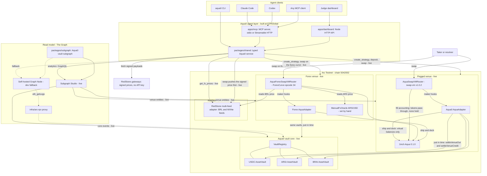
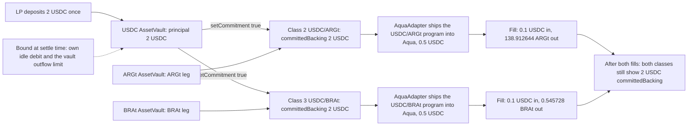
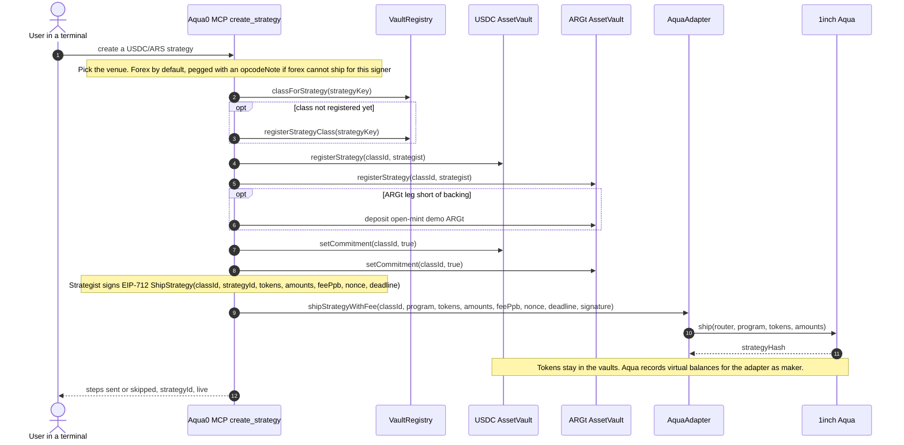
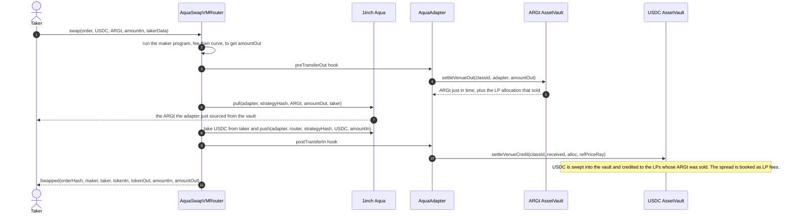
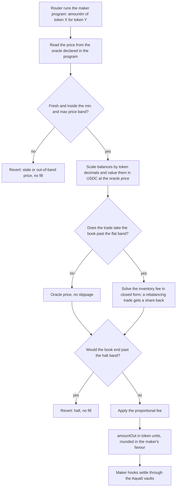

# Aqua0: one USDC deposit, many FX strategies, from your terminal

[](https://testnet.arcscan.app/address/0x9E094b21C4263e0BE5BEffa0f8296B3fd982fFFf)
[](#1inch-build-an-aqua-app-and-continuity)
[](#the-graph-best-ai-tooling-or-ai-use-case)
[](#mcp-tool-reference)
[](skills/aqua0/SKILL.md)
[](#continuity-pre-existing-vs-built-at-ethglobal)

**Aqua0 is shared liquidity for 1inch SwapVM.** An LP deposits once into a per-asset `AssetVault`, and that single principal backs many SwapVM strategies at the same time. Nothing is split between them. Tokens stay in the vault until a swap pulls them just in time.

For ETHGlobal we put Aqua0 on **Arc** and made it agent-native. From Claude Code, Codex or any MCP client, an agent reads state from **The Graph** and ships USDC ↔ Argentine peso and USDC ↔ Brazilian real strategies through **1inch Aqua**, all backed by the same USDC.

<!-- TODO: add demo video link -->

> [!IMPORTANT]
> **What's live right now (2026-09-12)**
> - **Live:** both Aqua0 venues on Arc Testnet, drawing on the same vaults ([see it on-chain](#see-it-on-chain)). On the forex venue, which runs Tomás's forex curve, `create_strategy` picked the forex curve by default for USDC/ARS and USDC/BRL, and both filled on-chain at the oracle price less the 30 bps fee. One 1 USDC principal backs those two forex strategies and a pegged USDC/BRL strategy at once. On the pegged venue, one 2 USDC deposit backs a USDC/ARS and a USDC/BRL strategy, both filled. Also live: the Aqua0 vault core, RedStone BRL and MXNe price feeds updated on-chain from signed market data, the Arc subgraph on Subgraph Studio indexing both Aqua venues, the public MCP endpoint (earlier 12-tool prepare-only build) and the judge dashboard.
> - **Fork-proven:** the forex curve's regimes, which the small live run does not reach ([`test-arc-fork-forex.sh`](scripts/test-arc-fork-forex.sh)). Inside the flat band a swap costs the 30 bps fee, a trade past it pays the inventory fee, a trade past the halt band reverts, and a +5% ARS feed move moves the quote by 5%.
> - **Planned:** the hosted redeploy of the 24-tool MCP, which runs locally over stdio today.

<kbd>[Demo](#the-demo-in-four-steps)</kbd> <kbd>[On-chain](#see-it-on-chain)</kbd> <kbd>[How it works](#how-it-works)</kbd> <kbd>[Forex curve](#forex-curve-in-brief)</kbd> <kbd>[Prize tracks](#prize-tracks)</kbd> <kbd>[Try it](#try-it)</kbd> <kbd>[Deployments](#deployments)</kbd> <kbd>[Reference](#reference)</kbd>

## The demo in four steps

Everything happens in an agentic terminal. The figures below come from the live forex run on Arc Testnet on 2026-09-12. The `aqua0` CLI drove it in execute mode with `SIGNER=circle`, signing with the demo Circle wallet `0xb0c0…d952`, and the shared Circle operator sent the strategy ships. The CLI calls the same service functions as the MCP tools.

```text
you   › What does Aqua0 hold on Arc, and what is my USDC backing?
agent › health · protocol_snapshot · get_balance · get_shared_backing
        Three vaults: USDC, ARGt, BRAt. Your USDC principal is 1 USDC.

you   › Create a USDC to Argentine peso strategy that follows the oracle.
agent › create_strategy {"pair":"USDC/ARS"}
        opcode: forex (the default), a ForexCurve program on AquaForexSwapVMRouter
        class → vault legs → fund ARGt leg → commit → EIP-712 sign → AquaAdapter.shipStrategyWithFee
        USDC/ARS is live in Aqua (class 6), backed by your 1 USDC.

you   › Now the same USDC with Brazilian reais.
agent › create_strategy {"pair":"usdc to brl"}
        USDC/BRL is live in Aqua (class 7), priced from RedStone, backed by the same 1 USDC.

you   › Swap 0.1 USDC on each, then query my backing again.
agent › quote_swap · swap · get_shared_backing
        0.1 USDC → 139.58 ARGt (oracle 1400)   ·   0.1 USDC → 0.513598 BRAt (RedStone 5.15143)
        About 30 bps on each: the curve's fee, inside the flat band.
        Principal 1 USDC, counted once, committed to class 4 (pegged USDC/BRL), 6 and 7. Nothing was split.
```

*"One capital, Argentine pesos and Brazilian reais, both live, all from a terminal."*

| # | Step | MCP tools | Status |
| --- | --- | --- | --- |
| 1 | Query state | `health`, `protocol_snapshot`, `get_balance`, `get_strategies` (The Graph); `get_shared_backing` (on-chain reads) | **Live** |
| 2 | Create USDC ↔ ARS strategy | `deposit`, `create_strategy` | **Live** on Arc (forex venue) |
| 3 | Create USDC ↔ BRL on the same USDC | `create_strategy` | **Live** on Arc (forex venue) |
| 4 | Query again, one swap each | `quote_swap`, `swap`, `get_shared_backing` | **Live** on Arc (forex venue) |
| + | The same flow at a fixed price with `opcode:"pegged"` | `deposit`, `create_strategy`, `quote_swap`, `swap` | **Live** on Arc (pegged venue) |
| + | Read the real BRL rate from signed RedStone prices | `get_fx_prices` | **Live** on Arc |
| + | Forex curve regimes: inventory fee past the flat band, halt band, an ARS feed move and re-quote | `quote_swap`, `set_fx_price` | **Fork-proven** |

Repeatable proofs: [`scripts/test-arc-fork-strategies.sh`](scripts/test-arc-fork-strategies.sh) (pegged) and [`scripts/test-arc-fork-forex.sh`](scripts/test-arc-fork-forex.sh) (forex curve) fork Arc, run these steps through the CLI and assert the fills, idempotency and shared backing.

### See it on-chain

Arc Testnet transactions from the live runs. Every hash is in [`deployments/arc-testnet-strategies.json`](deployments/arc-testnet-strategies.json) under `forexLiveRun` and `liveVenueRun`.

**Forex venue** (demo Circle wallet `0xb0c0…d952`, default opcode):

- Wire the forex AquaAdapter: [allowlist it in the VaultRegistry](https://testnet.arcscan.app/tx/0xbc5aa29ed8d56c84d2d376a131b4f772ec3ed0002d9a38f3bedf7a6af43ad57a), then `VENUE_SETTLER_ROLE` on the [USDC](https://testnet.arcscan.app/tx/0x7d81d8e29ec9d4d50daf0cb3742157340b85f9e431dacd8cac32878d3d65660f), [ARGt](https://testnet.arcscan.app/tx/0xf311a04452791477e4d36d10e5ffd02f075fe1ff6b6f15eb74ace4cdc1eb11a6) and [BRAt](https://testnet.arcscan.app/tx/0xe8c96205abe87a026516be364e1887d9bf6d27e157f49d5dcb6910d848c4464b) vaults
- [Ship the forex USDC/ARS strategy (class 6), sent by the Circle operator](https://testnet.arcscan.app/tx/0xc74849a497ff73207e70872d3d83ed9d5cbc1babaa8f161ee716f444a9b7071e)
- [Ship the forex USDC/BRL strategy (class 7) on the same USDC](https://testnet.arcscan.app/tx/0xb1d40beb277fda1516f39e59eacfd535c9199c0670d78d8181420289f88406b4)
- [Swap 0.1 USDC → 139.58 ARGt at oracle 1400, spread 29.99 bps](https://testnet.arcscan.app/tx/0x54f61cb5ddbeea9ea6cdeef75346aba69fe08c9f59f1d2f0eea4dd89e3ef7554)
- [Push the signed RedStone BRL price](https://testnet.arcscan.app/tx/0x46dbaaa5685b7365c30c0b815a32e0cb3f5efd856283993c6f11698d74d28bed)
- [Swap 0.1 USDC → 0.513598 BRAt at oracle 5.15143 BRAt per USDC, spread 29.99 bps](https://testnet.arcscan.app/tx/0xe28f401465a86dd8557ddd8de548366b0ad5e1fe20db74f71e56cd4a6bcc172a)

**Pegged venue** (demo wallet `0xAFF7…b02c`):

- [Deposit 2 USDC into the USDC AssetVault](https://testnet.arcscan.app/tx/0x088fb34b8147f936b7c10ac8066de4a59773f7d393f33eda64a4defeb8f6c6bd)
- [Ship the USDC/ARS strategy (class 2) through the AquaAdapter](https://testnet.arcscan.app/tx/0x97d5fea443f9090f6b9dd2432036bdfbc2ed58d636e8ac802742d2e499968471)
- [Ship the USDC/BRL strategy (class 3) on the same USDC](https://testnet.arcscan.app/tx/0x7571eea087df535b0a4391a48d510abeb9ed0084cc3816946040c05214aa2293)
- [Swap 0.1 USDC → 138.912644 ARGt](https://testnet.arcscan.app/tx/0x24d95d61c83e3dfdf5ffa8530350635eb9c9b5f71b51835f31b98eb61c5102fb)
- [Swap 0.1 USDC → 0.545728 BRAt](https://testnet.arcscan.app/tx/0x811e5fd474e554e7a3330f09f34edb09f40ca50475028be89c4de3e6cfd32539)

> [!NOTE]
> **Seeing the same USDC on every class is correct.** Aqua0 commitments are *non-subtractive*: each committed class counts the LP's full principal as backing. In the forex run the same 1 USDC is committed to classes 4, 6 and 7; in the pegged run the same 2 USDC stands behind classes 2 and 3. Each strategy ships only virtual balance into Aqua. Real outflow is still bounded when a swap settles, by the class's own idle debit and the vault's outflow limit. A vault can never pay out more than it holds.

> [!TIP]
> **Forex by default, pegged on request.** `create_strategy` ships `opcode:"forex"`, the oracle-priced forex curve. Pass `opcode:"pegged"` for a `[FlatFeeAmountIn 30 bps][PeggedSwap]` program pinned at a fixed FX price. If the forex venue cannot ship for a signer (for example it lacks `OPERATOR_ROLE`), `create_strategy` uses pegged and says why in `opcodeNote`. Apart from the program and router, the flow is identical.

## How it works



`packages/shared` is the one typed service behind the MCP, CLI and dashboard. The Graph is the read model for analytics. The Aqua0 vaults hold capital, and each AquaAdapter is the Aqua *maker* for the strategies on its router.

> [!NOTE]
> **Every fill has one liquidity path: the vaults, just in time.** On a USDC → BRL swap, the adapter's `preTransferOut` hook sources the BRL from the BRL AssetVault, and `postTransferIn` sweeps the taker's USDC into the USDC AssetVault and credits the LPs who sold. Aqua only records each strategy's virtual balances; no liquidity sits in Aqua or in the adapter. The venues differ only in the pricing program (fixed price or oracle curve), and all of them draw from the same vaults and strategy classes.

More: [`docs/ARCHITECTURE.md`](docs/ARCHITECTURE.md).

### Shared backing



Figures from the **live** pegged run on Arc Testnet; the live forex run shows the same pattern, with one 1 USDC principal behind three classes. Class ids are assigned at registration, so they vary per strategist and chain.

### Creating a strategy

A single idempotent `create_strategy` call walks the whole sequence and reports steps that are already done as skipped. No tokens move when a strategy ships.

<details>
<summary><b>Sequence: <code>create_strategy</code> from class registration to Aqua ship</b></summary>



- **Strategy key** is `keccak256(abi.encode(strategist, chainId, sorted token0/token1, keccak256(trimmed label)))`, so a class id is never guessed.
- **Program** is `maker = AquaAdapter` with maker traits `useAqua | postTransferIn | preTransferOut`, the only combination the adapter accepts. Pegged ships `[FlatFeeAmountIn][PeggedSwap]` to `AquaSwapVMRouter`; forex ships a `[ForexCurve]` program, which charges its own fee, to `AquaForexSwapVMRouter` through its own adapter.
- **Signature** uses EIP-712 domain `AquaAdapter` v`1`, is ERC-1271-aware and nonce-protected. In prepare mode the tool returns the calldata and typed data instead of sending.

</details>

### A swap through the maker hooks

The router runs the maker program, pulls the output just in time from the vault, and sweeps the taker's input back into the counter vault. The LPs that sold are credited, and the spread is booked as LP fees.

<details>
<summary><b>Sequence: exact-in swap settled through <code>preTransferOut</code> and <code>postTransferIn</code></b></summary>



The adapter handles either transfer order; whichever hook runs second performs the counter vault's `settleVenueCredit`. The `swap` tool quotes first and enforces a minimum output on-chain (default 50 bps slippage). `quote_swap` and `swap` report the oracle price (or the fixed price for pegged), the execution price and the effective spread.

</details>

## Forex curve in brief

**Why.** swap-vm's `PeggedSwap` centres liquidity at a fixed ratio, but FX rates float. A pegged curve leaves liquidity at a stale price, and arbitrageurs take the difference from LPs.

**What.** `ForexCurve` is a new SwapVM instruction, opcode 34 on `AquaForexSwapVMRouter`. It is Tomás's forex curve: the Shell v1 curve with an oracle, as DFX v2 runs it, solved in closed form and fully **stateless**. It replaces the earlier FXSwap venue (`AquaFXSwapVMRouter` `0xb54A…aEB` and its adapter `0x8236…43D5`), which is superseded and was never wired. On every swap it:

- reads the oracle the maker declared in its program;
- checks staleness and a min/max price band;
- values both Aqua balances in USDC at the oracle price;
- prices the trade:
  - while the book stays within the flat band `β` of an even value split, at exactly the oracle price;
  - past it, with an inventory fee (slope `δ`, capped at `maxFee`), of which a share `λ` goes back to a trade that rebalances the book;
  - a swap that would push the book past the halt band `α` reverts;
- charges a proportional fee `ε`.

| | Status |
| --- | --- |
| Instruction index **34** in [`AquaForexSwapVMRouter`](packages/contracts/src/routers/AquaForexSwapVMRouter.sol), a modified swap-vm v1.0.2 router (EIP-712 name `AquaSwapVMRouter`, version `1.0.2-forex`, 24,418 bytes, under EIP-170). On Arc at [`0x475d…187e`](https://testnet.arcscan.app/address/0x475d0E487779743Fb52c8E7729A1718934D4187e) with its AquaAdapter [`0xc9cD…0EfB`](https://testnet.arcscan.app/address/0xc9cD056FCF2EF46116259fb094BD897c7E7C0EfB), both verified on Arcscan, via [`deploy-arc-forex-venue.sh`](packages/contracts/script/deploy-arc-forex-venue.sh). The adapter is allowlisted and holds `VENUE_SETTLER_ROLE` on the three vaults; the shared Circle operator holds `OPERATOR_ROLE` on it. | **Live** |
| RedStone price feeds on Arc: [`AquaRedStoneMultiFeedAdapter`](https://testnet.arcscan.app/address/0x1a3fff65628048e4188C40dd5cf55A27Fb513ea0) with a BRL feed (USD per 1 BRL) and an MXNe feed (MXN per 1 USD), 8 decimals, no owner, [first update](https://testnet.arcscan.app/tx/0x3ec11cc0830567cb25a5d9b9b1f36c8caa5d966216c552b8a3098fee75d44ecf) sent. 5 Foundry tests replay the real Arc update calldata, so signature, 3-of-5 threshold and median checks run in CI without a fork. [`AquaRedStoneFeeds.sol`](packages/contracts/src/oracles/AquaRedStoneFeeds.sol) | **Live** on Arc |
| Matches all 979 reference vectors (Tomás's 968 plus the live DFX EURC/USDC pool) within a few wei of a 100-digit re-solve ([`ForexCurveVectors.t.sol`](packages/contracts/test/ForexCurveVectors.t.sol)), alongside unit, invariant and Arc-fork tests; 83 Foundry tests pass. Gas for `router.swap`, including the oracle read and Aqua: about 108k exact-in inside the flat band, 133k for a trade leaving it. | **Fork-proven** |
| Live on Arc Testnet: `create_strategy` picked the forex curve by default for USDC/ARS (class 6) and USDC/BRL (class 7). 0.1 USDC → 139.58 ARGt at oracle 1400, spread 29.99 bps; `swap` pushed a signed RedStone price, then 0.1 USDC → 0.513598 BRAt at oracle 5.15143 BRAt per USDC, spread 29.99 bps. Hashes: `forexLiveRun` in [`arc-testnet-strategies.json`](deployments/arc-testnet-strategies.json). | **Live** |
| Curve regimes on a fork, which the small live run does not reach: [`test-arc-fork-forex.sh`](scripts/test-arc-fork-forex.sh) deploys the forex router and an adapter on an Arc fork, wires them as the impersonated admins, and prices from the deployed RedStone BRL and ARS/USD feeds: one 2 USDC deposit backs forex USDC/ARS and USDC/BRL; inside the flat band a swap costs 30 bps, a trade past it paid 666 bps, and a trade past the halt band reverts with `ForexCurveUpperHalt()`; `swap` pushes a signed RedStone BRL price before swapping; the feed owner moves ARS/USD +5% and the quote moves by exactly 5%. Quotes agree with the reference [`fxforex_math.py`](scripts/fxforex_math.py) to about 1e-16. The TypeScript args encoder matches the Solidity args builder byte for byte (vector test). | **Fork-proven** |

**MCP defaults:** `α` 0.5, `β` 0.15, `δ` 0.5, `maxFee` 0.25, `λ` 0.3, `ε` 30 bps. A strategy ships 1 USDC plus its value in FX at the live oracle price, so the book starts balanced. USDC/ARS: price band half to double 1400 ARS per USD and a max feed age of 7 days, because that feed is set by hand. USDC/BRL: band 0.0909–0.3636 USD per BRL (half to double 5.5 BRL per USD) and a max feed age of 1 hour, because `swap` refreshes the RedStone price first. CLI flags: `--alpha`, `--beta`, `--delta`, `--max-fee` (or `--max-fee-percent`), `--lambda`, and `--fee-bps` for `ε`.

**Prices.** USDC/BRL strategies price from **RedStone** signed market data. USDC/ARS keeps a hand-set `ManualFxOracle`, because RedStone has no ARS feed. RedStone's `redstone-primary-prod` gateways are free, need no API key and are verified on Arc Testnet. The alternatives did not fit: Pyth's Hermes now needs an API key and its free tier excludes FX feeds, Chainlink Data Feeds exist only on Arc mainnet, and Circle StableFX covers only USDC/EURC.

<details>
<summary><b>RedStone on Arc: push, quote and staleness</b></summary>

- **Read.** ForexCurve reads the RedStone feed as oracle kind 0 (Chainlink-style `latestRoundData`), the only kind it accepts. `updatedAt` is the block time of the last push.
- **Push.** Anyone can call `updateDataFeedsValuesPartial(bytes32[])` with a signed payload appended to the calldata. The adapter stores a value only if 3 of RedStone's 5 primary-prod signers agree, the data is newer than the stored value, and it is at most 3 minutes old. Reads revert after 30 hours without an update.
- **No keeper.** The MCP and CLI `swap` push the latest signed payload right before swapping (about 130k gas). In prepare mode that push is the first prepared transaction.
- **Quote.** `quote_swap` sends nothing. It fetches the latest signed payload, decodes it the way the adapter aggregates it (median), and runs the router quote as an `eth_call` with a state override that places that value in the adapter's storage. Arc's RPC supports state overrides.
- **Create.** `create_strategy` for USDC/BRL sizes the default FX ship amount from the live RedStone price. The feed quotes USD per BRL, which is already the curve's USDC-per-BRL price, so the invert-price flag stays off. The ARS feed quotes ARS per USD, so USDC/ARS sets it.
- **Inspect.** `get_fx_prices {"pair":"BRL"}` shows the latest signed price (signing time, the three signer values, also inverted to BRL per USD) and the value stored on-chain. Without a pair it also lists MXNe, a live feed with no Aqua0 MXN vault yet. `set_fx_price` refuses the RedStone feed and moves only the ARS/USD `ManualFxOracle`.
- **Override.** `FX_ORACLE_BRL_USD`, if set, replaces the RedStone feed with a BRL-per-USD feed, such as the old `ManualFxOracle` [`0x1AE6…5e71`](https://testnet.arcscan.app/address/0x1AE6542b9da89Ed2AEf00600710Bba75DbFF5e71).
- **Sources.** [`AquaRedStoneFeeds.sol`](packages/contracts/src/oracles/AquaRedStoneFeeds.sol), [`DeployRedStoneFeeds.s.sol`](packages/contracts/script/DeployRedStoneFeeds.s.sol), [`AquaRedStoneFeeds.t.sol`](packages/contracts/test/AquaRedStoneFeeds.t.sol), and RedStone's contracts vendored under [`packages/contracts/lib/redstone`](packages/contracts/lib/redstone/README.md) (BUSL-1.1).

</details>

| Design vs the build plan | |
| --- | --- |
| Stateless oracle-priced curve, solved in closed form on every swap | ✅ |
| Oracle address and staleness declared in the program (Option B) | ✅ |
| Max-deviation check | ⚠️ simplified to a min/max price band |
| Signed prices (Option C): RedStone, pushed on-chain through the RedStone adapter before a swap. Pyth was dropped because its free tier excludes FX feeds. | ✅ for BRL; ARS stays hand-set (no RedStone ARS feed) |
| Volatility-based spread | **Planned** |

<details>
<summary><b>The maths: flat band, inventory fee and halt</b></summary>

```text
x = USDC balance,  y = p · FX balance        p = USDC per 1 FX unit, from the oracle
g = x + y,  ideal I = g / 2

distance past the band:  m = I(1 − β) − b  (below)   or   m = b − I(1 + β)  (above)
inventory fee per asset: μ = min(δ · m / I, maxFee) · m,  0 inside the band
ψ = μ_x + μ_y,  ω = ψ before the trade

retained by the pool:    s = ψ' − ω         if the fee grows (the taker pays it)
                         s = λ · (ψ' − ω)   if it shrinks (the taker gets λ of it back)
```

- **Balances** are scaled to 18 decimals (`rate = 10^(18 − decimals)`) and valued in USDC at the oracle price, so the curve sits at the live FX rate.
- **Solver.** Multiplying by `g + s` makes `s` a quadratic in each piece (each asset's regime, and `c` = 1 or `λ`), solved exactly instead of DFX's 32-step iteration. Inside the band `s = 0` and the price is the oracle. Rounding always favours the maker.
- **Halt and invariant.** As in DFX: a balance may end beyond `±α` of the new ideal only if it already was and the excursion does not grow, and the utility `g − ψ` may not drop.
- **Fee bound.** `maxFee` must be below 0.5 (so each quote has one solution). `δ` is capped only by its `uint64` field (about 18.45).
- **Fee.** `ε` applies to the output (exact in) or the input (exact out). The strategy declares it to the adapter as `feePpb`; no SwapVM flat fee is stacked on it.
- **Oracle kind.** Only `0`, a Chainlink-style `latestRoundData` feed: the RedStone BRL feed, or the ARS `ManualFxOracle`. RedStone needs no new kind, because the signed price is pushed before the swap.



</details>

<details>
<summary><b>Program arguments: the 123-byte layout</b></summary>

Big-endian and packed. Source: [`ForexCurve.sol`](packages/contracts/src/instructions/ForexCurve.sol).

| Offset | Size | Field | Meaning |
| --- | --- | --- | --- |
| 0 | 1 | `oracleKind` | `0` = Chainlink-style feed, the only kind accepted |
| 1 | 1 | `flags` | bit 0 = invert price (the feed quotes FX units per 1 USDC); bit 1 = the quote token (USDC) is the greater address |
| 2 | 20 | `oracle` | Price feed address |
| 22 | 1 | `oracleDecimals` | Feed decimals; `0` = read `decimals()` every swap |
| 23 | 4 | `maxStaleness` | Max answer age in seconds, `> 0` |
| 27 | 16 | `minPrice` | Lowest accepted answer, WAD, in the feed's orientation |
| 43 | 16 | `maxPrice` | Highest accepted answer, WAD |
| 59 | 8 | `alpha` | Halt band, WAD, `0 < α < 1` |
| 67 | 8 | `beta` | Flat band half-width, WAD, `0 ≤ β < α` |
| 75 | 8 | `delta` | Inventory fee slope, WAD |
| 83 | 8 | `maxFee` | Inventory fee cap, WAD, must be below 0.5 (so each quote has one solution) |
| 91 | 8 | `lambda` | Share of a shrinking fee returned to the taker, WAD, `≤ 1` |
| 99 | 8 | `epsilon` | Proportional fee, WAD, `< 0.1` |
| 107 | 8 | `rateLt` | Decimals multiplier of the lower-address token |
| 115 | 8 | `rateGt` | Decimals multiplier of the greater-address token |

`AquaForexSwapVMRouter` keeps every other swap-vm v1.0.2 `AquaOpcodes` index (Salt 20, FlatFeeAmountIn 21, PeggedSwap 31, XYCSwap 17). XYCConcentrate, Decay and the protocol-fee opcodes were removed to fit under EIP-170, and their slots are kept as no-ops.

</details>

## Prize tracks

Aqua0 is registered in the **Continuity** track. We target Arc, 1inch and The Graph. Only work built during the event is submitted for judging ([what pre-existed](#continuity-pre-existing-vs-built-at-ethglobal)).

| Prize | Pool | Fit today | Main gap |
| --- | --- | --- | --- |
| [The Graph: Best AI Tooling or AI Use Case](#the-graph-best-ai-tooling-or-ai-use-case) (Continuity pool) | $2,500 / $1,500 / $1,000 | Reusable Graph-backed MCP server and agent skill; the agent reads live Subgraph Studio data and acts on it | Public MCP on the earlier build |
| [The Graph: Composable or Standardized Graph Products](#the-graph-composable-or-standardized-graph-products) | $2,500 / $1,500 / $1,000 | `benchmark_fx_strategy`: one Messari standardized DEX query pattern across 4 protocols on 6 chains, composed with the Aqua0 subgraph | Video; the standardized Base and Polygon subgraphs are sometimes unavailable on the gateway |
| [Arc: Best DeFi / Onchain Finance Application](#arc-best-defi--onchain-finance-application) | $3,500 ($2,500 mainnet-conditional) | USDC-quoted shared FX liquidity, live on Arc Testnet, traded through Circle developer-controlled wallets | Testnet only; no App Kits, CCTP, Gateway or StableFX yet |
| [Arc: Best Agentic Economy Application with Circle Agent Stack](#arc-best-agentic-economy-application-with-circle-agent-stack) | $3,500 ($2,500 mainnet-conditional) | Partial: the agent transacts in execute mode through the user's Circle wallet | No Agent Stack; the agent acts on user instructions, not autonomously |
| [Arc: Best DeFi or Agentic Application (Continuity)](#arc-best-defi-or-agentic-application-continuity) | $3,000 ($2,000 mainnet-conditional) | Entered as the DeFi application | Same as the DeFi prize |
| [1inch: Build an Aqua App (and Continuity)](#1inch-build-an-aqua-app-and-continuity) | $2,500 / $1,500 / $1,000; Continuity $1,500 / $500 | Official Aqua and SwapVM, live fills on Arc Testnet, a new SwapVM instruction | Inventory fee and halt band shown on a fork only |

### The Graph: Best AI Tooling or AI Use Case

**What they're looking for**
- **Tooling** that makes The Graph easier to use from AI environments (MCP servers, agent SKILLs, x402, A2A, framework plugins, client configs), **or** AI agents and apps that use The Graph as their live source of blockchain data.
- The Graph must be **load-bearing**: Subgraphs, the Subgraph MCP or Substreams are the data source.
- **Live data from a Graph provider**, such as a Subgraph Studio endpoint with an API key. Mocked, local-only or static data doesn't qualify.
- **Meaningful work** with the data (reasoning, decisions, automation, natural language), not just printing query results.
- Tooling must be **reusable infrastructure**, open source with a clear README or SKILL.md, a public repo and a 2–4 minute video.
- Continuity pool: document pre-existing work; only event work is judged.

**How Aqua0 delivers**
- [x] **Reusable MCP infrastructure.** Tools are exposed over stdio or Streamable HTTP, sit on a typed service package with a CLI on top, and ship with an Arc manifest generator and an Arc RPC proxy that any Graph Node can reuse. [`apps/mcp`](apps/mcp), [`packages/shared`](packages/shared), [`infra/arc-rpc-proxy`](infra/arc-rpc-proxy) · **Live**
- [x] **Agent skill.** [`skills/aqua0/SKILL.md`](skills/aqua0/SKILL.md) tells Claude Code, Codex and similar agents when to use Aqua0, how to connect, which tool answers which job, and how to stay safe. · **Live**
- [x] **Live provider data.** The Arc subgraph is on [Subgraph Studio](https://thegraph.com/studio/subgraph/aqua-0-ethglobal-arc-testnet), deployed by Rithik, with `_meta.hasIndexingErrors = false`. The public MCP and dashboard read from it. [`deployments/graph-studio-arc-testnet.json`](deployments/graph-studio-arc-testnet.json) · **Live**
- [x] **The Graph is load-bearing.** `health`, `get_balance`, `get_strategies`, `get_fees`, `list_opportunities`, `protocol_snapshot` and `graph_query` read subgraph entities. A Graph failure is surfaced as an error, with no silent RPC fallback. [`graph.ts`](packages/shared/src/graph.ts), [`packages/subgraph`](packages/subgraph) · **Live**
- [x] **Meaningful work.** The agent maps a loose request ("usdc to brl") to a pair, decides whether a class already exists and which venue can ship, runs a multi-step strategy setup idempotently, and explains what changed after mining. [`index.ts`](apps/mcp/src/index.ts) · **Live** (reads, pegged and forex writes on Arc)
- [x] **Aqua venues in the read model.** The subgraph indexes both Aqua venues, pegged and forex, as `AquaStrategy`, `AquaOrder` and `AquaFill` with a `venue` label, plus per-LP fill stats and fees. Subgraph Studio serves it as version `ethglobal-arc-3d0b9ef`, synced to the Arc head. [`packages/subgraph`](packages/subgraph/README.md), [`graph-studio-arc-testnet.json`](deployments/graph-studio-arc-testnet.json) · **Live**
- [x] **Open source, runnable from docs.** This README, [`docs/`](docs), [`.env.example`](.env.example), `pnpm check-env` and CI. · **Live**
- [ ] **2–4 minute demo video.** · **In progress**
- [x] **Continuity documented.** [Pre-existing vs built at ETHGlobal](#continuity-pre-existing-vs-built-at-ethglobal), [`docs/CONTINUITY.md`](docs/CONTINUITY.md) · **Live**

> [!WARNING]
> **Gaps / next:**
> 1. Redeploy the public MCP with the 24 tools (**Planned**; today they run locally).
> 2. Have `get_shared_backing` read the indexed Aqua entities, which Studio now serves; today it uses on-chain reads, and says so in its response.

### The Graph: Composable or Standardized Graph Products

**What they're looking for:** a project that composes **two or more** Graph products (Subgraphs, Substreams, the Subgraph MCP) or builds meaningfully on a **standardized schema**, such as Messari Standardized Subgraphs. It must use live provider data and make clear what the standard or composition made easier. Querying one subgraph doesn't qualify. Public repo and a 2–4 minute video.

**How Aqua0 delivers**
- [x] **A standardized schema across protocols and chains.** `benchmark_fx_strategy` sends one Messari DEX AMM query pattern (`liquidityPools` filtered by `inputTokens`, then `dailySnapshots` and `hourlySnapshots`) unchanged through The Graph Network gateway to 12 Messari standardized subgraphs: Uniswap v3 on Ethereum, Base, Polygon, Arbitrum, Optimism and Celo; Curve on Ethereum; SushiSwap on Ethereum, Polygon, Arbitrum and Celo; Velodrome v2 on Optimism. It finds every pool holding USDC and a pinned EUR, BRL, MXN, ARS, SGD or CAD stablecoin, and reports fee tier, realized fee, TVL, daily volume, 24h range and last activity. [`graph-benchmark.ts`](packages/shared/src/graph-benchmark.ts), [`index.ts`](apps/mcp/src/index.ts) · **Live**
- [x] **Composed with the Aqua0 subgraph.** The same call reads Aqua0's live forex strategies and their indexed fills and fees (`AquaStrategy`, `AquaFill`) from Subgraph Studio, next to the market pools, so an Aqua0 strategy is compared with the market from Graph data on both sides. For USDC/ARS and USDC/BRL it also returns a live Arc Testnet router quote. · **Live**
- [x] **Live provider data.** The gateway (API key sent only as a bearer header, redacted from errors) and Subgraph Studio. · **Live**
- [x] **What the standard made easier.** One query and one parser cover four protocols on six chains. Schema 1.3 (Curve, SushiSwap, Velodrome) and 4.0 (Uniswap v3) answer the same fields, so adding a protocol or a chain is a subgraph id and the chain's token addresses, not a new integration. Aerodrome on Base has no standardized subgraph; it and the official Uniswap v3 subgraphs need their own query, and run only as a labelled, non-standardized fallback for a chain the standardized subgraphs do not cover. · **Live**
- [x] **Decisions from the data.** The tool returns a verdict (liquid, thin or none) with the numbers behind it, and names every source that failed. · **Live**
- [ ] **2–4 minute demo video.** · **In progress**

Live run on 2026-09-12 (7-day lookback, a 30 bps Aqua0 strategy):

| Pair | Verdict | What the tool found |
| --- | --- | --- |
| EUR | liquid | 11 of 12 standardized subgraphs answered (Uniswap v3 on Base timed out). Uniswap v3 EURC/USDC 5 bps on Ethereum: $3.26M TVL, $966k a day; Curve EURS/USDC on Ethereum charges 45 bps. The busiest pool is Aerodrome EURC/USDC 5 bps on Base (fallback): $3.09M TVL, $3.73M a day. A 30 bps strategy is not price-competitive. |
| BRL | thin | Uniswap v3 BRLA/USDC 5 bps on Polygon: $118k TVL, $220k a day (the subgraph does not price BRLA in USD, so volume is the USDC leg). Aerodrome BRZ/USDC 1% on Base: $10k TVL. Aqua0's USDC/BRL forex strategy on Arc Testnet: 30 bps, 2 indexed fills. |
| MXN | none | No standardized pool. Aerodrome MXNe/USDC 1% on Base: $11.7k TVL, $9.13 of volume in the week. |
| ARS | none | No standardized pool. Aerodrome ARST/USDC 1% on Base: $5.9k TVL. Aqua0's USDC/ARS forex strategy on Arc Testnet: 30 bps, 2 indexed fills. |

Not live on the gateway when checked: PancakeSwap v3 and Curve on Optimism ("no allocations"), Balancer v2 on Ethereum (indexing error). Details: [`docs/THE_GRAPH_TRACK.md`](docs/THE_GRAPH_TRACK.md#composable-and-standardized-graph-products).

> [!NOTE]
> The Aqua0 MCP can run next to The Graph's Subgraph MCP in the same client: the agent uses the Subgraph MCP to discover more subgraphs and pools, and Aqua0 to benchmark and act. The two servers are not integrated in code.

### Arc: Best DeFi / Onchain Finance Application

**What they're looking for**
- **Stablecoin-native DeFi on Arc**: lending, swaps, liquidity, FX, yield, payments or treasury, built on Arc and USDC.
- **Advanced programmable money flows**: conditional payments, onchain automation, multi-step settlement.
- App Kits where relevant, and a clear case for why stablecoin-native infrastructure changes what's possible.
- Core products: Arc, USDC, App Kits, Circle Wallets, Circle Contracts, CCTP, Gateway, StableFX.
- $2,500 of the prize requires deployment to Arc Mainnet by September 30.

> [!NOTE]
> **All Arc prizes require:**
> - a functional MVP with a working frontend, a backend and an architecture diagram;
> - a video demo and presentation of the core functions and the use of Circle's developer tools, backed by detailed documentation;
> - a GitHub or Replit repo link.

**How Aqua0 delivers**
- [x] **Stablecoin-native FX liquidity on Arc.** Arc's native USDC is the shared quote asset, and one USDC balance makes markets in several local currencies. Principal, fees and gas are all USDC. [See it on-chain](#see-it-on-chain) · **Live** (vault core, pegged and forex venues)
- [x] **Multi-step atomic settlement.** One swap runs the maker program, pulls output from the vault just in time, pushes the taker's input into Aqua, sweeps it into the counter vault, credits the LPs that sold and books the spread as fees. [Swap sequence](#a-swap-through-the-maker-hooks) · **Live**
- [x] **Conditional fills.** The forex curve refuses to fill on a stale or out-of-band oracle price, and reverts a swap that would push the book past its halt band. [Forex curve](#forex-curve-in-brief) · **Live** on Arc (staleness and band checks on every forex swap), **Fork-proven** (halt band)
- [x] **Real FX market data on Arc.** RedStone BRL and MXNe feeds on Arc Testnet, updated on-chain only with prices signed by 3 of RedStone's 5 primary-prod signers. USDC/BRL forex strategies price from them, so non-USD stablecoin pairs track a market rate rather than a number someone typed. [Forex curve](#forex-curve-in-brief) · **Live** on Arc (feeds and forex swaps on them)
- [x] **Working frontend and backend.** The [judge dashboard](https://ethglobal-demo.18-207-103-187.nip.io/) reads and prepares only; the backend is its Node API, the MCP server and the contracts. [`apps/dashboard`](apps/dashboard) · **Live**
- [x] **Architecture diagram and detailed documentation.** [How it works](#how-it-works), [`docs/ARCHITECTURE.md`](docs/ARCHITECTURE.md), [`docs/ARC_DEPLOYMENT.md`](docs/ARC_DEPLOYMENT.md) · **Live**
- [x] **Circle Wallets.** A user signs in with Privy and trades through a Circle developer-controlled wallet on Arc; a shared Circle operator wallet sends the strategies users sign. [Sign in](#sign-in-with-privy-trade-with-a-circle-wallet) · **Live**
- [ ] **App Kits, Circle Contracts, CCTP, Gateway, StableFX.** Not integrated. [`docs/ARC_TRACK.md`](docs/ARC_TRACK.md) · **Planned**
- [ ] **Video demo.** · **In progress**
- [ ] **Arc Mainnet by September 30** (conditional share). · **Planned**

> [!WARNING]
> **Gaps / next:**
> 1. Evaluate StableFX (USDC/EURC only today) for a EURC pair, and CCTP or Gateway for USDC onboarding.
> 2. Deploy to Arc Mainnet only after a security review.

### Arc: Best Agentic Economy Application with Circle Agent Stack

**What they're looking for**
- **Autonomous agents that transact on Arc**: they hold wallets, make payments, manage risk, settle jobs or trade with other agents in USDC.
- Clear **decision logic tied to real signals**.
- **Agent Stack** connecting agents to wallets, USDC payments and onchain actions, plus Nanopayments, Paymaster or App Kits where relevant.
- Core products: Arc, USDC, Agent Stack, App Kits, Circle Wallets, Circle Contracts, Nanopayments, Paymaster.
- Same mainnet condition and common Arc requirements as above.

**How Aqua0 delivers**
- [x] **Agent tooling transacts on Arc.** With `MCP_WRITE_MODE=execute`, `deposit`, `create_strategy` and `swap` send transactions, restricted to Arc Testnet or a local fork. The live Arc run used the `aqua0` CLI in execute mode, which calls the same service functions. The public endpoint is prepare-only. [Execute mode](#connect-the-mcp) · **Live**
- [x] **Decisions tied to real signals.** Indexed vault capital and commitments, `classForStrategy`, venue readiness, and an on-chain quote before every swap with an enforced minimum output. The forex curve adds signed RedStone prices, oracle staleness and band checks, and a halt band. · **Live** (Graph signals, quote and min-out, forex oracle checks), **Fork-proven** (halt band)
- [x] **Circle Wallets for the agent's user.** A person signs in with Privy from the terminal (`login`), gets a Circle developer-controlled wallet on Arc, and the agent then deposits, creates strategies and swaps through Circle's API. A shared Aqua0 operator wallet sends the strategies the user signs and tops up new wallets with testnet USDC, so no per-user role is needed. [Sign in](#sign-in-with-privy-trade-with-a-circle-wallet) · **Live** (tx hashes in [`arc-testnet-strategies.json`](deployments/arc-testnet-strategies.json) `circleSignInRun`)
- [ ] **Agent Stack and autonomy.** The agent acts on user instructions, not autonomously, and does not use Agent Stack. · **Planned**
- [ ] **Nanopayments, Paymaster or App Kits.** Candidates: per-quote USDC nanopayments and sponsored LP transactions. · **Planned**

> [!WARNING]
> **Gaps / next:** Aqua0 does not use Agent Stack today and we don't claim it. Our entry targets the DeFi prize; the Agent Stack steps are in [`docs/ARC_TRACK.md`](docs/ARC_TRACK.md).

### Arc: Best DeFi or Agentic Application (Continuity)

**What they're looking for:** either of the two Arc applications above, from a project registered in the Continuity track. $3,000, of which $2,000 is mainnet-conditional.

**How Aqua0 delivers**
- [x] **Entered as the DeFi application**, with the checklist above. · see statuses above
- [x] **Continuity split documented.** The Aqua0 vault contracts and AquaAdapter pre-exist. Everything in the [continuity table](#continuity-pre-existing-vs-built-at-ethglobal) was built during the event. · **Live**

### 1inch: Build an Aqua App (and Continuity)

**What they're looking for**
- A **custom Aqua app** implementing a **sophisticated DeFi position**, demonstrated through test scripts or a UI.
- **SwapVM use scores higher.** You may modify opcodes and define your own instructions.
- **Official Aqua and SwapVM contracts** must be used; redeploying a modified SwapVM contract is allowed.
- **On-chain token transfers** in the final demo; local forks are fine.
- **Proper git history**, not a single final-day commit.

**How Aqua0 delivers**
- [x] **Sophisticated position: shared-backing FX market making.** One vault deposit backs several SwapVM strategies that the AquaAdapter ships into Aqua as maker, settled just in time through maker hooks. [How it works](#how-it-works) · **Live** on Arc Testnet (pegged and forex venues)
- [x] **SwapVM programs.** A `[FlatFeeAmountIn][PeggedSwap]` program (opcodes 21 and 31) and a forex-curve program (`ForexCurve`, opcode 34) both run live strategies. [`ArcFxStrategies.s.sol`](packages/contracts/script/ArcFxStrategies.s.sol), [`fx.ts`](packages/shared/src/fx.ts), [`swapvm.ts`](packages/shared/src/swapvm.ts) · **Live**
- [x] **A new SwapVM instruction.** ForexCurve, Tomás's forex curve, at index 34 in a modified router. It matches all 979 reference vectors within a few wei, runs end to end on an Arc fork, and runs live strategies on Arc, verified on Arcscan. [`packages/contracts/src`](packages/contracts/src), [`ForexCurveArcFork.t.sol`](packages/contracts/test/fork/ForexCurveArcFork.t.sol) · **Live**
- [x] **Oracle-anchored on real signed prices.** ForexCurve reads its feed on every swap. On Arc the USDC/BRL feed carries RedStone prices signed by 3 of 5 primary-prod signers, and `swap` pushes the latest one right before swapping. [`AquaRedStoneFeeds.sol`](packages/contracts/src/oracles/AquaRedStoneFeeds.sol) · **Live** (feeds and forex swaps on them)
- [x] **Official contracts.** aqua 0.1.0 `AquaRouter` and swap-vm v1.0.2 `AquaSwapVMRouter`, built from unmodified upstream source, run the live strategies on Arc Testnet. [`DeployAquaVenue.s.sol`](packages/contracts/script/DeployAquaVenue.s.sol), [broadcast](packages/contracts/broadcast/DeployAquaVenue.s.sol/5042002/run-latest.json) · **Live**
- [x] **On-chain token transfers.** On Arc Testnet the router moved real ARGt and BRAt out of Aqua and USDC in, with the hooks moving tokens out of and into the vaults: [0.1 USDC → 138.912644 ARGt](https://testnet.arcscan.app/tx/0x24d95d61c83e3dfdf5ffa8530350635eb9c9b5f71b51835f31b98eb61c5102fb) and [0.1 USDC → 0.545728 BRAt](https://testnet.arcscan.app/tx/0x811e5fd474e554e7a3330f09f34edb09f40ca50475028be89c4de3e6cfd32539) on the pegged venue, [0.1 USDC → 139.58 ARGt](https://testnet.arcscan.app/tx/0x54f61cb5ddbeea9ea6cdeef75346aba69fe08c9f59f1d2f0eea4dd89e3ef7554) and [0.1 USDC → 0.513598 BRAt](https://testnet.arcscan.app/tx/0xe28f401465a86dd8557ddd8de548366b0ad5e1fe20db74f71e56cd4a6bcc172a) on the forex venue. · **Live**
- [x] **Positions via test scripts.** [`run-arc-fx-strategies.sh`](packages/contracts/script/run-arc-fx-strategies.sh) (Foundry), [`test-arc-fork-strategies.sh`](scripts/test-arc-fork-strategies.sh) (pegged, MCP service path) and [`test-arc-fork-forex.sh`](scripts/test-arc-fork-forex.sh) (forex curve, MCP service path), all with assertions. · **Fork-proven**
- [x] **Proper git history.** 60+ commits from the whole team across 2026-09-05, 09-08 and 09-12. · **Live**
- [x] **Continuity split.** The AquaAdapter and vaults pre-exist; the Arc venues, strategy scripts, MCP SwapVM tools and the ForexCurve instruction are event work. [`docs/CONTINUITY.md`](docs/CONTINUITY.md) · **Live**

> [!WARNING]
> **Gaps / next:**
> 1. The live forex strategies have only traded inside the flat band; the inventory fee and halt band are shown on a fork ([`test-arc-fork-forex.sh`](scripts/test-arc-fork-forex.sh)).

<details>
<summary><b>SwapVM wire facts (swap-vm v1.0.2 <code>AquaSwapVMRouter</code>)</b></summary>

| Item | Value |
| --- | --- |
| `FlatFeeAmountIn` opcode | 21 (`uint32` fee, 1e9 = 100%) |
| `PeggedSwap` opcode | 31 (`x0, y0, linearWidth, rateLt, rateGt`, 5 × `uint256`) |
| `ForexCurve` opcode (`AquaForexSwapVMRouter` only) | 34 (123-byte args, [layout](#forex-curve-in-brief)) |
| Maker traits accepted by AquaAdapter | `useAqua (1<<254) \| postTransferIn (1<<251) \| preTransferOut (1<<250)` |
| Taker data for an exact-in swap | 22-byte header `uint160(0) ++ uint16(0x0041)` (isExactIn, transferFrom + Aqua push) |
| Taker approval target | The router (it pulls tokenIn and pushes it into Aqua) |

</details>

## Try it

Agents can load the [Aqua0 agent skill](skills/aqua0/SKILL.md) for the tool map, examples and safety rules. Installing needs only Claude Code or Codex, plus Node 20 or newer for the local server. Building from source needs Node 22 and pnpm 9, and Foundry (`forge`, `anvil`, `cast`) for the contracts and fork proofs.

### Connect the MCP

Pick one of two one-step installs.

**1. Claude Code plugin: hosted, prepare-only, instant.** Installs the Aqua0 skill and connects the hosted MCP server:

```text
/plugin marketplace add Aqua0-fi/aqua0-ethglobal
/plugin install aqua0@aqua0
```

From a shell: `claude plugin marketplace add Aqua0-fi/aqua0-ethglobal`, then `claude plugin install aqua0@aqua0`. For the hosted server without the skill (or from another client): `claude mcp add --transport http aqua0 https://ethglobal-mcp.18-207-103-187.nip.io/mcp`.

> [!NOTE]
> The hosted server is **Live**, reads from Subgraph Studio and holds no key. It still runs the earlier prepare-only build: reads plus `prepare_*`. The strategy, swap and FX tools run locally today; a hosted redeploy is **Planned**.

**2. Local stdio server: the full tool set.** Runs on your machine through npx, with no clone or build:

```bash
claude mcp add aqua0 -- npx -y @aqua0/mcp
codex mcp add aqua0 -- npx -y @aqua0/mcp
```

It starts in prepare mode on Arc Testnet and reads the public Studio subgraph, so no variables are needed. In prepare mode every write tool returns ordered calldata and EIP-712 typed data for a wallet to sign.

> [!NOTE]
> `@aqua0/mcp` is not on npm yet. Until it is, run it from a clone: `pnpm install && pnpm build`, then use `-- node <repo>/apps/mcp/dist/index.js` in place of `-- npx -y @aqua0/mcp`.

**Execute mode with your own Arc Testnet key.** The local server sends the transactions itself:

```bash
claude mcp add aqua0 \
  -e MCP_WRITE_MODE=execute \
  -e WRITE_PRIVATE_KEY=0x...throwaway-arc-testnet-key \
  -- npx -y @aqua0/mcp
```

The key's address needs testnet USDC on Arc, which pays gas. `deposit`, `quote_swap` and `swap` then work. Creating strategies also needs `OPERATOR_ROLE` on the Aqua0 AquaAdapter for that address (or a Circle operator wallet that holds it, below), which only the adapter admin grants. The hosted build holds no key and no role, so it cannot create strategies.

**Privy sign-in with a Circle wallet.** If you have your own Circle developer credentials, the same npx command runs with `SIGNER=circle`, the Circle keys and a Privy app id: see [Sign in with Privy](#sign-in-with-privy-trade-with-a-circle-wallet).

Variables are optional on Arc. `GRAPH_ENDPOINT` defaults to the public Studio query URL, `WRITE_RPC_URL` and `WRITE_CHAIN_ID` to Arc Testnet, and the venue and feed addresses to the Arc deployment. Override them (`GRAPH_ENDPOINT`, `FXSWAP_ROUTER_ADDRESS`, `FXSWAP_AQUA_ADAPTER_ADDRESS`, `FX_ORACLE_ARS_USD`) only for another subgraph or a fork. `FXSWAP_ROUTER_ADDRESS` and `FXSWAP_AQUA_ADAPTER_ADDRESS` keep their names but point at the forex router and its adapter. Leave `FX_ORACLE_BRL_USD` unset so BRL prices from RedStone. Then try:

```text
Check Aqua0 health, show the protocol snapshot, and tell me which data came from The Graph.
Is 0xAFF7Da673820fAA38289de8B03984A9cf20fb02c's USDC backing both FX strategies?
How many Argentine pesos would 0.1 USDC buy right now? Show the execution price and spread.
What's the real BRL rate right now, and what value is stored on-chain?
What rate is the ARS feed on? Prepare a +5% move and tell me who can send it.
Create a USDC/BRL forex strategy as a dry run and walk me through each step.
Is a 30 bps euro FX strategy competitive onchain? How deep is BRL liquidity?
```

The last prompt runs `benchmark_fx_strategy`, which needs `GRAPH_GATEWAY_API_KEY` (a The Graph Network gateway key) in the server's environment.

`set_fx_price` moves only the ARS/USD feed, and only sends in execute mode when the signer owns it; otherwise it returns the prepared call. It refuses the RedStone BRL feed. Forex strategies are live on Arc; the fork proof ([`test-arc-fork-forex.sh`](scripts/test-arc-fork-forex.sh)) also shows the inventory fee, the halt band and an ARS feed move.

### Sign in with Privy, trade with a Circle wallet

A local MCP (or `aqua0 login`) can act for a signed-in person without holding their key:

1. The agent calls `login`, which opens `http://localhost:8787/login`. The user signs in with any method the Privy app enables: email, Google, a wallet.
2. The server verifies the Privy access token against Privy's public keys (no app secret) and uses the Privy user id as the `refId` of a **Circle developer-controlled EOA on Arc Testnet**: created on first sign-in, reused after. Only the user id and wallet address are saved (`~/.aqua0/session.json`, mode 600).
3. A shared **Aqua0 operator wallet** (a Circle EOA holding `OPERATOR_ROLE`) tops up a new wallet holding under 1 USDC with testnet USDC, so it can pay gas (USDC on Arc) and deposit.
4. From then on `deposit`, `create_strategy` and `swap` run as that user. The user's wallet signs the strategy (EIP-712); the adapter authorizes a ship by that signature, so the operator only sends it. No per-user role is needed.

```bash
claude mcp add aqua0 \
  -e MCP_WRITE_MODE=execute \
  -e SIGNER=circle -e CIRCLE_API_KEY=... -e CIRCLE_ENTITY_SECRET=... \
  -e CIRCLE_WALLET_SET_ID=... -e CIRCLE_OPERATOR_WALLET_ID=... \
  -e PRIVY_APP_ID=... -e PRIVY_CLIENT_ID=... \
  -- npx -y @aqua0/mcp
```

Then: *"Log me in to Aqua0"* → *"Deposit 2 USDC"* → *"Create a USDC/BRL strategy"* → *"Swap 0.1 USDC to BRL"*. Allow `http://localhost:8787` on the Privy app client you use. `whoami` shows the signed-in user and wallet; `logout` forgets the session.

> [!IMPORTANT]
> Local sign-in chooses which Circle wallet the server signs with. It is not isolation between users: whoever runs the server holds the Circle API key and entity secret. Per-user isolation needs a hosted server that keeps those secrets.

<details>
<summary><b>Execute mode, Codex HTTP config, stdio-only clients, CLI</b></summary>

**Execute mode** sends transactions itself. It needs:
- `MCP_WRITE_MODE=execute`;
- `WRITE_PRIVATE_KEY` (or `SIGNER=circle`, see [sign-in](#sign-in-with-privy-trade-with-a-circle-wallet)) for an address **without contract code**: an EIP-7702-delegated address is checked through ERC-1271 and rejected;
- to ship strategies, `OPERATOR_ROLE` on the AquaAdapter for that address, or a `CIRCLE_OPERATOR_WALLET_ID` operator that holds it and sends the ships the signer signs;
- for `set_fx_price`, the signer must be the ARS/USD feed owner, or nothing is sent.

The guard only allows Arc Testnet (`5042002`) or a local fork URL, refuses Ethereum and Base mainnet, and fails on reverted receipts. `dryRun: true` always returns calldata instead of sending.

> [!WARNING]
> Use a throwaway testnet key, set only in the local server's environment. Never paste a key into a chat, and never give one to the public endpoint; it holds none by design.

**Codex over HTTP** (`~/.codex/config.toml`):

```toml
[mcp_servers.aqua0]
url = "https://ethglobal-mcp.18-207-103-187.nip.io/mcp"
```

**Stdio-only clients** can bridge to HTTP with `mcp-remote`:

```json
{ "mcpServers": { "aqua0": { "command": "npx", "args": ["-y", "mcp-remote", "https://ethglobal-mcp.18-207-103-187.nip.io/mcp"] } } }
```

**Serve over HTTP locally:** `MCP_TRANSPORT=http HOST=127.0.0.1 PORT=3000 pnpm --filter @aqua0/mcp dev` serves `http://127.0.0.1:3000/mcp`, with `/health` alongside.

**The CLI mirrors the MCP** and honours the same `MCP_WRITE_MODE` guard:

```bash
pnpm --filter @aqua0/cli dev snapshot
pnpm --filter @aqua0/cli dev deposit --token USDC --amount 2
pnpm --filter @aqua0/cli dev create-strategy --pair USDC/ARS --opcode pegged --usdc-amount 0.5
pnpm --filter @aqua0/cli dev create-strategy --pair USDC/BRL --opcode forex --fee-bps 5 --band-percent 15
pnpm --filter @aqua0/cli dev create-strategy --pair USDC/ARS --alpha 0.4 --beta 0.1 --max-fee 0.05 --lambda 0.5
pnpm --filter @aqua0/cli dev quote --pair USDC/BRL --amount 0.1
pnpm --filter @aqua0/cli dev swap --pair USDC/BRL --amount 0.1 --slippage-bps 50
pnpm --filter @aqua0/cli dev shared-backing 0x...
pnpm --filter @aqua0/cli dev fx-prices
pnpm --filter @aqua0/cli dev set-fx-price --pair ARS --change-percent 5 --dry-run true
```

</details>

### Run the fork proofs

```bash
pnpm install
./scripts/test-arc-fork-strategies.sh   # pegged venue, fork on 127.0.0.1:8579
./scripts/test-arc-fork-forex.sh        # forex curve, fork on 127.0.0.1:8580
```

Both fork Arc and send the missing adapter wiring as impersonated admins, on the fork only; the forex script first deploys `AquaForexSwapVMRouter` and an AquaAdapter bound to it. They then run deposit → two strategies → quote and swap each → shared backing through the MCP service path with a throwaway key, and assert the result. The forex script also checks the curve: a trade inside the flat band costs about the 30 bps fee, a trade past it pays the inventory fee, a trade past the halt band reverts, and a +5% ARS/USD move reprices the quote. USDC/BRL prices from the deployed RedStone feed: the quote applies the latest signed payload as a state override, and `swap` pushes it on-chain first. Only USDC is stubbed, because Arc's USDC calls native precompiles that a local fork lacks.

<details>
<summary><b>Foundry path, forex curve tests, contracts setup</b></summary>

```bash
git submodule update --init packages/contracts/lib/swap-vm
(cd packages/contracts/lib/swap-vm && npm install --ignore-scripts)
(cd packages/contracts && forge build)

# ForexCurve: unit, invariant, reference-vector and Arc-fork tests (FOREX_SKIP_FORK=true skips the fork test)
(cd packages/contracts && forge test)
```

The AquaAdapter is pre-existing Aqua0 code, compiled from a local Aqua0 contracts checkout (`AQUA0_CONTRACTS_DIR`).

```bash
cd packages/contracts

# 1. Pegged venue + adapter on a local Arc fork (impersonates the core admin for wiring)
anvil --fork-url https://rpc.testnet.arc.network --port 8577
MODE=fork AQUA0_CONTRACTS_DIR=<path> DEPLOYER=<address> ./script/deploy-arc-aqua-venue.sh

# 2. Forex venue: AquaForexSwapVMRouter and a second AquaAdapter bound to it (it reads the existing feeds)
MODE=fork AQUA0_CONTRACTS_DIR=<path> DEPLOYER=<address> ./script/deploy-arc-forex-venue.sh

# 3. One USDC deposit, two FX strategies, one swap each (Foundry path, pegged)
MODE=fork DEPLOYER=<address> KEYSTORE_ACCOUNT=<account> KEYSTORE_PASSWORD_FILE=<file> \
AQUA_ADAPTER=<from step 1> AQUA_SWAPVM_ROUTER=<from step 1> ./script/run-arc-fx-strategies.sh
```

With `MODE=arc` the deploy scripts use a keystore signer, record addresses and print the admin-only wiring calldata instead of sending it. Tunables for step 3: `USDC_DEPOSIT`, `USDC_SHIP`, `USDC_SWAP_IN`, `FEE_PPB`, `LINEAR_WIDTH`, `ARS_PER_USDC_E2`, `BRL_PER_USDC_E2`. The scripts refuse any chain id other than `5042002`. The RedStone feeds deploy with `DeployRedStoneFeeds.s.sol` and need no wiring ([RedStone FX feeds](packages/contracts/README.md#redstone-fx-feeds)). More detail: [`packages/contracts/README.md`](packages/contracts/README.md).

</details>

<details>
<summary><b>Subgraph: build, Arc manifest, Subgraph Studio</b></summary>

```bash
pnpm --filter @aqua0/subgraph test:required-events
pnpm --filter @aqua0/subgraph codegen && pnpm --filter @aqua0/subgraph graph:build

# Arc manifest: vault core plus both Aqua venues (pegged and forex)
PUBLIC_ARC_VAULT_FACTORY=0x879C0c90205172a8DD66afB8124994D866372FBa \
PUBLIC_ARC_VAULT_REGISTRY=0x9E094b21C4263e0BE5BEffa0f8296B3fd982fFFf \
PUBLIC_ARC_COMPOSER=0x656F28021a624aDfA0d92dDFdBb20577674aFEC7 \
PUBLIC_ARC_FILLER_REGISTRY=0xa8e08346DD7b6809C47A920c365bCC987Ea91297 \
PUBLIC_ARC_START_BLOCK=60613306 \
PUBLIC_ARC_AQUA_ADAPTER=0xbF72D34b804636496c3308796908152b82624Ca5 \
PUBLIC_ARC_AQUA_ADAPTER_START_BLOCK=61679229 \
PUBLIC_ARC_AQUA_SWAPVM_ROUTER=0xb20bc70b485eC1352C190d26fCaB1959d219F763 \
PUBLIC_ARC_AQUA_SWAPVM_ROUTER_START_BLOCK=61679223 \
PUBLIC_ARC_FX_AQUA_ADAPTER=0xc9cD056FCF2EF46116259fb094BD897c7E7C0EfB \
PUBLIC_ARC_FX_AQUA_ADAPTER_START_BLOCK=61773163 \
PUBLIC_ARC_FXSWAP_ROUTER=0x475d0E487779743Fb52c8E7729A1718934D4187e \
PUBLIC_ARC_FXSWAP_ROUTER_START_BLOCK=61773156 \
pnpm --filter @aqua0/subgraph generate:arc

# Subgraph Studio (defaults to Arc; credentials from the gitignored .secrets/graph-studio.env)
./scripts/deploy-graph-studio.sh
DRY_RUN=1 ./scripts/deploy-graph-studio.sh   # builds and prints the deploy command without a key
```

A self-hosted Graph Node, kept as a development fallback, indexes Arc through [`infra/arc-rpc-proxy`](infra/arc-rpc-proxy), because Arc's public RPC limits topic-OR lists in `eth_getLogs`. Entities and details: [`packages/subgraph/README.md`](packages/subgraph/README.md), [`docs/THE_GRAPH_TRACK.md`](docs/THE_GRAPH_TRACK.md).

</details>

## Deployments

Arc Testnet, chain id `5042002`. Full records are in [`deployments/arc-testnet.json`](deployments/arc-testnet.json) and [`docs/ARC_DEPLOYMENT.md`](docs/ARC_DEPLOYMENT.md).

| Contract | Address | Status |
| --- | --- | --- |
| VaultRegistry | [`0x9E09…fFFf`](https://testnet.arcscan.app/address/0x9E094b21C4263e0BE5BEffa0f8296B3fd982fFFf) | **Live** |
| VaultFactory | [`0x879C…2FBa`](https://testnet.arcscan.app/address/0x879C0c90205172a8DD66afB8124994D866372FBa) | **Live** |
| Composer | [`0x656F…FEC7`](https://testnet.arcscan.app/address/0x656F28021a624aDfA0d92dDFdBb20577674aFEC7) | **Live** |
| FillerRegistry | [`0xa8e0…1297`](https://testnet.arcscan.app/address/0xa8e08346DD7b6809C47A920c365bCC987Ea91297) | **Live** |
| USDC AssetVault | [`0x99c2…4429`](https://testnet.arcscan.app/address/0x99c2ab427b29dB1Cc14D228d970596015d1C4429) | **Live** |
| ARGt AssetVault | [`0x8a3d…F460`](https://testnet.arcscan.app/address/0x8a3d6188C58d7877499592E179DfE3bd80c4F460) | **Live** |
| BRAt AssetVault | [`0xEcB1…0785`](https://testnet.arcscan.app/address/0xEcB132648B781ec5742b582c526243Eeef900785) | **Live** |
| Aqua (`AquaRouter`, 1inch aqua 0.1.0) | [`0x490d…20D4`](https://testnet.arcscan.app/address/0x490d2eceD9aCF99e1db6090f820775bFa70020D4) | **Live** |
| `AquaSwapVMRouter` (1inch swap-vm v1.0.2), pegged venue | [`0xb20b…F763`](https://testnet.arcscan.app/address/0xb20bc70b485eC1352C190d26fCaB1959d219F763) | **Live** |
| Aqua0 `AquaAdapter`, pegged venue | [`0xbF72…4Ca5`](https://testnet.arcscan.app/address/0xbF72D34b804636496c3308796908152b82624Ca5) ([deploy tx](https://testnet.arcscan.app/tx/0x24a8f224e81b86c1f1827e3247912ff5dde01e7f47108521b6ac73581e4188d9)) | **Live**: allowlisted, `VENUE_SETTLER_ROLE` on all 3 vaults |
| `AquaForexSwapVMRouter` (ForexCurve = opcode 34) | [`0x475d…187e`](https://testnet.arcscan.app/address/0x475d0E487779743Fb52c8E7729A1718934D4187e) ([deploy tx](https://testnet.arcscan.app/tx/0x6697a9364a485b1f3d09c99d12b929275d1bb564dcf5a656adb463bf885e2809)) | **Live**; verified on Arcscan |
| Aqua0 `AquaAdapter`, forex venue | [`0xc9cD…0EfB`](https://testnet.arcscan.app/address/0xc9cD056FCF2EF46116259fb094BD897c7E7C0EfB) ([deploy tx](https://testnet.arcscan.app/tx/0x9c77d0cda621deef452e315b885661024c1402b008cf878f9e1f8aa0d7842ff0)) | **Live**: allowlisted ([tx](https://testnet.arcscan.app/tx/0xbc5aa29ed8d56c84d2d376a131b4f772ec3ed0002d9a38f3bedf7a6af43ad57a)), `VENUE_SETTLER_ROLE` on all 3 vaults; verified on Arcscan; `OPERATOR_ROLE` granted to the shared Circle operator |
| `AquaRedStoneMultiFeedAdapter` (RedStone `MultiFeedAdapterWithoutRoundsPrimaryProd`) | [`0x1a3f…3ea0`](https://testnet.arcscan.app/address/0x1a3fff65628048e4188C40dd5cf55A27Fb513ea0) ([first update tx](https://testnet.arcscan.app/tx/0x3ec11cc0830567cb25a5d9b9b1f36c8caa5d966216c552b8a3098fee75d44ecf)) | **Live**: no owner, nothing to wire |
| `AquaRedStonePriceFeed` BRL (USD per 1 BRL, 8 dp) | [`0xac4D…1796`](https://testnet.arcscan.app/address/0xac4D10eE7FF790c2E505fBBD6A72d15D7Cbc1796) | **Live** (readable with `get_fx_prices`); default USDC/BRL feed |
| `AquaRedStonePriceFeed` MXNe (MXN per 1 USD, 8 dp) | [`0xc7cD…07ad`](https://testnet.arcscan.app/address/0xc7cDEfF4e7534dAdeEBFc701c80d8C65b91807ad) | **Live** (readable with `get_fx_prices`); no Aqua0 MXN vault yet |
| `ManualFxOracle` ARS/USD (1400) | [`0xc05A…E70C`](https://testnet.arcscan.app/address/0xc05A3Fb016f973C82b0232EF50336d4C0466E70C) | **Live**: prices forex USDC/ARS (readable with `get_fx_prices`) |
| `ManualFxOracle` BRL/USD (5.50) | [`0x1AE6…5e71`](https://testnet.arcscan.app/address/0x1AE6542b9da89Ed2AEf00600710Bba75DbFF5e71) | Deployed, no longer the default (replaced by RedStone; set `FX_ORACLE_BRL_USD` to use it) |

| Token | Address | Decimals |
| --- | --- | --- |
| USDC (Arc native, ERC-20 interface) | [`0x3600000000000000000000000000000000000000`](https://testnet.arcscan.app/address/0x3600000000000000000000000000000000000000) | 6 |
| ARGt, an open-mint **testnet demo token** standing in for an ARS stablecoin | [`0xd8dE250970842A581f89E885dA0F5165037714Ef`](https://testnet.arcscan.app/address/0xd8dE250970842A581f89E885dA0F5165037714Ef) | 18 |
| BRAt, an open-mint **testnet demo token** standing in for a BRL stablecoin | [`0xa9482a878A3784663512f0Bf8d0be17aD6DEA38E`](https://testnet.arcscan.app/address/0xa9482a878A3784663512f0Bf8d0be17aD6DEA38E) | 18 |

| Endpoint | URL | Status |
| --- | --- | --- |
| Subgraph Studio query (always the latest version) | `https://api.studio.thegraph.com/query/1760183/aqua-0-ethglobal-arc-testnet/version/latest` | **Live**: version `ethglobal-arc-3d0b9ef`, indexing both Aqua venues |
| Subgraph Studio project | [`aqua-0-ethglobal-arc-testnet`](https://thegraph.com/studio/subgraph/aqua-0-ethglobal-arc-testnet) | **Live** |
| MCP (Streamable HTTP) | `https://ethglobal-mcp.18-207-103-187.nip.io/mcp` | **Live**, earlier prepare-only build (12 tools, no signer) |
| MCP health | `https://ethglobal-mcp.18-207-103-187.nip.io/health` | **Live** (Graph `_meta` query) |
| Judge dashboard | `https://ethglobal-demo.18-207-103-187.nip.io/` | **Live**, read-only and prepare-only |

<details>
<summary><b>Venue wiring: done for both adapters</b></summary>

An AquaAdapter settles swaps only after four calls: `VaultRegistry.setAdapterAllowed(adapter, true)`, and `grantRole(keccak256("VENUE_SETTLER_ROLE"), adapter)` on the USDC, ARGt and BRAt AssetVaults.

- **Pegged AquaAdapter `0xbF72…4Ca5`:** sent by the core admin.
- **Forex AquaAdapter `0xc9cD…0EfB`:** the core admin `0xBaA3…407C` granted the team key `0x7E61…730D` `DEFAULT_ADMIN_ROLE` on the VaultRegistry and `CAPITAL_ADMIN_ROLE` on the three vaults. The team key, holding those roles, sent the calls: [allowlist](https://testnet.arcscan.app/tx/0xbc5aa29ed8d56c84d2d376a131b4f772ec3ed0002d9a38f3bedf7a6af43ad57a), and `VENUE_SETTLER_ROLE` on the [USDC](https://testnet.arcscan.app/tx/0x7d81d8e29ec9d4d50daf0cb3742157340b85f9e431dacd8cac32878d3d65660f), [ARGt](https://testnet.arcscan.app/tx/0xf311a04452791477e4d36d10e5ffd02f075fe1ff6b6f15eb74ace4cdc1eb11a6) and [BRAt](https://testnet.arcscan.app/tx/0xe8c96205abe87a026516be364e1887d9bf6d27e157f49d5dcb6910d848c4464b) vaults. Recorded under `forexVenue.coreWiring` in [`deployments/arc-testnet.json`](deployments/arc-testnet.json).

To ship from the MCP, a signer needs `OPERATOR_ROLE` on the adapter, or a Circle operator that holds it. The shared Circle operator holds it on both adapters.

"Verified" in the deploy scripts means the post-deploy checks passed on-chain: the router is bound to Aqua, the adapter is bound to the registry and router, and `oneStrategyPerToken` is off, so one token can back several strategies. It does **not** mean source verification on arcscan.

</details>

## Reference

<a id="mcp-tool-reference"></a>

<details>
<summary><b>MCP tool reference (24 tools)</b></summary>

All write tools send only when the server runs with `MCP_WRITE_MODE=execute` and `dryRun` isn't true. Otherwise they return calldata and typed data. `authorize_strategy` is additionally registered in execute mode.

| Tool | Kind | What it does |
| --- | --- | --- |
| `health` | Graph | `_meta` query; configured vs reachable |
| `info` | Config | Public chain and write config, secrets redacted |
| `get_balance` | Graph | LP vault positions: principal, credit, deployed and free units |
| `get_strategies` | Graph | LP strategy positions joined with strategy-vault legs |
| `get_fees` | Graph | LP fee accrual history, optionally over a window |
| `list_opportunities` | Graph | Live strategy vaults and recent lifecycle events |
| `protocol_snapshot` | Graph | Vault and strategy counts and totals |
| `graph_query` | Graph | Raw GraphQL escape hatch |
| `prepare_create_strategy` | RPC read + ABI | Strategy key, `classForStrategy`, next-stage calldata |
| `prepare_authorize_strategy` | ABI | `AssetVault.setCommitment` calldata |
| `prepare_deposit` | ABI | `AssetVault.deposit` calldata, raw units |
| `prepare_withdraw` | ABI | `AssetVault.withdraw` calldata, raw units |
| `create_strategy` | Write | `{pair, chain?, opcode?, params?, strategist?, fundFxLeg?, dryRun?}`: class → vault legs → FX funding → commitments → EIP-712 sign → `AquaAdapter.shipStrategyWithFee`. Idempotent. Accepts loose pairs ("usdc to brl", "pesos"). `opcode` is `"forex"` (the default; if the forex venue cannot ship for the signer it uses pegged and explains why in `opcodeNote`) or `"pegged"`. Human params: `feeBps` (the curve's fee `ε` for forex, the flat fee for pegged), `alpha`, `beta`, `delta`, `maxFee` or `maxFeePercent`, `lambda`, `bandPercent` or `minPrice`/`maxPrice`, `maxStaleness`, `usdcAmount`, `fxAmount`; pegged takes `price` instead of the curve params. The old CryptoSwap params (`a`, `gamma`, `outFeeBps`, `feeGamma`, `flatFeeBps`) return an error. |
| `deposit` | Write | Deposit USDC, ARS (ARGt) or BRL (BRAt) in human units; approves when needed |
| `quote_swap` | RPC read | Exact-in quote via the strategy's router (`AquaForexSwapVMRouter` or `AquaSwapVMRouter`; forex is tried first); shows oracle or fixed price, execution price and effective spread; sends nothing. RedStone-priced strategies are quoted at the latest signed price through an `eth_call` state override. |
| `swap` | Write | For a RedStone-priced strategy, first pushes the latest signed price (`updateDataFeedsValuesPartial`, about 130k gas). Then quotes, enforces min out on-chain (`slippageBps` default 50, or `minAmountOut`), approves, swaps; same pricing fields |
| `get_shared_backing` | RPC read | Principal counted once, every committed class, backing and availability per vault, shipped strategies on both venues tagged by opcode. Labelled as on-chain reads. |
| `get_fx_prices` | RPC read + RedStone gateways | BRL: the latest signed RedStone price (signing time, the three signer values, also as BRL per USD) and the value stored on-chain. ARS: the `ManualFxOracle` price, age and owner. Without a pair it also lists MXNe. Each feed shows whether it sits in the default band |
| `benchmark_fx_strategy` | Graph: standardized DEX subgraphs + Aqua0 subgraph | `{pair, feeBps?, flatBandPercent?, tradeSizesUsd?, lookbackDays?, chains?, fallback?, includeArcQuote?}` for EUR, BRL, MXN, ARS, SGD or CAD against USDC. Sends one Messari DEX AMM query pattern through The Graph Network gateway to the standardized Uniswap v3, Curve, SushiSwap and Velodrome subgraphs on six chains; returns each pool's fee tier, realized fee, TVL, daily volume, 24h range and last activity, next to the Aqua0 strategy's fee per trade size, its indexed Arc Testnet fills and a verdict (liquid, thin or none). Read-only; needs `GRAPH_GATEWAY_API_KEY`. |
| `set_fx_price` | Write | `{pair, price \| changePercent, dryRun?}`: `ManualFxOracle.setAnswer` on the ARS/USD feed; refuses the RedStone BRL feed. Sends only in execute mode with the feed owner as signer; a non-owner gets an error and nothing is sent. Trust assumption: forex strategies trade at whatever the feed says, bounded only by their price band and staleness window. |

Source: [`apps/mcp/src/index.ts`](apps/mcp/src/index.ts). Graph reads return raw integer units as strings and never invent decimals. Agent guidance: [`skills/aqua0/SKILL.md`](skills/aqua0/SKILL.md).

</details>

<details>
<summary><b>Environment variables</b></summary>

| Variable | Purpose |
| --- | --- |
| `GRAPH_ENDPOINT` | **Required.** GraphQL endpoint for the Aqua0 subgraph (the Studio query URL) |
| `GRAPH_AUTH_TOKEN` | Optional bearer token (for example a Studio query key); never returned by `info` |
| `GRAPH_NETWORK` | Network label for health and info, for example `arc-testnet` |
| `GRAPH_GATEWAY_API_KEY` | The Graph Network gateway API key for `benchmark_fx_strategy`; a secret, sent only as a bearer header and redacted from errors |
| `WRITE_RPC_URL` | RPC for on-chain reads and guarded writes |
| `WRITE_CHAIN_ID` | Chain id for strategy keys and the execution guard (`5042002`) |
| `VAULT_REGISTRY_ADDRESS` | Aqua0 `VaultRegistry` (Arc default for pair commands) |
| `AQUA_ADAPTER_ADDRESS`, `AQUA_SWAPVM_ROUTER_ADDRESS` | Pegged venue overrides; empty falls back to the Arc deployment |
| `FXSWAP_ROUTER_ADDRESS`, `FXSWAP_AQUA_ADAPTER_ADDRESS` | Forex venue overrides (`AquaForexSwapVMRouter` and its AquaAdapter; the names are kept); empty falls back to the Arc deployment |
| `FX_ORACLE_ARS_USD` | ARS/USD feed quoting ARS per 1 USD; empty falls back to the Arc `ManualFxOracle` |
| `FX_ORACLE_BRL_USD` | Optional BRL-per-USD feed that replaces RedStone for BRL (for example the old `ManualFxOracle` `0x1AE6…5e71`); empty uses the RedStone BRL feed |
| `MCP_WRITE_MODE` | `prepare` (default) or `execute` |
| `WRITE_PRIVATE_KEY` | Secret, execute mode only; never logged or returned |
| `SIGNER` | `local` (default: signs with `WRITE_PRIVATE_KEY`) or `circle` (a Circle developer-controlled wallet); Circle is used only when set explicitly |
| `CIRCLE_API_KEY`, `CIRCLE_ENTITY_SECRET` | Secrets for `SIGNER=circle` (`ENTITY_SECRET` is also accepted); never logged or returned |
| `CIRCLE_WALLET_ID` | Circle `ARC-TESTNET` EOA wallet to sign with; takes precedence over the lookup below |
| `CIRCLE_WALLET_SET_ID`, `CIRCLE_USER_REF` | Without a wallet id: sign with the wallet in the set whose `refId` is the user ref, creating an EOA on first use |
| `CIRCLE_OPERATOR_WALLET_ID` | Shared Circle operator EOA holding `OPERATOR_ROLE`: sends the strategy ships users sign and tops up new users |
| `AQUA0_ONBOARD_USDC` | Testnet USDC the operator sends a signed-in wallet holding under 1 USDC; default `5`, `0` disables |
| `AQUA0_ONBOARD_DAILY_CAP_USDC`, `AQUA0_ONBOARD_LEDGER` | Top-up guard rails: each wallet and each signed-in user is topped up once, all top-ups stay under the cap (default `50` USDC) per rolling 24 hours; the ledger defaults to `~/.aqua0/onboarding-topups.json` |
| `PRIVY_APP_ID`, `PRIVY_CLIENT_ID` | Privy app (and optional app client) for `login`; public values. The Privy user id becomes `CIRCLE_USER_REF` |
| `PRIVY_LOGIN_PORT`, `AQUA0_SESSION_FILE` | Local sign-in page port (default `8787`, allow `http://localhost:<port>` in Privy) and saved sign-in (default `~/.aqua0/session.json`) |
| `MCP_TRANSPORT`, `HOST`, `PORT` | `stdio` (default) or `http`, and HTTP bind settings |

See [`.env.example`](.env.example); `pnpm check-env` validates it.

</details>

<details>
<summary><b>Repository layout</b></summary>

```text
apps/
  mcp/              MCP server (stdio + Streamable HTTP)
  cli/              aqua0 CLI mirroring the MCP tools
  dashboard/        Judge dashboard: static UI + Node JSON API, read-only and prepare-only
packages/
  shared/           Graph client, analytics, strategy keys, SwapVM programs (pegged and forex curve), calldata, execution guard
  subgraph/         Aqua0 vault subgraph: schema, mappings, Base manifest, Arc manifest generator (both venues)
  contracts/        Foundry: Aqua + SwapVM venues on Arc, FX strategy scripts, ForexCurve instruction and router
skills/aqua0/       Agent skill for Claude Code, Codex and other MCP clients
deployments/        Public Arc Testnet addresses, strategy records and the live run (JSON)
infra/arc-rpc-proxy eth_getLogs topic-splitting proxy for a self-hosted Graph Node on Arc
deploy/aws/         Docker compose and Caddy examples for the public MCP and dashboard
scripts/            Env check, Arc and Base fork proofs, Arc USDC demo tx printer, Studio deploy
docs/               Architecture, Arc deployment, track notes, demo runbook, continuity scope
```

</details>

<a id="continuity-pre-existing-vs-built-at-ethglobal"></a>

<details>
<summary><b>Continuity: pre-existing vs built at ETHGlobal</b></summary>

Aqua0 and its vault contracts, including the AquaAdapter, pre-exist in the private Aqua0 contracts repository. Only the right-hand column is submitted for judging. This repo's history starts on 2026-09-05.

| Pre-existing Aqua0 work | Built during ETHGlobal |
| --- | --- |
| Vault contracts: VaultRegistry, VaultFactory, Composer, FillerRegistry, AssetVault with non-subtractive commitments and venue settlement | Aqua0 vault subgraph, required-events check, Arc manifest generator, Subgraph Studio deployment and both-venue Aqua indexing (**Live**) |
| `AquaAdapter`: maker hooks, `shipStrategyWithFee`, EIP-712 strategist signatures | Graph-backed typed service, MCP server with public deployment, CLI, judge dashboard, agent skill |
| Base mainnet Aqua0 deployment | Arc Testnet deployment of the vault core and USDC/ARGt/BRAt vaults |
| Strategy-key derivation in the Aqua0 web app | Arc RPC proxy for Graph Node |
| 1inch Aqua and SwapVM (official sources) | Aqua 0.1.0, AquaSwapVMRouter and AquaAdapter on Arc, wired and running live strategies (**Live**); Arc strategy scripts |
| RedStone connector and price-feed contracts (vendored unmodified, BUSL-1.1) | `AquaRedStoneFeeds` BRL and MXNe feeds on Arc, their deploy script and the Arc-calldata replay test (**Live**); signed-payload fetch, decode and quote state override in the service |
| | MCP SwapVM tools: `create_strategy`, `deposit`, `quote_swap`, `swap`, `get_shared_backing` (**Live** on Arc, pegged and forex venues) |
| | ForexCurve instruction, `AquaForexSwapVMRouter`, forex adapter and ARS/USD feed on Arc (**Live**); forex MCP tools `opcode:"forex"`, `get_fx_prices` and `set_fx_price`, with RedStone BRL pricing (**Live**; `set_fx_price` **Fork-proven**) |

Details: [`docs/CONTINUITY.md`](docs/CONTINUITY.md).

</details>

## Team and roadmap

| Member | Role |
| --- | --- |
| Rithik | The Graph subgraph, Subgraph Studio, MCP server, dashboard |
| Yudhishthra | Arc SwapVM integration, ForexCurve instruction, MCP strategy tools |
| Tomás | Arc deployment (build plan), FX formulas |

**Next**
- [x] Wire the pegged venue and run the two-strategy demo on Arc Testnet · **Live**
- [x] Publish the Arc subgraph to Subgraph Studio · **Live**
- [x] SKILL.md for agent clients · **Live**
- [x] Wire the forex adapter on Arc and run the forex flow there · **Live**
- [x] Redeploy the subgraph to Studio with both Aqua venues · **Live**
- [ ] Redeploy the public MCP with the 24 tools · **Planned**
- [x] Port Tomás's forex curve to SwapVM and match all 979 reference vectors within a few wei
- [x] Signed FX prices for the forex curve: RedStone BRL and MXNe feeds on Arc, pushed on-chain before a swap (Pyth dropped: its free tier excludes FX) · **Live** (feeds and forex swaps on them)
- [x] A composable Graph tool: `benchmark_fx_strategy` compares Aqua0 forex strategies with the onchain market through standardized DEX subgraphs · **Live**
- [ ] A volatility-based spread for the forex curve · **Planned**
- [ ] Circle Wallets or Agent Stack, Paymaster, Nanopayments; StableFX as an FX source; CCTP or Gateway onboarding · **Planned**
- [ ] Security review of ForexCurve, then Arc Mainnet · **Planned**
