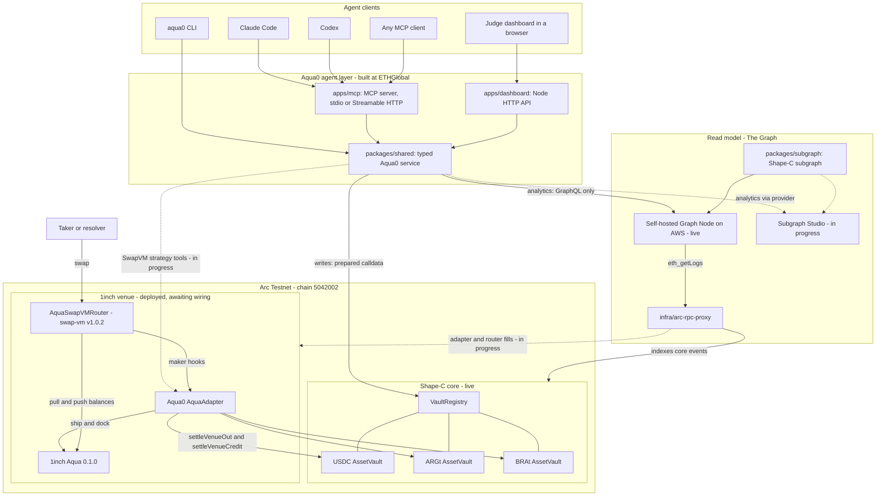
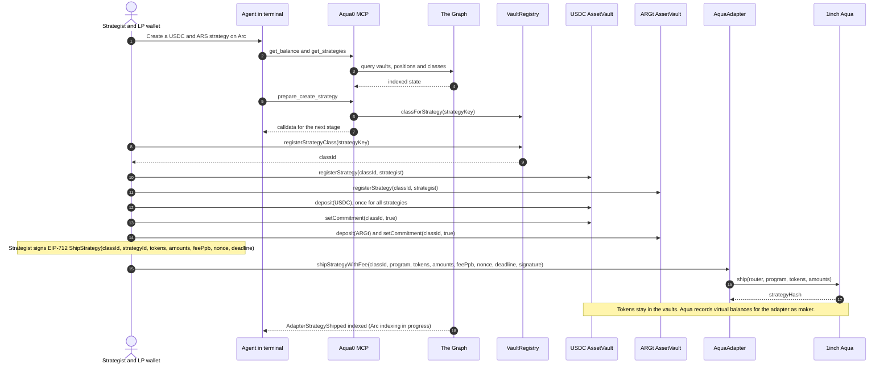
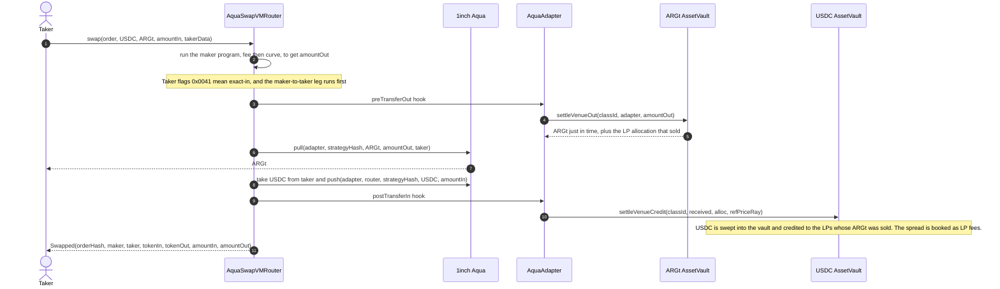
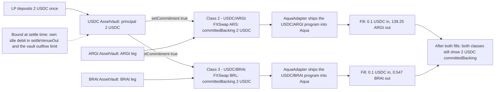
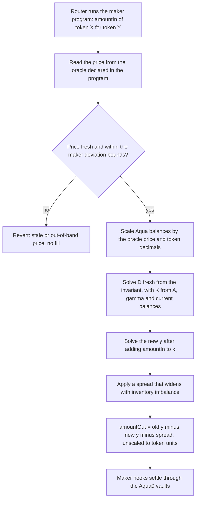

# Aqua0: one USDC deposit, many FX strategies, from your terminal

Aqua0 is a shared-liquidity protocol. A liquidity provider deposits once, and the same capital backs many trading strategies at the same time without being split between them. For ETHGlobal we brought Aqua0 to **Arc** and made it agent-native. From Claude Code, Codex or any MCP client you can read Aqua0's state from **The Graph**, then set up **1inch SwapVM** strategies that pair one USDC deposit with Argentine peso and Brazilian real stablecoin stand-ins, shipped through **1inch Aqua**. Tokens stay in Aqua0 vaults until a swap pulls them just in time. **FXSwap**, a new SwapVM instruction, prices every swap off an oracle instead of a fixed peg, because FX rates float.

**Status as of 2026-09-12.**
**Live:** Shape-C core and three vaults on Arc Testnet; the Graph-backed MCP server (prepare-only) and judge dashboard.
**Deployed, awaiting admin wiring:** 1inch Aqua, AquaSwapVMRouter and the Aqua0 AquaAdapter on Arc.
**Fork-proven:** one USDC deposit backing two FX strategies, both filled through the router on a fork of Arc.
**In progress:** the FXSwap instruction, MCP SwapVM strategy tools, AquaAdapter indexing on Arc, and Subgraph Studio publishing.

| Status label | Meaning |
| --- | --- |
| **Live** | Running on Arc Testnet or the public endpoints now; verifiable from the links below |
| **Deployed, awaiting wiring** | Contracts are on Arc Testnet but inert until the core admin sends the wiring transactions |
| **Fork-proven** | Executed end to end against a local fork of Arc (real Arc bytecode and state) |
| **In progress** | Being built by the team now; not claimed as working |
| **Planned** | Not started |

<!-- TODO(coordinator): add the demo video link here once uploaded. -->

## Contents

- [The demo in four steps](#the-demo-in-four-steps)
- [Why this matters](#why-this-matters)
- [How it works](#how-it-works)
- [Prize tracks](#prize-tracks)
- [Deployments and live endpoints](#deployments-and-live-endpoints)
- [Repository layout](#repository-layout)
- [Run it](#run-it)
- [Continuity: pre-existing vs built at ETHGlobal](#continuity-pre-existing-vs-built-at-ethglobal)
- [Status and roadmap](#status-and-roadmap)
- [Team](#team)

## The demo in four steps

Everything happens in an agentic terminal. The target conversation:

```text
you   > What capital does Aqua0 have on Arc, and which strategies are running?
agent > [The Graph: health, protocol_snapshot, get_balance, get_strategies]
        Vaults: USDC, ARGt, BRAt. Your USDC principal: 2 USDC, not yet committed.

you   > Create a strategy: my USDC paired with Argentine pesos, using FXSwap, on Arc.
agent > [derive strategy key, register class + vault legs, commit USDC, ship SwapVM program via AquaAdapter]
        Class "FXSwap ARS" is live in Aqua, backed by your 2 USDC.

you   > Now a second one: the same USDC paired with Brazilian reais.
agent > [same flow, second class, same deposit]
        Class "FXSwap BRL" is live in Aqua, backed by your 2 USDC.

you   > Query my balance again.
agent > Principal 2 USDC. Committed backing: FXSwap ARS 2 USDC, FXSwap BRL 2 USDC. Nothing was split.
```

*"One capital, Argentine pesos and Brazilian reais, both live, all from a terminal."*

The quoted numbers come from the Arc-fork run described below. What works today, step by step:

| Step | Tools | Status today |
| --- | --- | --- |
| 1. Query state | `health`, `protocol_snapshot`, `list_opportunities`, `get_balance`, `get_strategies`, `graph_query` | **Live.** Reads the Arc subgraph on a self-hosted Graph Node. Moving to Subgraph Studio is **in progress**. |
| 2. Create USDC/ARS strategy | `prepare_create_strategy`, `prepare_deposit`, `prepare_authorize_strategy` build the class, leg, deposit and commit calldata | **Live** (prepare-only) |
|  | Build the SwapVM program, sign the EIP-712 ship request, `AquaAdapter.shipStrategyWithFee`, quote, swap from the MCP | **In progress** (MCP SwapVM tools) |
|  | The same on-chain sequence end to end: [`ArcFxStrategies.s.sol`](packages/contracts/script/ArcFxStrategies.s.sol) | **Fork-proven.** Runs on Arc once the admin wiring lands. |
| 3. Create USDC/BRL strategy with the same USDC | Same as step 2 | Same as step 2 |
| 4. Query again: same USDC backs both | Fork run reads `committedBacking` for both classes | **Fork-proven.** The Graph read of adapter ship/fill events on Arc is **in progress**. |

<!-- TODO(coordinator): replace "MCP SwapVM tools" with exact tool names when they land, and flip statuses in this table. -->

**What to notice**

- **The same number twice is correct.** Shape-C commitments are *non-subtractive*: each committed class sees the LP's full principal as backing. Real outflow is still bounded at swap time, because `settleVenueOut` debits the class's own idle balance and the vault enforces an outflow limit. Shared backing never lets a vault pay out more than it holds.
- **No tokens move when a strategy is created.** Aqua records virtual balances for the AquaAdapter (the maker). The vault releases tokens only inside a swap, through the maker hooks.
- **The Graph is the read model.** Every analytics answer comes from indexed entities, with no silent RPC fallback. RPC is used only to read `classForStrategy` so the agent never guesses a class id, and to send writes.
- **Official 1inch contracts, unmodified,** are deployed on Arc: aqua 0.1.0 and swap-vm v1.0.2.
- **The public agent endpoint holds no key.** It prepares calldata, and a wallet signs.

**Fallback if FXSwap is not ready:** the same flow runs with swap-vm's existing instructions, `[FlatFeeAmountIn][PeggedSwap]`, with the FX price pinned in the curve's rate multipliers. The fork proof used this, and it is a fixed-price curve that does not follow a moving FX rate. See [`docs/DEMO.md`](docs/DEMO.md) for the full runbook.

## Why this matters

### One deposit, many strategies

In a conventional AMM, capital is locked per pool. An LP who wants to make markets in USDC/ARS and USDC/BRL has to split the USDC between them, and each pool sits idle most of the time. In Aqua0's Shape-C architecture, an LP deposits once into a per-asset `AssetVault` and commits that principal to many strategy classes. Committing to strategy A does not reduce what strategy B can use. Capital is consumed only when a swap actually settles, and settlement is atomic and bounded by the vault. The vault serves both strategies as long as they are not both drained at once.

### FX stablecoins on Arc

Local-currency stablecoins trade against USDC, and their liquidity is thin and fragmented across pairs. Arc is USDC-native: USDC is the gas asset, and `0x3600…0000` is its ERC-20 interface. That makes USDC the natural quote asset for FX. With Aqua0, a USDC holder can make markets in several Latin American currencies with a single balance and earn fees in each. The demo uses two open-mint **testnet demo tokens**, ARGt and BRAt, modelled on ARS and BRL stablecoins. They are not issued stablecoins, and no issuer is a partner.

### Why FXSwap: a stateless, oracle-anchored curve

swap-vm's `PeggedSwap` assumes parity: a curve centred at a fixed ratio. FX pairs float. A pegged curve leaves liquidity at a stale price, and arbitrageurs take the difference from LPs.

FXSwap adapts the Curve CryptoSwap invariant (here `n = 2`):

```text
K · D^(n-1) · Σx  +  Πx  =  K · D^n  +  (D/n)^n
K  = A · K0 · γ² / (γ + 1 − K0)²
K0 = Πx · n^n / D^n
```

CryptoSwap pools keep state that a SwapVM position cannot have, because SwapVM positions are programs executed per swap, not pools with storage:

| | Curve CryptoSwap pool | FXSwap instruction |
| --- | --- | --- |
| Price reference | Internal `price_scale`, moved by an EMA | External oracle price read on every swap, from the feed the maker declares in its program |
| Repricing | `tweak_price`, gated by `xcp_profit` (repeg brake) | None to maintain. `D` is computed fresh each swap from current balances scaled by the oracle price |
| Stale-price protection | Repeg only when profitable | The maker sets maximum staleness and deviation; the instruction reverts on a stale or out-of-band price |
| LP protection against one-sided flow | Pool fee schedule | Spread that widens with inventory imbalance, in the style of Lifinity and DODO PMM |
| Oracle kinds | n/a | Oracle address in the program today; signed pull prices as a future oracle kind |

**Status: In progress** in [`packages/contracts`](packages/contracts). A router build that includes FXSwap is allowed under the 1inch rules ("redeploying a modified SwapVM is allowed").

<!-- TODO(coordinator): add the FXSwap opcode index, program argument layout, oracle interface, and whether it ships as a new AquaSwapVMRouter build, once the contracts workstream lands. -->

## How it works

### System architecture



- **Agent layer (built at ETHGlobal).** `packages/shared` is the single typed service. The MCP server, CLI and dashboard are thin shells over it, so every client gets the same reads and the same guarded writes.
- **Read model.** The Shape-C subgraph indexes vaults, LP positions, strategy classes, commitments, fees and venue settlement. Arc's public RPC limits topic-OR lists in `eth_getLogs`, so the Graph Node indexes through a small splitting proxy.
- **Write model.** The Shape-C core holds capital and accounting. The AquaAdapter is the Aqua *maker* for every Aqua0 strategy: it ships SwapVM programs into Aqua and settles swaps against the vaults through maker hooks.

More detail: [`docs/ARCHITECTURE.md`](docs/ARCHITECTURE.md).

### Creating a strategy



- **Strategy key.** `keccak256(abi.encode(strategist, chainId, sorted token0/token1, keccak256(trimmed label)))`, derived identically by the MCP, the Aqua0 web app, and the Foundry script. If `classForStrategy` returns `0`, the tool returns only the `registerStrategyClass` stage and tells the agent to re-read after mining.
- **Program.** The SwapVM order has `maker = AquaAdapter` and maker traits `useAqua (1<<254) | postTransferIn (1<<251) | preTransferOut (1<<250)`, the only combination the adapter accepts. The fork proof uses `[FlatFeeAmountIn(feePpb)][PeggedSwap(x0, y0, linearWidth, rateLt, rateGt)]`, which is opcodes 21 and 31 on swap-vm v1.0.2. FXSwap replaces the curve instruction.
- **Signature.** EIP-712 domain `AquaAdapter`, version `1`, verifying contract = the adapter. The signature is ERC-1271-aware and nonce-protected.

### A swap through the maker hooks



The adapter handles either transfer order. The second hook to run performs the counter vault's `settleVenueCredit`.

### Shared backing



The figures come from the **fork-proven** run of [`ArcFxStrategies.s.sol`](packages/contracts/script/ArcFxStrategies.s.sol) on a local fork of Arc. On Arc Testnet itself, class ids are assigned at registration and depend on the signing strategist. A separate Base-fork test, [`scripts/test-shared-backing-fork.sh`](scripts/test-shared-backing-fork.sh), checks the commitment invariant on its own: one 100 USDC principal shows 100 USDC `committedBacking` and `availableFor` on two classes.

### FXSwap per-swap execution



**Status: In progress.** This diagram describes the design. The instruction is not deployed.

## Prize tracks

| Partner | Prize | Fit today |
| --- | --- | --- |
| The Graph | Best AI Tooling or AI Use Case with The Graph (Continuity pool) | Strong on tooling. The Graph provider endpoint is **in progress**. |
| The Graph | Best Use of Composable or Standardized Graph Products | Stretch target, **planned** |
| Circle / Arc | Best DeFi / Onchain Finance Application | Arc + USDC **live**, swaps **fork-proven**, testnet only |
| Circle / Arc | Best Agentic Economy Application with Circle Agent Stack | Partial. Agent reads and prepares; Circle Agent Stack **planned** |
| Circle / Arc | Best DeFi or Agentic Application (Continuity) | Same as the DeFi entry, with the continuity split documented |
| 1inch | Build an Aqua App, and Build an Aqua App (Continuity) | Official Aqua + SwapVM **deployed** on Arc, positions **fork-proven**, FXSwap **in progress** |

<!-- TODO(coordinator): confirm which prizes the team registered for and remove any rows that do not apply. -->

### The Graph: Best AI Tooling or AI Use Case with The Graph (Continuity pool)

**Prizes:** $2,500 / $1,500 / $1,000.

**What The Graph is looking for.** Tooling that makes The Graph easier to use from AI environments (MCP servers, agent skills, x402, A2A, plugins, client configs), or AI agents and apps that use The Graph as their live data source. The Graph must be load-bearing, through Subgraphs, the Subgraph MCP, or Substreams. Data must come live from a Graph provider such as Subgraph Studio with an API key; mocked, local or static data does not qualify. The agent must do meaningful work with the data (reasoning, decisions, automation, or a natural-language interface), not just print query results. Tooling must be reusable infrastructure, open source with a clear README or SKILL.md so judges can run it, with a public repo and a 2–4 minute demo video. In the Continuity pool, pre-existing work must be documented and only event work is judged.

**How Aqua0 addresses it**

| Requirement | What Aqua0 does | Evidence | Status |
| --- | --- | --- | --- |
| The Graph is load-bearing | Every analytics tool (`get_balance`, `get_strategies`, `get_fees`, `list_opportunities`, `protocol_snapshot`, `health`, `graph_query`) reads subgraph entities. A Graph failure surfaces as an error, with no RPC fallback. | [`packages/shared/src/service.ts`](packages/shared/src/service.ts), [`packages/shared/src/graph.ts`](packages/shared/src/graph.ts), [`packages/subgraph`](packages/subgraph) | **Live** |
| Live data from a Graph provider | Today the Arc subgraph is served by the team's self-hosted Graph Node, which does not meet this requirement on its own. Publishing the Arc subgraph to Subgraph Studio and pointing the public MCP at it is underway. | [`docs/THE_GRAPH_TRACK.md`](docs/THE_GRAPH_TRACK.md), [`scripts/deploy-graph-studio.sh`](scripts/deploy-graph-studio.sh) | **In progress** |
| Meaningful work with the data | The agent answers capital questions in natural language and decides whether a strategy class already exists (strategy key plus `classForStrategy`). It stages multi-transaction strategy setup and explains indexed state changes after mining. The shared-backing read and quote reasoning land with the SwapVM tools. | [`apps/mcp/src/index.ts`](apps/mcp/src/index.ts), [`packages/shared/src/write.ts`](packages/shared/src/write.ts) | **Live** for reads and prepare; SwapVM tools **in progress** |
| Reusable infrastructure | Any MCP client can use the server over stdio or Streamable HTTP. The typed service is a standalone package with a CLI on top. The Arc manifest is generated from the canonical manifest for any Shape-C deployment. The Arc RPC proxy works for any Graph Node on Arc. | [`apps/mcp`](apps/mcp), [`apps/cli`](apps/cli), [`packages/subgraph/scripts/generate-arc-manifest.mjs`](packages/subgraph/scripts/generate-arc-manifest.mjs), [`infra/arc-rpc-proxy`](infra/arc-rpc-proxy) | **Live** |
| Open source, runnable from docs | This README ([Run it](#run-it)), `docs/`, `.env.example`, `pnpm check-env`, and CI that builds the Arc manifest | [`.github/workflows/ci.yml`](.github/workflows/ci.yml) | **Live**. A SKILL.md is **planned**. |
| Public repo + 2–4 min video | Public GitHub repo; video link added at submission | — | Video pending |
| Continuity documentation | Pre-existing vs event work is listed below and in [`docs/CONTINUITY.md`](docs/CONTINUITY.md) | Git history from 2026-09-05 | **Done** |

### The Graph: Best Use of Composable or Standardized Graph Products

**Prizes:** $2,500 / $1,500 / $1,000.

**What The Graph is looking for.** Projects that compose two or more Graph products, or build on a standardized schema (for example Messari Standardized Subgraphs, standardized Substreams, or the Subgraph MCP for cross-protocol analysis), using live provider data. Querying a single subgraph does not qualify. Submissions should show what the standards make possible.

**Honest status: not achieved, Planned.** Aqua0 queries one custom subgraph today. A qualifying version would add an MCP tool that composes the Aqua0 subgraph with The Graph's Subgraph MCP, or with a standardized DEX subgraph on a network that has one. The tool would benchmark an Aqua0 strategy's fills and fees against the same pair on other venues, so the agent can recommend where to commit shared capital. Prerequisites: the Studio deployment above, plus a supported network with standardized DEX coverage for the compared pairs.

### Circle / Arc: Best DeFi / Onchain Finance Application

**Prize:** $3,500, of which $2,500 is paid only if the project is deployed to Arc Mainnet by September 30.

**What Circle is looking for.** Stablecoin-native DeFi on Arc: lending, swaps, liquidity, FX, yield, payments, treasury. Meaningful use of Arc and USDC; advanced programmable money flows such as conditional payments, onchain automation and multi-step settlement; App Kits where relevant; and a clear case for why stablecoin-native infrastructure changes what is possible. Core products: Arc, USDC, App Kits, Circle Wallets, Circle Contracts, CCTP, Gateway, StableFX. Every Arc prize requires a functional MVP with a working frontend and backend plus an architecture diagram, a video demo covering core functions and use of Circle developer tools with detailed documentation, and a GitHub repo link.

**How Aqua0 addresses it**

| Criterion | What Aqua0 does | Evidence | Status |
| --- | --- | --- | --- |
| Stablecoin-native DeFi on Arc | USDC-quoted FX liquidity: one USDC vault backs USDC/ARS and USDC/BRL strategies simultaneously | [Deployments](#deployments-and-live-endpoints), [`docs/ARC_DEPLOYMENT.md`](docs/ARC_DEPLOYMENT.md) | Core **live**; venue **deployed, awaiting wiring** |
| Meaningful use of Arc and USDC | Arc's native USDC is the shared quote asset held by the Shape-C vault; all contracts are on Arc Testnet | [`deployments/arc-testnet.json`](deployments/arc-testnet.json) | **Live** |
| Advanced programmable money flows | One swap runs a maker program, pulls just-in-time from the vault, pulls from Aqua to the taker, pushes the taker's input into Aqua, sweeps it into the counter vault, credits the LPs that sold, and books the spread as fees, all atomically. FXSwap adds an oracle-conditional fill: no fill on a stale price. | [Swap sequence](#a-swap-through-the-maker-hooks), [`ArcFxStrategies.s.sol`](packages/contracts/script/ArcFxStrategies.s.sol) | **Fork-proven**; FXSwap **in progress** |
| Why stablecoin-native changes things | On Arc the LP's principal, fees and gas are all USDC. FX strategies quote local stablecoins directly against it, and one balance can make several FX markets. That is safe only because settlement is atomic and each outflow is bounded by the vault at swap time. | [Why this matters](#why-this-matters) | Design |
| App Kits, Circle Wallets, Circle Contracts, CCTP, Gateway, StableFX | Not integrated | [`docs/ARC_TRACK.md`](docs/ARC_TRACK.md) | **Planned** |
| Working frontend + backend + architecture diagram | Judge dashboard and JSON API; MCP server; contracts; diagrams above | [Dashboard](https://ethglobal-demo.18-207-103-187.nip.io/), [`apps/dashboard`](apps/dashboard) | **Live** |
| Video + documentation | README and `docs/`; video link added at submission | — | Video pending |
| Arc Mainnet (for the conditional $2,500) | Not deployed | — | **Planned** |

### Circle / Arc: Best Agentic Economy Application with Circle Agent Stack

**Prize:** $3,500, of which $2,500 is mainnet-conditional.

**What Circle is looking for.** Autonomous agents that transact on Arc: they hold wallets, make payments, manage risk and settle jobs in USDC, with clear decision logic tied to real signals. Agent Stack is used for wallets, payments and onchain actions, plus Nanopayments, Paymaster or App Kits where relevant. Core products: Arc, USDC, Agent Stack, App Kits, Circle Wallets, Circle Contracts, Nanopayments, Paymaster. The common Arc requirements above also apply.

**How Aqua0 addresses it: partial fit today**

| Criterion | What Aqua0 does | Status |
| --- | --- | --- |
| Agent acts on Arc | The agent reads Aqua0 state and prepares every Arc transaction for strategy setup. A local MCP in `MCP_WRITE_MODE=execute` can send guarded writes (`create_strategy`, `authorize_strategy`), on Arc Testnet or local Anvil only. The public endpoint is prepare-only. | **Live** (prepare); guarded execute **live** locally |
| Decision logic tied to real signals | Indexed vault capital, commitments, strategy classes and fees from The Graph. The FXSwap oracle price and staleness checks are added with the SwapVM tools. | Graph signals **live**; oracle signals **in progress** |
| Agent holds a wallet and pays in USDC | No Circle Wallet or Agent Stack integration. Execution uses a locally configured key. | **Planned** |
| Nanopayments / Paymaster / App Kits | Not integrated. Candidates: per-quote USDC nanopayments; Paymaster-sponsored strategist and LP transactions. | **Planned** |

We do not claim Agent Stack usage. Next steps are in [`docs/ARC_TRACK.md`](docs/ARC_TRACK.md).

### Circle / Arc: Best DeFi or Agentic Application (Continuity)

**Prize:** $3,000, of which $2,000 is mainnet-conditional. This is either of the two Arc applications above, registered in the Continuity track. Aqua0's entry is the DeFi application. The pre-existing Shape-C contracts and AquaAdapter are separated from the work done at the event: the Arc deployments, venue, strategy scripts, FXSwap, subgraph, MCP, CLI, dashboard and RPC proxy. See [Continuity](#continuity-pre-existing-vs-built-at-ethglobal).

### 1inch: Build an Aqua App, and Build an Aqua App (Continuity)

**Prizes:** Build an Aqua App $2,500 / $1,500 / $1,000; Continuity $1,500 / $500.

**What 1inch is looking for.** A custom Aqua app implementing a sophisticated DeFi position, demonstrated through test scripts or a UI. Using SwapVM scores higher, and opcodes may be modified or new instructions defined. The official Aqua and SwapVM contracts must be used; redeploying a modified SwapVM is allowed. The demo must show onchain execution of token transfers (local forks are fine), and the repo needs a real git history, not a single final-day commit.

**How Aqua0 addresses it**

| Requirement | What Aqua0 does | Evidence | Status |
| --- | --- | --- | --- |
| Sophisticated DeFi position | Shared-backing FX market making. One vault deposit backs several SwapVM strategies that the AquaAdapter ships into Aqua as maker. Swaps settle just-in-time from Aqua0 vaults through maker hooks, crediting the LPs that sold and booking the spread as fees. | [Creating a strategy](#creating-a-strategy), [Swap sequence](#a-swap-through-the-maker-hooks) | **Fork-proven** |
| SwapVM use, new instructions | Programs are SwapVM bytecode, `[FlatFeeAmountIn][PeggedSwap]` today. **FXSwap** is a new instruction: an oracle-anchored CryptoSwap-style curve with an inventory spread. | [`ArcFxStrategies.s.sol`](packages/contracts/script/ArcFxStrategies.s.sol), [Why FXSwap](#why-fxswap-a-stateless-oracle-anchored-curve) | Existing opcodes **fork-proven**; FXSwap **in progress** |
| Official Aqua / SwapVM contracts | aqua 0.1.0 `AquaRouter` and swap-vm v1.0.2 `AquaSwapVMRouter`, built from unmodified upstream source with upstream compiler settings (`evm_version = cancun` for Arc) and deployed on Arc Testnet | [`packages/contracts/script/DeployAquaVenue.s.sol`](packages/contracts/script/DeployAquaVenue.s.sol), [`packages/contracts/foundry.toml`](packages/contracts/foundry.toml), [broadcast](packages/contracts/broadcast/DeployAquaVenue.s.sol/5042002/run-latest.json) | **Deployed**, awaiting wiring |
| Onchain token transfers in the demo | Arc-fork run: the router pulls ARGt and BRAt from Aqua to the taker and pushes the taker's USDC into Aqua, with the adapter hooks moving tokens out of and into the vaults: 0.1 USDC → 139.25 ARGt, 0.1 USDC → 0.547 BRAt | [`run-arc-fx-strategies.sh`](packages/contracts/script/run-arc-fx-strategies.sh) | **Fork-proven**; Arc Testnet after wiring |
| Positions via test scripts | Foundry script registers classes, deposits, commits, signs, ships and swaps | [`packages/contracts/README.md`](packages/contracts/README.md) | **Fork-proven** |
| Proper git history | 48 commits from four authors on 2026-09-05, 2026-09-08 and 2026-09-12; the contracts work is in scoped commits (`540e420`, `c1115fc`, `9b910ef`, `c338e16`, `e1c1a95`) | `git log` | **Done** |
| Continuity split | AquaAdapter and Shape-C vaults are pre-existing. The Arc venue deployment, strategy scripts and FXSwap are event work. | [`docs/CONTINUITY.md`](docs/CONTINUITY.md) | **Done** |

**SwapVM wire facts (swap-vm v1.0.2 `AquaSwapVMRouter`)**

| Item | Value |
| --- | --- |
| `FlatFeeAmountIn` opcode | 21 (`uint32` fee, 1e9 = 100%) |
| `PeggedSwap` opcode | 31 (`x0, y0, linearWidth, rateLt, rateGt`, 5 × `uint256`) |
| Maker traits accepted by AquaAdapter | `useAqua (1<<254) \| postTransferIn (1<<251) \| preTransferOut (1<<250)` |
| Taker data for an exact-in swap | 22-byte header `uint160(0) ++ uint16(0x0041)` (isExactIn, transferFrom + Aqua push) |
| Taker approval target | The router (it pulls tokenIn and pushes it into Aqua) |

## Deployments and live endpoints

Arc Testnet, chain id `5042002`. Explorer: `https://testnet.arcscan.app`. Full records: [`deployments/arc-testnet.json`](deployments/arc-testnet.json) and [`docs/ARC_DEPLOYMENT.md`](docs/ARC_DEPLOYMENT.md).

**Shape-C core: Live.** Pre-existing contracts deployed by the team at block `60613306`.

| Contract | Address |
| --- | --- |
| VaultRegistry | [`0x9E094b21C4263e0BE5BEffa0f8296B3fd982fFFf`](https://testnet.arcscan.app/address/0x9E094b21C4263e0BE5BEffa0f8296B3fd982fFFf) |
| VaultFactory | [`0x879C0c90205172a8DD66afB8124994D866372FBa`](https://testnet.arcscan.app/address/0x879C0c90205172a8DD66afB8124994D866372FBa) |
| Composer | [`0x656F28021a624aDfA0d92dDFdBb20577674aFEC7`](https://testnet.arcscan.app/address/0x656F28021a624aDfA0d92dDFdBb20577674aFEC7) |
| FillerRegistry | [`0xa8e08346DD7b6809C47A920c365bCC987Ea91297`](https://testnet.arcscan.app/address/0xa8e08346DD7b6809C47A920c365bCC987Ea91297) |
| USDC AssetVault | [`0x99c2ab427b29dB1Cc14D228d970596015d1C4429`](https://testnet.arcscan.app/address/0x99c2ab427b29dB1Cc14D228d970596015d1C4429) |
| ARGt AssetVault | [`0x8a3d6188C58d7877499592E179DfE3bd80c4F460`](https://testnet.arcscan.app/address/0x8a3d6188C58d7877499592E179DfE3bd80c4F460) |
| BRAt AssetVault | [`0xEcB132648B781ec5742b582c526243Eeef900785`](https://testnet.arcscan.app/address/0xEcB132648B781ec5742b582c526243Eeef900785) |

**1inch venue and adapter: Deployed and verified, awaiting the core admin's wiring transactions** (registry allowlist and `VENUE_SETTLER_ROLE` on the three vaults) before live swaps.

| Contract | Source | Address |
| --- | --- | --- |
| Aqua (`AquaRouter`) | 1inch aqua 0.1.0 | [`0x490d2eceD9aCF99e1db6090f820775bFa70020D4`](https://testnet.arcscan.app/address/0x490d2eceD9aCF99e1db6090f820775bFa70020D4) |
| `AquaSwapVMRouter` | 1inch swap-vm v1.0.2, unmodified | [`0xb20bc70b485eC1352C190d26fCaB1959d219F763`](https://testnet.arcscan.app/address/0xb20bc70b485eC1352C190d26fCaB1959d219F763) |
| `AquaAdapter` | Aqua0 (pre-existing contract) | [`0xbF72D34b804636496c3308796908152b82624Ca5`](https://testnet.arcscan.app/address/0xbF72D34b804636496c3308796908152b82624Ca5) |

<!-- TODO(coordinator): flip the venue to "Live" with wiring tx links once the admin wiring lands. -->

**Tokens**

| Token | Address | Decimals | Notes |
| --- | --- | --- | --- |
| USDC | [`0x3600000000000000000000000000000000000000`](https://testnet.arcscan.app/address/0x3600000000000000000000000000000000000000) | 6 | Arc's native USDC ERC-20 interface |
| ARGt | [`0xd8dE250970842A581f89E885dA0F5165037714Ef`](https://testnet.arcscan.app/address/0xd8dE250970842A581f89E885dA0F5165037714Ef) | 18 | Testnet demo token standing in for an ARS stablecoin |
| BRAt | [`0xa9482a878A3784663512f0Bf8d0be17aD6DEA38E`](https://testnet.arcscan.app/address/0xa9482a878A3784663512f0Bf8d0be17aD6DEA38E) | 18 | Testnet demo token standing in for a BRL stablecoin |

**Strategy classes on Arc.** Class 1 (USDC/ARGt) was registered earlier by the core deployer and is not funded (legacy). The two-strategy flow creates its own classes when it runs.

**Live endpoints**

| Endpoint | URL | Notes |
| --- | --- | --- |
| MCP (Streamable HTTP) | `https://ethglobal-mcp.18-207-103-187.nip.io/mcp` | Prepare-only, no signing key |
| MCP health | `https://ethglobal-mcp.18-207-103-187.nip.io/health` | Live Graph `_meta` query |
| Judge dashboard | `https://ethglobal-demo.18-207-103-187.nip.io/` | Arc vaults, live Graph data, prepare-only calldata |
| Arc Testnet RPC | `https://rpc.testnet.arc.network` | Public |
| Graph data source | Self-hosted Graph Node (AWS) | Subgraph Studio publishing **in progress** |

The pre-existing Aqua0 Base mainnet deployment and its provider-ready manifest are documented in [`packages/subgraph/README.md`](packages/subgraph/README.md).

## Repository layout

```text
apps/
  mcp/              MCP server (stdio + Streamable HTTP) exposing typed Aqua0 tools
  cli/              aqua0 CLI with the same analytics and write-preparation commands
  dashboard/        Judge dashboard: static UI + Node JSON API, prepare-only
packages/
  shared/           Graph client, analytics service, strategy-key derivation, calldata, execution guard
  subgraph/         Shape-C subgraph: schema, mappings, Base manifest, Arc manifest generator
  contracts/        Foundry: 1inch Aqua + SwapVM venue on Arc, AquaAdapter deploy, FX strategy scripts
deployments/        Public Arc Testnet addresses and strategy records (JSON)
infra/
  arc-rpc-proxy/    eth_getLogs topic-splitting and rate-pacing proxy for Graph Node on Arc
deploy/aws/         Docker compose and Caddy examples for the public MCP and dashboard
scripts/            Env check, Base-fork shared-backing proof, Arc USDC demo tx printer, Studio deploy
docs/               Architecture, Arc deployment, track notes, demo runbook, continuity scope
Dockerfile.mcp      MCP container
Dockerfile.dashboard  Dashboard container
.github/workflows/  CI: test, typecheck, build, lint, subgraph event check, Arc manifest build
```

## Run it

### Connect to the public MCP (no install)

Claude Code:

```bash
claude mcp add --transport http aqua0 https://ethglobal-mcp.18-207-103-187.nip.io/mcp
```

Codex (`~/.codex/config.toml`):

```toml
[mcp_servers.aqua0]
url = "https://ethglobal-mcp.18-207-103-187.nip.io/mcp"
```

Any client that supports only stdio servers can bridge with `mcp-remote`:

```json
{
  "mcpServers": {
    "aqua0": {
      "command": "npx",
      "args": ["-y", "mcp-remote", "https://ethglobal-mcp.18-207-103-187.nip.io/mcp"]
    }
  }
}
```

Try:

```text
Use the Aqua0 MCP tools. Check health, show the protocol snapshot, and list strategy opportunities on Arc. Tell me which data came from The Graph.
```

```text
Prepare an Aqua0 strategy on Arc Testnet for strategist 0x..., pairing Arc USDC (0x3600000000000000000000000000000000000000) with BRAt (0xa9482a878A3784663512f0Bf8d0be17aD6DEA38E), using the USDC and BRAt Shape-C vaults. Do not broadcast anything.
```

### Local setup

Requirements: Node 22, pnpm 9. Foundry is needed for `packages/contracts`.

```bash
pnpm install
cp .env.example .env        # fill GRAPH_ENDPOINT at minimum; check-env loads .env
pnpm check-env
pnpm typecheck
pnpm build
pnpm test
```

Run the MCP locally:

```bash
pnpm --filter @aqua0/mcp dev                                          # stdio
MCP_TRANSPORT=http HOST=127.0.0.1 PORT=3000 pnpm --filter @aqua0/mcp dev  # http://127.0.0.1:3000/mcp
```

Register a local stdio build with Claude Code:

```bash
pnpm build
claude mcp add aqua0-local \
  -e GRAPH_ENDPOINT=https://your-subgraph-endpoint \
  -e WRITE_RPC_URL=https://rpc.testnet.arc.network \
  -e WRITE_CHAIN_ID=5042002 \
  -e VAULT_REGISTRY_ADDRESS=0x9E094b21C4263e0BE5BEffa0f8296B3fd982fFFf \
  -- node "$PWD/apps/mcp/dist/index.js"
```

### Environment variables

| Variable | Used by | Purpose |
| --- | --- | --- |
| `GRAPH_ENDPOINT` | MCP, CLI, dashboard | **Required.** GraphQL endpoint for the Aqua0 subgraph |
| `GRAPH_AUTH_TOKEN` | MCP, CLI, dashboard | Optional bearer token for Graph reads, for example a Studio query key. Never returned by `info`. |
| `GRAPH_NETWORK` | MCP, CLI, dashboard | Network label reported by health and info, for example `arc-testnet` |
| `WRITE_RPC_URL` | MCP, CLI, dashboard | RPC for the `classForStrategy` read and, optionally, guarded writes |
| `WRITE_CHAIN_ID` | MCP, CLI, dashboard | Chain id for strategy-key derivation and the execution guard (`5042002` on Arc) |
| `VAULT_REGISTRY_ADDRESS` | MCP, CLI, dashboard | Shape-C `VaultRegistry` |
| `MCP_WRITE_MODE` | MCP, CLI | `prepare` (default) or `execute` |
| `WRITE_PRIVATE_KEY` | MCP, CLI | Secret, needed only for guarded execute mode. Never logged or returned. |
| `MCP_TRANSPORT` | MCP | `stdio` (default) or `http` |
| `HOST`, `PORT` | MCP, dashboard | HTTP bind settings |
| `AQUA0_WORKSPACE_ROOT` | Dashboard | Optional override for the repository root it reads `deployments/` and `docs/` from |

### MCP tools

| Tool | Source | Description | Status |
| --- | --- | --- | --- |
| `health` | Graph | Cheap `_meta` query; reports configured vs reachable | Live |
| `info` | Config | Public chain and write config, secrets redacted | Live |
| `get_balance` | Graph | LP vault positions: raw principal, credit, deployed and free units, plus vault metadata | Live |
| `get_strategies` | Graph | LP strategy positions joined with indexed `StrategyVault` and vault metadata | Live |
| `get_fees` | Graph | LP `StrategyFeeAccruedEvent` history, optionally for a time window, with raw-unit totals | Live |
| `list_opportunities` | Graph | Live, unpaused strategy vaults plus recent V4 swap and Aqua lifecycle events | Live |
| `protocol_snapshot` | Graph | Vault and strategy counts and raw-unit totals | Live |
| `graph_query` | Graph | Raw GraphQL escape hatch for advanced agents | Live |
| `prepare_create_strategy` | RPC read + ABI encode | Derives the strategy key, reads `classForStrategy`, returns the next stage's calldata | Live |
| `prepare_authorize_strategy` | ABI encode | `AssetVault.setCommitment` calldata | Live |
| `prepare_deposit` | ABI encode | `AssetVault.deposit` calldata in raw units | Live |
| `prepare_withdraw` | ABI encode | `AssetVault.withdraw` calldata in raw units | Live |
| `create_strategy` | Guarded write | Registered only when `MCP_WRITE_MODE=execute`; enforces the execution guard | Live (local execute mode) |
| `authorize_strategy` | Guarded write | Registered only when `MCP_WRITE_MODE=execute`; calls `setCommitment` under the guard | Live (local execute mode) |
| SwapVM strategy tools: create strategy (program + EIP-712 ship through AquaAdapter), deposit, quote, swap, shared-backing read | Graph + RPC + ABI encode | Terminal flow for demo steps 2–4 | **In progress** |

The tools return raw integer units as strings and never invent token decimals. Natural-language clients call the typed tools directly; there is no custom text parser.

### CLI

```bash
pnpm --filter @aqua0/cli dev health
pnpm --filter @aqua0/cli dev balance 0x...
pnpm --filter @aqua0/cli dev strategies 0x...
pnpm --filter @aqua0/cli dev fees 0x... 86400
pnpm --filter @aqua0/cli dev opportunities
pnpm --filter @aqua0/cli dev snapshot
pnpm --filter @aqua0/cli dev create-strategy --strategist 0x... --token0 0x... --token1 0x... --label "FXSwap ARS" --vault 0x... --vault 0x...
pnpm --filter @aqua0/cli dev authorize --vault 0x... --strategy-id 2 --backing true
```

CLI write commands honour the same `MCP_WRITE_MODE` guard as the MCP.

### Dashboard

```bash
GRAPH_ENDPOINT=https://your-subgraph-endpoint \
WRITE_RPC_URL=https://rpc.testnet.arc.network \
WRITE_CHAIN_ID=5042002 \
VAULT_REGISTRY_ADDRESS=0x9E094b21C4263e0BE5BEffa0f8296B3fd982fFFf \
pnpm --filter @aqua0/dashboard dev
```

Routes and the AWS compose setup are listed in [`docs/ARC_TRACK.md`](docs/ARC_TRACK.md).

### Contracts: fork and Arc

```bash
git submodule update --init packages/contracts/lib/swap-vm
(cd packages/contracts/lib/swap-vm && npm install --ignore-scripts)
(cd packages/contracts && forge build)
```

The `AquaAdapter` is pre-existing Aqua0 code, compiled from a local Aqua0 contracts checkout (`AQUA0_CONTRACTS_DIR`).

```bash
cd packages/contracts

# 1. Venue + adapter on a local fork of Arc (impersonates the core admin for wiring)
anvil --fork-url https://rpc.testnet.arc.network --port 8577
MODE=fork AQUA0_CONTRACTS_DIR=<path-to-aqua0-contracts> DEPLOYER=<address> ./script/deploy-arc-aqua-venue.sh

# 2. One USDC deposit, two FX strategies, one swap each (fork)
MODE=fork DEPLOYER=<address> KEYSTORE_ACCOUNT=<foundry-keystore-account> KEYSTORE_PASSWORD_FILE=<path> \
AQUA_ADAPTER=<printed-by-step-1> AQUA_SWAPVM_ROUTER=<printed-by-step-1> ./script/run-arc-fx-strategies.sh

# Same flow on Arc Testnet, after the admin wiring lands (reads deployments/arc-testnet.json)
MODE=arc DEPLOYER=<address> KEYSTORE_ACCOUNT=<foundry-keystore-account> KEYSTORE_PASSWORD_FILE=<path> ./script/run-arc-fx-strategies.sh
```

Tunables: `USDC_DEPOSIT` (default 2 USDC), `USDC_SHIP`, `USDC_SWAP_IN`, `FEE_PPB`, `LINEAR_WIDTH`, `ARS_PER_USDC_E2`, `BRL_PER_USDC_E2`. Both scripts refuse any RPC whose chain id is not `5042002`.

**Fork caveat:** Arc's USDC ERC-20 interface calls native precompiles that anvil does not implement. On a fork only, the script puts a plain ERC-20 at the USDC address; everything else is real Arc bytecode and state. Details: [`packages/contracts/README.md`](packages/contracts/README.md).

Base-fork commitment proof, run against the pre-existing Base deployment:

```bash
./scripts/start-base-fork.sh
./scripts/test-shared-backing-fork.sh
```

### Subgraph

```bash
pnpm --filter @aqua0/subgraph test:required-events
pnpm --filter @aqua0/subgraph codegen
pnpm --filter @aqua0/subgraph graph:build

PUBLIC_ARC_VAULT_FACTORY=0x879C0c90205172a8DD66afB8124994D866372FBa \
PUBLIC_ARC_VAULT_REGISTRY=0x9E094b21C4263e0BE5BEffa0f8296B3fd982fFFf \
PUBLIC_ARC_COMPOSER=0x656F28021a624aDfA0d92dDFdBb20577674aFEC7 \
PUBLIC_ARC_FILLER_REGISTRY=0xa8e08346DD7b6809C47A920c365bCC987Ea91297 \
PUBLIC_ARC_START_BLOCK=60613306 \
pnpm --filter @aqua0/subgraph generate:arc
pnpm --filter @aqua0/subgraph exec graph build subgraph.arc.yaml
```

Indexing the Arc venue (AquaAdapter strategies and AquaSwapVMRouter `Swapped` fills, through `PUBLIC_ARC_AQUA_ADAPTER` and `PUBLIC_ARC_AQUA_SWAPVM_ROUTER`) is **in progress**; see [`packages/subgraph/README.md`](packages/subgraph/README.md). Provider deployment, including the in-progress `NETWORK=arc` Studio target: [`docs/THE_GRAPH_TRACK.md`](docs/THE_GRAPH_TRACK.md). Arc RPC proxy: [`infra/arc-rpc-proxy`](infra/arc-rpc-proxy).

### Execution safety

Preparation is the default. Execution requires all of: `MCP_WRITE_MODE=execute`, `WRITE_PRIVATE_KEY`, `WRITE_RPC_URL`, `WRITE_CHAIN_ID`, and either chain id `5042002` (Arc Testnet) or a local Anvil URL. The guard refuses Ethereum mainnet (`1`) and Base mainnet (`8453`). Writes fail on reverted receipts. Deposit and withdraw are preparation-only. The public AWS MCP and dashboard run prepare-only with no key.

## Continuity: pre-existing vs built at ETHGlobal

Aqua0 existed before the event. Only the right-hand column is submitted for judging.

| Pre-existing Aqua0 work | Built during ETHGlobal (this repo, from 2026-09-05) |
| --- | --- |
| Shape-C contracts: VaultRegistry, VaultFactory, Composer, FillerRegistry, AssetVault with non-subtractive commitments and venue settlement | Shape-C subgraph with canonical event indexing and a required-events check; Arc manifest generator |
| Aqua0 `AquaAdapter` (maker hooks, `shipStrategyWithFee`, EIP-712 strategist signatures) | Graph-backed typed service, MCP server (stdio + HTTP) with public AWS deployment, CLI, judge dashboard |
| Base mainnet Shape-C deployment | Arc Testnet deployment of the Shape-C core and USDC/ARGt/BRAt vaults |
| Strategy-key derivation in the Aqua0 web app | Arc RPC topic-splitting proxy for Graph Node |
| 1inch Aqua and SwapVM (official 1inch sources) | 1inch Aqua 0.1.0 + AquaSwapVMRouter + AquaAdapter deployed on Arc; Arc strategy scripts (fork-proven) |
| | Base-fork and Arc-fork shared-backing proofs |
| | FXSwap SwapVM instruction (**in progress**); MCP SwapVM strategy tools (**in progress**); AquaAdapter indexing on Arc and Subgraph Studio publishing (**in progress**) |

Details and locations: [`docs/CONTINUITY.md`](docs/CONTINUITY.md).

<!-- TODO(coordinator): add a public link to the pre-existing Aqua0 contracts repository if it is public. -->

## Status and roadmap

| Item | Status |
| --- | --- |
| Shape-C core + USDC/ARGt/BRAt vaults on Arc Testnet | **Live** |
| Graph-backed MCP (public, prepare-only), CLI, judge dashboard | **Live** |
| Arc subgraph on self-hosted Graph Node + Arc RPC proxy | **Live** |
| 1inch Aqua + AquaSwapVMRouter + Aqua0 AquaAdapter on Arc | **Deployed, awaiting admin wiring** |
| One USDC deposit backing two FX strategies, shipped and filled | **Fork-proven**; Arc Testnet run after wiring |
| FXSwap SwapVM instruction | **In progress** |
| MCP SwapVM strategy tools (create, deposit, quote, swap, shared-backing read) | **In progress** |
| AquaAdapter + router fill indexing on Arc; Subgraph Studio publishing | **In progress** |
| SKILL.md for agent clients | Planned |
| Composable Graph tool (Aqua0 subgraph + Subgraph MCP or standardized DEX data) | Planned |
| Circle Wallets / Agent Stack for agent-held wallets; Nanopayments; Paymaster | Planned |
| StableFX evaluation as an FX price source; CCTP / Gateway USDC onboarding | Planned |
| Signed pull prices as an FXSwap oracle kind | Planned |
| Security review of FXSwap and Arc Mainnet deployment | Planned |

## Team

| Member | Role |
| --- | --- |
| Rithik | The Graph subgraph and indexer, MCP server, terminal interface |
| Yudhishthra | FXSwap opcode, Arc SwapVM integration |
| Tomás | Arc deployment, FX formulas |
