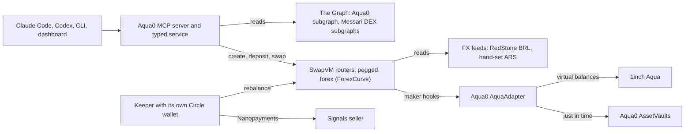

# Aqua0: one USDC deposit, many FX strategies, from your terminal

[](https://testnet.arcscan.app/address/0x9E094b21C4263e0BE5BEffa0f8296B3fd982fFFf)
[](#1inch-build-an-aqua-app-and-continuity)
[](#the-graph-best-ai-tooling-or-ai-use-case)
[](https://www.npmjs.com/package/@aqua0/mcp)
[](apps/mcp/README.md#tools)
[](#connect-the-mcp)
[](skills/aqua0/SKILL.md)
[](#continuity-pre-existing-vs-built-at-ethglobal)
[](LICENSE)

**Aqua0 is shared liquidity for 1inch SwapVM.** An LP deposits once into a per-asset `AssetVault`, and that one principal backs many SwapVM strategies at the same time. Tokens stay in the vault until a swap pulls them.

For ETHGlobal we brought Aqua0 to **Arc** and made it agent-native. An agent in Claude Code, Codex or any MCP client reads Aqua0 from **The Graph** and ships USDC/ARS and USDC/BRL strategies through **1inch Aqua** on an oracle-priced forex curve, all backed by the same USDC. An autonomous keeper with its own **Circle** wallet buys market signals with Nanopayments and keeps those books balanced.

<!-- TODO: add demo video link -->

Submission copy, links and proof: [`docs/ETHGLOBAL_SUBMISSION.md`](docs/ETHGLOBAL_SUBMISSION.md).

**Navigate:** [Architecture](docs/ARCHITECTURE.md) · [Strategy and swap sequences](docs/ARCHITECTURE.md#creating-a-strategy) · [MCP tools](apps/mcp/README.md#tools) · [Forex curve maths](packages/contracts/README.md#forexcurve-maths) · [Demo runbook](docs/DEMO.md) · [Pitch context](docs/FX_OPCODE_HANDOFF.md) · [Everything else](#repository)

## What's live

On Arc Testnet (chain `5042002`):

- **Aqua0 vaults** for USDC, ARGt and BRAt.
- **1inch Aqua with two SwapVM routers** on those vaults: a pegged router, and a forex router running our new `ForexCurve` instruction (opcode 34).
- **Forex USDC/ARS and USDC/BRL strategies** filling at about 30 bps. One 1 USDC principal backs three strategies.
- **Circle developer-controlled wallets** with Privy sign-in.
- **An autonomous FX book keeper** that pays for signals with Circle Nanopayments and rebalances from its own wallet (ERC-8004 agent 894559).
- **The Aqua0 subgraph** on Subgraph Studio, and a benchmark over Messari standardized DEX subgraphs.
- **The MCP server** as a Claude Code plugin, as `@aqua0/mcp` on npm, and hosted, with a judge dashboard.

## The demo

Figures from the live runs on Arc Testnet on 2026-09-12. Runbook: [`docs/DEMO.md`](docs/DEMO.md).

```text
you    › Create a USDC to Argentine peso strategy, then the same USDC with Brazilian reais.
agent  › create_strategy {"pair":"USDC/ARS"} · create_strategy {"pair":"usdc to brl"}
         Both are live in Aqua on the forex curve, backed by the same 1 USDC.

you    › Swap 0.1 USDC to BRL.
agent  › swap → 0.513568 BRAt at 29.99 bps. The book is now USDC-heavy.

keeper   wake=swap · bought the book signal for 0.001 USDC with a Nanopayment
         gpt-5-nano: rebalance USDC/BRL, spread 265.53 bps is above 150
         swapped from its own Circle wallet · spread 265.53 → 29.99 bps

you    › Did the keeper rebalance my book?
agent  › keeper_status → USDC/BRL 265.53 → 29.99 bps. Spent 0.006 USDC on signals and $0.000112 on the model.
```

## See it on-chain

Every hash is recorded in [`deployments/arc-testnet-strategies.json`](deployments/arc-testnet-strategies.json).

- **Forex strategies** (demo Circle wallet `0xb0c0…d952`): [ship USDC/ARS](https://testnet.arcscan.app/tx/0xc74849a497ff73207e70872d3d83ed9d5cbc1babaa8f161ee716f444a9b7071e), [ship USDC/BRL on the same USDC](https://testnet.arcscan.app/tx/0xb1d40beb277fda1516f39e59eacfd535c9199c0670d78d8181420289f88406b4), [swap 0.1 USDC → 139.58 ARGt](https://testnet.arcscan.app/tx/0x54f61cb5ddbeea9ea6cdeef75346aba69fe08c9f59f1d2f0eea4dd89e3ef7554), [push the RedStone BRL price](https://testnet.arcscan.app/tx/0x46dbaaa5685b7365c30c0b815a32e0cb3f5efd856283993c6f11698d74d28bed) then [swap 0.1 USDC → 0.513598 BRAt](https://testnet.arcscan.app/tx/0xe28f401465a86dd8557ddd8de548366b0ad5e1fe20db74f71e56cd4a6bcc172a).
- **Keeper** (its Circle wallet `0x5214…4d87`): [a user's swap tilts USDC/BRL to 265.53 bps](https://testnet.arcscan.app/tx/0xa1ed7419b56c1888ce80b60af125579e82877d247f38dcd366cacc61d3b80e1c), [the keeper rebalances it to 29.99 bps](https://testnet.arcscan.app/tx/0xa3a786f86937bb03ab6f5bc6dbb5745b7f22ab3cbf03a8dca164362a4ea165e4), [App Kit funding](https://testnet.arcscan.app/tx/0x3fdc1d70e7aee510d345b1d168cdf635d136b33d0a80a64530f231e8f643b3d0), [Gateway deposit](https://testnet.arcscan.app/tx/0x651eeac424758a02fa3c651c9d09091424a88166863e9381aa662b818bb3c122), [ERC-8004 registration](https://testnet.arcscan.app/tx/0x149d5e54c40c5d48bc912383cf341525dea93e84df7f905c6e58a2cbe03797ff) and [feedback](https://testnet.arcscan.app/tx/0x76f1b72bde3dedea7ab054ed60cfb30208902c033a7f38287aa8735299c657c2).
- **Pegged strategies** (demo wallet `0xAFF7…b02c`): [deposit 2 USDC](https://testnet.arcscan.app/tx/0x088fb34b8147f936b7c10ac8066de4a59773f7d393f33eda64a4defeb8f6c6bd), [ship USDC/ARS](https://testnet.arcscan.app/tx/0x97d5fea443f9090f6b9dd2432036bdfbc2ed58d636e8ac802742d2e499968471) and [USDC/BRL](https://testnet.arcscan.app/tx/0x7571eea087df535b0a4391a48d510abeb9ed0084cc3816946040c05214aa2293), [swap to ARGt](https://testnet.arcscan.app/tx/0x24d95d61c83e3dfdf5ffa8530350635eb9c9b5f71b51835f31b98eb61c5102fb) and [to BRAt](https://testnet.arcscan.app/tx/0x811e5fd474e554e7a3330f09f34edb09f40ca50475028be89c4de3e6cfd32539).

The same USDC shows as backing on every strategy class by design: commitments do not subtract, and at settle time a vault never pays out more than it holds.

## How it works



- **One service** (`packages/shared`) sits behind the MCP server, CLI, dashboard and keeper. The Graph is its read model. [Full system diagram](docs/ARCHITECTURE.md#system)
- **Strategies hold no tokens.** The AquaAdapter ships only virtual balances into Aqua ([creating a strategy](docs/ARCHITECTURE.md#creating-a-strategy)). On a swap, its hooks pull the output from one vault and sweep the input into the other, crediting the LPs who sold ([a swap through the maker hooks](docs/ARCHITECTURE.md#a-swap-through-the-maker-hooks)).
- **One principal backs every strategy it is committed to.** Each swap is bounded at settle time by the strategy class's own balance and the vault's outflow limit ([shared backing](docs/ARCHITECTURE.md#shared-backing)).

## Autonomous FX book keeper

[`apps/keeper`](apps/keeper) keeps the live forex books near an even split, so traders get the oracle price at about 30 bps instead of the inventory fee.

- **Wakes on its own** when the forex router emits `Swapped`, plus a heartbeat.
- **Pays for data:** oracle and book signals from [`apps/signals`](apps/signals), $0.0005 to $0.001 each, with Circle Nanopayments (x402 batched by Circle Gateway).
- **Decides:** `gpt-5-nano` picks one action, inside limits enforced in code (budget, trade size, cooldown, spend caps). A rules policy takes over if the model's answer is invalid.
- **Acts:** rebalances from its own Circle wallet, funded with App Kit, with an ERC-8004 identity that gets feedback after each rebalance.
- **Reports:** your agent checks it with `get_signals` and `keeper_status`.

## Forex curve in brief

A pegged curve fixes a price, but FX rates move, so LPs lose to arbitrage. `ForexCurve` is a new SwapVM instruction (opcode 34) implementing Tomás's forex curve: the Shell v1 curve with an oracle, as DFX v2 runs it, and stateless.

- **Inside the flat band** (`β`), a trade gets the oracle price plus the fee `ε`.
- **Past it**, an inventory fee applies (slope `δ`, capped at `maxFee` below 0.5), and trades that rebalance the book get a share `λ` back.
- **Past the halt band** (`α`), the swap reverts. A stale or out-of-band oracle price also reverts.
- **Tested:** it matches all 979 reference vectors, and [`test-arc-fork-forex.sh`](scripts/test-arc-fork-forex.sh) drives every regime on an Arc fork.
- **Prices:** USDC/BRL uses RedStone data signed by 3 of its 5 signers, pushed on-chain before each swap. USDC/ARS uses a hand-set demo feed, because RedStone has no ARS feed.

Try it: the [interactive ForexCurve simulator](https://ethglobal-demo.18-207-103-187.nip.io/forex-curve.html) (source [`apps/dashboard/public/forex-curve.html`](apps/dashboard/public/forex-curve.html)) moves the oracle, reserves, trade size, `β` and `α` and shows the quote cross the bands. Deployment, per-pair defaults, gas and why RedStone: [forex curve on Arc](docs/ARCHITECTURE.md#forex-curve-on-arc). Maths and program layout: [`packages/contracts/README.md`](packages/contracts/README.md#forexcurve-maths).

## Prize tracks

Aqua0 is in the **Continuity** track. Only work built during the event is submitted ([what pre-existed](#continuity-pre-existing-vs-built-at-ethglobal)).

| Prize | What Aqua0 shows |
| --- | --- |
| [The Graph: AI Tooling](#the-graph-best-ai-tooling-or-ai-use-case) (Continuity pool) | A reusable Graph-backed MCP server and agent skill |
| [The Graph: Composable](#the-graph-composable-or-standardized-graph-products) | One Messari standardized query across protocols and chains, composed with the Aqua0 subgraph |
| [Arc: DeFi](#arc-best-defi--onchain-finance-application) | Shared FX liquidity in USDC on an oracle-priced curve, traded through Circle wallets |
| [Arc: Agentic](#arc-best-agentic-economy-application-with-circle-agent-stack) | An autonomous keeper with its own Circle wallet, Nanopayments, App Kit and ERC-8004 |
| [Arc: Continuity](#arc-best-defi-or-agentic-application-continuity) | The DeFi application and its keeper |
| [1inch: Aqua App (and Continuity)](#1inch-build-an-aqua-app-and-continuity) | Official Aqua and SwapVM, a new SwapVM instruction, live fills |

### The Graph: Best AI Tooling or AI Use Case

- **Reusable MCP:** 25 tools over stdio or HTTP, as [`@aqua0/mcp`](https://www.npmjs.com/package/@aqua0/mcp), a Claude Code plugin and a hosted endpoint, plus an [agent skill](skills/aqua0/SKILL.md).
- **The Graph is load-bearing:** the read tools query the [Subgraph Studio](https://thegraph.com/studio/subgraph/aqua-0-ethglobal-arc-testnet) deployment, and a Graph failure is reported as an error, never silently replaced by RPC reads ([`graph.ts`](packages/shared/src/graph.ts)).
- **Meaningful work:** the agent turns "usdc to brl" into a multi-step strategy setup, runs it safely twice, and explains the result.
- **Both Aqua venues indexed:** strategies, orders and fills ([`packages/subgraph`](packages/subgraph/README.md)).

### The Graph: Composable or Standardized Graph Products

- **One standardized query** runs unchanged through The Graph Network gateway against 12 Messari DEX subgraphs: 4 protocols on 6 chains ([`graph-benchmark.ts`](packages/shared/src/graph-benchmark.ts)).
- **Composed with the Aqua0 subgraph** and a live Arc quote in the same `benchmark_fx_strategy` call.
- **A verdict from the data:** in the 2026-09-12 run, EUR was liquid, BRL thin, and MXN and ARS had no pools ([results](docs/THE_GRAPH_TRACK.md#composable-and-standardized-graph-products)).

### Arc: Best DeFi / Onchain Finance Application

- **USDC-native FX liquidity:** one USDC balance makes markets in several currencies; principal, fees and gas are all USDC.
- **Atomic settlement and conditional fills:** one swap settles across two vaults, and the curve refuses stale prices and swaps past the halt band ([swap sequence](docs/ARCHITECTURE.md#a-swap-through-the-maker-hooks)).
- **Circle Wallets:** users sign in with Privy and trade through Circle developer-controlled wallets.
- **MVP:** the [judge dashboard](https://ethglobal-demo.18-207-103-187.nip.io/), the MCP server and API, an architecture diagram, and docs ([`docs/ARC_TRACK.md`](docs/ARC_TRACK.md)).

### Arc: Best Agentic Economy Application with Circle Agent Stack

- **Autonomous and transacting:** the keeper rebalanced a tilted book with no human in the loop, from 265.53 to 29.99 bps ([tx](https://testnet.arcscan.app/tx/0xa3a786f86937bb03ab6f5bc6dbb5745b7f22ab3cbf03a8dca164362a4ea165e4)).
- **Circle products:** its own developer-controlled wallet, Nanopayments per signal, App Kit funding.
- **Identity and risk:** ERC-8004 identity and reputation; model decisions tied to on-chain signals, within limits enforced in code.

### Arc: Best DeFi or Agentic Application (Continuity)

The DeFi application and its keeper, above. The Aqua0 vault contracts and AquaAdapter pre-exist; everything else was built during the event.

### 1inch: Build an Aqua App (and Continuity)

- **Sophisticated position:** shared-backing FX market making on the official aqua 0.1.0 and swap-vm v1.0.2 contracts.
- **New SwapVM instruction:** `ForexCurve` (opcode 34), matching all 979 reference vectors and running live strategies ([`packages/contracts`](packages/contracts/README.md)).
- **Real token transfers on every fill:** [forex USDC → ARGt](https://testnet.arcscan.app/tx/0x54f61cb5ddbeea9ea6cdeef75346aba69fe08c9f59f1d2f0eea4dd89e3ef7554), [forex USDC → BRAt](https://testnet.arcscan.app/tx/0xe28f401465a86dd8557ddd8de548366b0ad5e1fe20db74f71e56cd4a6bcc172a), [keeper BRAt → USDC](https://testnet.arcscan.app/tx/0xa3a786f86937bb03ab6f5bc6dbb5745b7f22ab3cbf03a8dca164362a4ea165e4).
- **Tested positions:** [`test-arc-fork-strategies.sh`](scripts/test-arc-fork-strategies.sh) and [`test-arc-fork-forex.sh`](scripts/test-arc-fork-forex.sh) assert fills and shared backing on an Arc fork.

## Known gaps

- **Not used:** the Circle Agent Stack starter kits, and Paymaster, which is not on Arc.
- **No automatic docking:** the keeper recommends docking a strategy with a bad oracle, but docking needs the strategist's signature.
- **Indexed fees show 1 wei:** the curve's spread is booked as swap proceeds, so indexed `feesCredited` is 1 wei. LPs still receive the full input.

## Try it

### Connect the MCP

In Claude Code, the plugin adds the agent skill and the hosted server, which prepares transactions for your wallet but never signs:

```text
/plugin marketplace add Aqua0-fi/aqua0-ethglobal
/plugin install aqua0@aqua0
```

Or run it locally from npm (Node 20+), with no setup:

```bash
claude mcp add aqua0 -- npx -y @aqua0/mcp
codex mcp add aqua0 -- npx -y @aqua0/mcp
```

To send transactions with your own testnet key or with Privy sign-in and Circle wallets, see [`apps/mcp/README.md`](apps/mcp/README.md). Then ask:

```text
Check Aqua0 health and tell me which data came from The Graph.
How many Argentine pesos would 0.1 USDC buy right now?
Is the BRL book healthy, and did the keeper rebalance it?
Is a 30 bps euro FX strategy competitive onchain?
```

### Run the demo

Needs Node 22, pnpm 9 and the keys in `.secrets/` (see [`docs/DEMO.md`](docs/DEMO.md)):

```bash
pnpm install && pnpm build
scripts/demo/terminal-a-keeper.sh   # left: the keeper and its signals seller
scripts/demo/terminal-b-agent.sh    # right: Claude Code with the Aqua0 MCP
```

Fork proofs, no keys needed: `scripts/test-arc-fork-strategies.sh` (pegged) and `scripts/test-arc-fork-forex.sh` (forex curve). What they assert: [fork proofs](docs/ARCHITECTURE.md#fork-proofs).

## Deployments

Arc Testnet, chain `5042002`. Everything else is in [`deployments/arc-testnet.json`](deployments/arc-testnet.json) and [`docs/ARC_DEPLOYMENT.md`](docs/ARC_DEPLOYMENT.md).

| Contract or wallet | Address |
| --- | --- |
| VaultRegistry | [`0x9E09…fFFf`](https://testnet.arcscan.app/address/0x9E094b21C4263e0BE5BEffa0f8296B3fd982fFFf) |
| USDC, ARGt, BRAt AssetVaults | [`0x99c2…4429`](https://testnet.arcscan.app/address/0x99c2ab427b29dB1Cc14D228d970596015d1C4429), [`0x8a3d…F460`](https://testnet.arcscan.app/address/0x8a3d6188C58d7877499592E179DfE3bd80c4F460), [`0xEcB1…0785`](https://testnet.arcscan.app/address/0xEcB132648B781ec5742b582c526243Eeef900785) |
| 1inch Aqua (`AquaRouter` 0.1.0) | [`0x490d…20D4`](https://testnet.arcscan.app/address/0x490d2eceD9aCF99e1db6090f820775bFa70020D4) |
| `AquaForexSwapVMRouter` (ForexCurve) and its AquaAdapter | [`0x475d…187e`](https://testnet.arcscan.app/address/0x475d0E487779743Fb52c8E7729A1718934D4187e), [`0xc9cD…0EfB`](https://testnet.arcscan.app/address/0xc9cD056FCF2EF46116259fb094BD897c7E7C0EfB) |
| `AquaSwapVMRouter` (swap-vm v1.0.2) and its AquaAdapter | [`0xb20b…F763`](https://testnet.arcscan.app/address/0xb20bc70b485eC1352C190d26fCaB1959d219F763), [`0xbF72…4Ca5`](https://testnet.arcscan.app/address/0xbF72D34b804636496c3308796908152b82624Ca5) |
| RedStone BRL feed, ARS/USD feed (hand-set) | [`0xac4D…1796`](https://testnet.arcscan.app/address/0xac4D10eE7FF790c2E505fBBD6A72d15D7Cbc1796), [`0xc05A…E70C`](https://testnet.arcscan.app/address/0xc05A3Fb016f973C82b0232EF50336d4C0466E70C) |
| Keeper, operator and demo Circle wallets | [`0x5214…4d87`](https://testnet.arcscan.app/address/0x5214daeb80b07340bac9060559d660e905564d87), [`0xcdbd…d404`](https://testnet.arcscan.app/address/0xcdbd43edb8292def7e8ac99c77860a689cc6d404), [`0xb0c0…d952`](https://testnet.arcscan.app/address/0xb0c0687eb013a5ffde4d23a89398a11bc424d952) |

| Endpoint | URL |
| --- | --- |
| Subgraph Studio | [`aqua-0-ethglobal-arc-testnet`](https://thegraph.com/studio/subgraph/aqua-0-ethglobal-arc-testnet) |
| Hosted MCP (prepare-only) | `https://ethglobal-mcp.18-207-103-187.nip.io/mcp` |
| Judge dashboard | `https://ethglobal-demo.18-207-103-187.nip.io/` |
| npm | [`@aqua0/mcp`](https://www.npmjs.com/package/@aqua0/mcp) |

ARGt and BRAt are open-mint testnet tokens standing in for ARS and BRL stablecoins.

## Repository

| Looking for | Go to |
| --- | --- |
| System diagram, components, design decisions | [`docs/ARCHITECTURE.md`](docs/ARCHITECTURE.md) |
| Shared backing, strategy creation and swap sequences | [Shared backing](docs/ARCHITECTURE.md#shared-backing), [creating a strategy](docs/ARCHITECTURE.md#creating-a-strategy), [a swap through the maker hooks](docs/ARCHITECTURE.md#a-swap-through-the-maker-hooks) |
| MCP tools, install modes, environment variables | [`apps/mcp/README.md`](apps/mcp/README.md#tools) |
| Forex curve maths and program layout | [`packages/contracts/README.md`](packages/contracts/README.md#forexcurve-maths), [`docs/FX_CURVES.md`](docs/FX_CURVES.md), the [interactive ForexCurve simulator](https://ethglobal-demo.18-207-103-187.nip.io/forex-curve.html) |
| Forex curve on Arc: deployment, defaults, gas, tests | [Forex curve on Arc](docs/ARCHITECTURE.md#forex-curve-on-arc), [fork proofs](docs/ARCHITECTURE.md#fork-proofs) |
| Pitch context: problem, solution, maths | [`docs/FX_OPCODE_HANDOFF.md`](docs/FX_OPCODE_HANDOFF.md) |
| Demo runbook and the two-terminal keeper demo | [`docs/DEMO.md`](docs/DEMO.md) |
| Arc and The Graph track notes | [`docs/ARC_TRACK.md`](docs/ARC_TRACK.md), [`docs/THE_GRAPH_TRACK.md`](docs/THE_GRAPH_TRACK.md) |
| Deployed addresses and transactions | [`docs/ARC_DEPLOYMENT.md`](docs/ARC_DEPLOYMENT.md), [`deployments/`](deployments) |
| Submission copy and on-chain proof | [`docs/ETHGLOBAL_SUBMISSION.md`](docs/ETHGLOBAL_SUBMISSION.md) |
| What pre-existed vs built at ETHGlobal | [`docs/CONTINUITY.md`](docs/CONTINUITY.md) |
| Agent skill | [`skills/aqua0/SKILL.md`](skills/aqua0/SKILL.md) |

```text
apps/mcp          MCP server, published as @aqua0/mcp
apps/cli          aqua0 CLI, with the keeper and signals commands
apps/keeper       Autonomous FX book keeper
apps/signals      Signals sold with Circle Nanopayments
apps/dashboard    Judge dashboard
packages/shared   Typed service: Graph client, SwapVM programs, calldata, execution guard
packages/subgraph Aqua0 subgraph
packages/contracts Foundry: Aqua venues, ForexCurve, RedStone feeds
skills/aqua0      Agent skill
deployments       Arc Testnet addresses and live runs
docs              Architecture, deployment, track notes, demo runbook, submission copy
```

<a id="continuity-pre-existing-vs-built-at-ethglobal"></a>

## Continuity

The Aqua0 vault contracts (VaultRegistry, AssetVault, AquaAdapter and the rest) and the Base mainnet deployment pre-exist in the private Aqua0 contracts repository, alongside the official 1inch Aqua and SwapVM sources. Everything else here was built during ETHGlobal, starting 2026-09-05: the Arc deployment, the subgraph, the MCP server, CLI, dashboard and skill, the `ForexCurve` instruction and forex router, the RedStone feeds, Privy and Circle sign-in, the keeper and the benchmark. Full split: [`docs/CONTINUITY.md`](docs/CONTINUITY.md).

## Team

| Member | Role |
| --- | --- |
| Rithik | The Graph subgraph and Subgraph Studio, MCP server, dashboard, hosted deploy |
| Yudhishthra | Arc SwapVM integration, ForexCurve instruction, MCP strategy tools, the keeper agent |
| Tomás | Forex curve maths, simulations and reference vectors; Arc deployment |

MIT licensed: [`LICENSE`](LICENSE).
