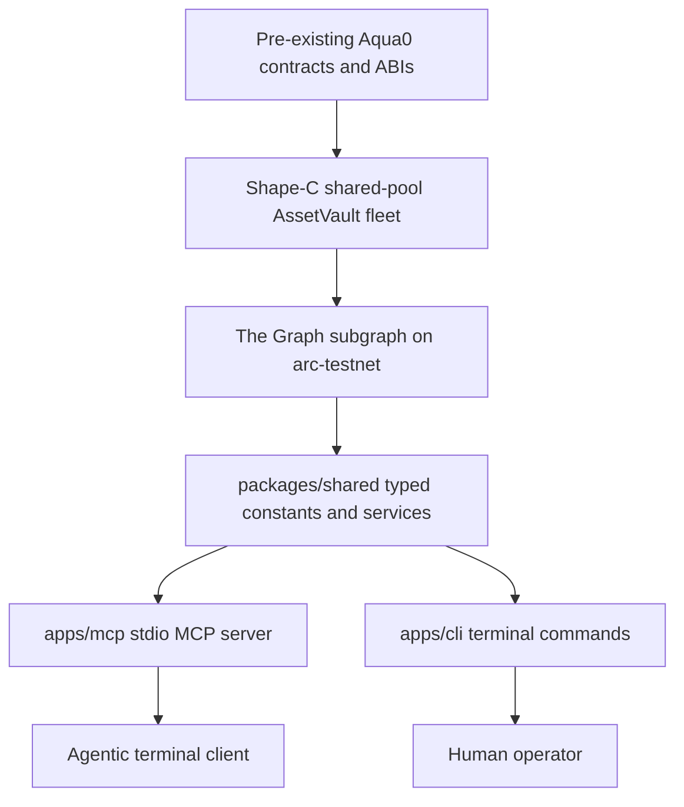

# Aqua0 ETHGlobal Continuity

Rithik-owned scaffold for Aqua0's ETHGlobal Continuity submission. This repo is the hackathon workspace for The Graph indexing surface and the agentic terminal interface around Aqua0.

## Continuity Disclosure

This repository contains hackathon work for ETHGlobal Continuity: the TypeScript workspace, Graph-facing service layer, MCP server, CLI, and documentation for the terminal-as-frontend workflow.

The Aqua0 contracts and ABIs are pre-existing Aqua0 work. This scaffold does not claim those contracts as new hackathon output, does not invent contract addresses, and does not include subgraph mappings yet. Subgraph schema/mappings are intentionally deferred to the next commit.

## Track Mapping

- The Graph Continuity: graph endpoint configuration, Graph network identifier `arc-testnet`, and the shared service boundary that MCP/CLI tools will use to query indexed Aqua0 state.
- Arc Continuity: Arc Testnet constants are centralized in `packages/shared`, including chain ID `5042002` and RPC URL `https://rpc.testnet.arc.network`.
- 1inch Aqua Continuity: Aqua0's Shape-C shared-pool AssetVault fleet is the architecture target for future routing and vault state reads. The 1inch-facing work should consume indexed vault/liquidity state rather than relying on ad hoc frontend calls.

## Terminal As Frontend

Aqua0's submission treats the terminal as an agentic frontend. The MCP server exposes structured tools to agent clients over stdio, while the CLI gives humans the same service layer directly from a shell. Both entrypoints should read from the same typed Aqua0/Graph services so the terminal UX and agent UX stay consistent.

## Architecture



## Workspace

```text
apps/
  cli/       Terminal entrypoint over the shared service layer
  mcp/       MCP stdio server for agent clients
docs/        Build plan and architecture notes
packages/
  shared/    Chain constants, config types, and service layer
scripts/     Repo utility scripts
```

## Setup

```bash
pnpm install
cp .env.example .env
pnpm check-env
pnpm typecheck
pnpm build
```

`GRAPH_ENDPOINT` is required for live graph access. `AQUA0_API_URL` and `ARC_RPC_URL` are optional public configuration values.

## Commands

```bash
pnpm --filter @aqua0/mcp dev
pnpm --filter @aqua0/cli dev info
pnpm --filter @aqua0/cli dev health
```
