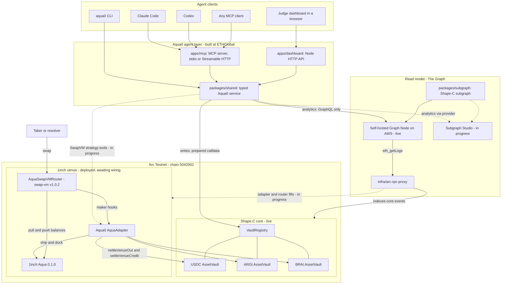

# Architecture

This file is also served by the judge dashboard at `/docs/ARCHITECTURE.md`. The [README](../README.md#how-it-works) has the full diagram set: strategy creation, a swap through the maker hooks, shared backing, and FXSwap per-swap execution.

Status legend: **Live** means running on Arc Testnet or the public AWS endpoints. **Deployed, not wired** means the contracts are on Arc but wait on admin transactions. **Fork-proven** means executed against a local fork of Arc. **In progress** and **Planned** mean not yet available.

## System

## Components

| Layer | Component | Location | Status |
| --- | --- | --- | --- |
| Agent interface | MCP server (stdio + Streamable HTTP) | [`apps/mcp`](../apps/mcp) | Live, prepare-only at the public endpoint |
| Agent interface | SwapVM strategy tools: create, deposit, quote, swap, shared-backing read | `packages/shared`, `apps/mcp` | In progress |
| Agent interface | CLI | [`apps/cli`](../apps/cli) | Live (local) |
| Web MVP | Judge dashboard + JSON API | [`apps/dashboard`](../apps/dashboard) | Live |
| Service | Typed Graph client, analytics, strategy-key derivation, calldata, execution guard | [`packages/shared`](../packages/shared) | Live |
| Read model | Shape-C subgraph (Base manifest + generated Arc manifest) | [`packages/subgraph`](../packages/subgraph) | Live on a self-hosted Graph Node for the Arc core |
| Read model | AquaAdapter + router fill indexing on Arc | `packages/subgraph` | In progress |
| Read model | Subgraph Studio (Graph provider) deployment for Arc | `packages/subgraph`, `scripts/deploy-graph-studio.sh` | In progress |
| Indexing infra | Arc RPC topic-splitting proxy | [`infra/arc-rpc-proxy`](../infra/arc-rpc-proxy) | Live |
| Contracts | Shape-C core: registry, factory, composer, filler registry, three AssetVaults | Pre-existing Aqua0 source, deployed on Arc | Live |
| Contracts | 1inch Aqua 0.1.0 + AquaSwapVMRouter (swap-vm v1.0.2, unmodified) + Aqua0 AquaAdapter | [`packages/contracts`](../packages/contracts) | Deployed, awaiting admin wiring |
| Contracts | Two FX strategies on one USDC deposit, shipped and filled | [`packages/contracts/script/ArcFxStrategies.s.sol`](../packages/contracts/script/ArcFxStrategies.s.sol) | Fork-proven |
| Contracts | FXSwap SwapVM instruction (oracle-anchored CryptoSwap-style curve) | `packages/contracts` | In progress |

## Separation of concerns

- **The Graph is the read model.** Balance, strategy, fee, opportunity and snapshot tools read indexed subgraph entities. They never quietly fall back to RPC when a Graph query fails. The one RPC read in the write path is `VaultRegistry.classForStrategy`, which exists so a class id is never guessed.
- **Shape-C and the 1inch venue are the write model.** Typed tools prepare exact contract calls. Guarded execution is limited to Arc Testnet (`5042002`) or a local Anvil URL. The public AWS MCP runs prepare-only and holds no signing key.
- **MCP is the natural-language boundary.** The LLM interprets intent and calls typed tools. Aqua0 ships no custom text parser.
- **The Arc RPC proxy is indexing infrastructure only.** Arc's public RPC rejects large topic-OR lists in `eth_getLogs`, so the proxy splits those requests to keep full canonical event coverage. It passes every other method through unchanged, and it neither fabricates nor caches chain data.
- **Secrets stay out of the repository.** Graph keys and signing keys come from environment variables and are never returned by `info`.

## Shared backing

An LP deposits once into a per-asset `AssetVault` and commits that principal to several strategy classes. Commitments are *non-subtractive*: `committedBacking(classId)` for each committed class equals the full principal, and committing to class A leaves class B's backing unchanged. Tokens stay in the vault until a swap needs them. The AquaAdapter's `preTransferOut` hook calls `settleVenueOut` to pull just-in-time. Its `postTransferIn` hook calls `settleVenueCredit` to sweep the taker's input into the counter vault and credit the LPs that sold. Actual outflow is bounded at settle time by the class's own idle debit and the vault's outflow limit, so shared backing never lets a vault pay out more than it holds.

Evidence:

- Arc fork, full swap path: [`packages/contracts/script/ArcFxStrategies.s.sol`](../packages/contracts/script/ArcFxStrategies.s.sol). One 2 USDC deposit backs two classes, and after one fill per class both still show 2 USDC committed backing.
- Base fork, commitment invariant: [`scripts/test-shared-backing-fork.sh`](../scripts/test-shared-backing-fork.sh). One 100 USDC principal shows 100 USDC `committedBacking` and `availableFor` on both the ARS and BRL classes.
