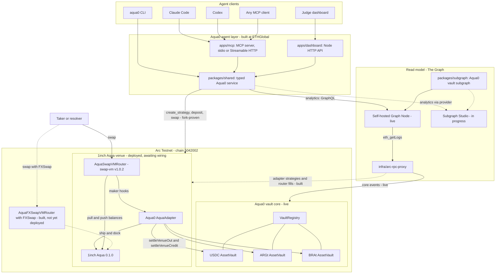

# Architecture

This file is also served by the judge dashboard at `/docs/ARCHITECTURE.md`. The [README](../README.md#how-it-works) has the full diagram set: shared backing, strategy creation, a swap through the maker hooks, and FXSwap per-swap execution.

Status legend:
- **Live**: running on Arc Testnet or the public AWS endpoints.
- **Deployed, awaiting wiring**: on Arc Testnet but inert until the core admin sends the wiring transactions.
- **Fork-proven**: executed end to end against a local fork of Arc.
- **Built, not yet deployed**: code and tests exist, but nothing is on-chain or hosted yet.
- **In progress** and **Planned**: not yet available.

## System

## Components

| Layer | Component | Location | Status |
| --- | --- | --- | --- |
| Agent interface | MCP server, 17 tools (stdio + Streamable HTTP) | [`apps/mcp`](../apps/mcp) | Public endpoint **Live** on the earlier prepare-only build (12 tools, no signer) |
| Agent interface | SwapVM tools: `create_strategy`, `deposit`, `quote_swap`, `swap`, `get_shared_backing` | [`packages/shared`](../packages/shared), [`apps/mcp`](../apps/mcp) | **Fork-proven** ([`scripts/test-arc-fork-strategies.sh`](../scripts/test-arc-fork-strategies.sh)) |
| Agent interface | CLI mirroring the MCP tools | [`apps/cli`](../apps/cli) | **Live** (local) |
| Web MVP | Judge dashboard + JSON API, read-only and prepare-only | [`apps/dashboard`](../apps/dashboard) | **Live** |
| Service | Graph client, analytics, strategy keys, SwapVM programs, calldata, execution guard | [`packages/shared`](../packages/shared) | **Live** |
| Read model | Aqua0 vault subgraph for the Arc vault core | [`packages/subgraph`](../packages/subgraph) | **Live** on a self-hosted Graph Node |
| Read model | Aqua venue indexing: `AquaStrategy`, `AquaOrder`, `AquaFill`, per-LP fill stats | [`packages/subgraph`](../packages/subgraph) | **Built, not yet deployed** |
| Read model | Subgraph Studio deployment for Arc | [`scripts/deploy-graph-studio.sh`](../scripts/deploy-graph-studio.sh) | **In progress** (needs the team's Studio key) |
| Indexing infra | Arc RPC topic-splitting proxy | [`infra/arc-rpc-proxy`](../infra/arc-rpc-proxy) | **Live** |
| Contracts | Aqua0 vault core: registry, factory, composer, filler registry, three AssetVaults | Pre-existing Aqua0 source, deployed on Arc | **Live**, unfunded |
| Contracts | 1inch Aqua 0.1.0 + AquaSwapVMRouter (swap-vm v1.0.2, unmodified) + Aqua0 AquaAdapter | [`packages/contracts`](../packages/contracts) | **Deployed, awaiting wiring** |
| Contracts | Two FX strategies on one USDC deposit, shipped and filled | [`ArcFxStrategies.s.sol`](../packages/contracts/script/ArcFxStrategies.s.sol) | **Fork-proven** |
| Contracts | FXSwap instruction (index 34) in `AquaFXSwapVMRouter`, plus demo `ManualFxOracle` feeds | [`packages/contracts/src`](../packages/contracts/src) | **Built, not yet deployed** (46 tests) |

## Separation of concerns

- **The Graph is the read model for analytics.** `health`, `get_balance`, `get_strategies`, `get_fees`, `list_opportunities`, `protocol_snapshot` and `graph_query` read indexed subgraph entities and never fall back to RPC when a Graph query fails.
- **On-chain reads are explicit.**
  - `classForStrategy` is read so a class id is never guessed.
  - `quote_swap` is an `eth_call` to the router.
  - `get_shared_backing` reads vault state directly and labels its response as on-chain until the Aqua venue entities are indexed on a provider.
- **The Aqua0 vaults and the 1inch venue are the write model.** Write tools return ordered calldata and EIP-712 typed data by default. They send only with `MCP_WRITE_MODE=execute`, on Arc Testnet (`5042002`) or a local fork. The public AWS MCP holds no signing key.
- **MCP is the natural-language boundary.** The LLM interprets intent and calls typed tools. Loose pair names such as "usdc to brl" are resolved inside the tools.
- **The Arc RPC proxy is indexing infrastructure only.** Arc's public RPC rejects large topic-OR lists in `eth_getLogs`, so the proxy splits those requests. Every other method passes through unchanged, and the proxy neither fabricates nor caches chain data.
- **Secrets stay out of the repository.** Graph keys and signing keys come from environment variables and are never returned by `info`.

## Shared backing

An LP deposits once into a per-asset `AssetVault` and commits that principal to several strategy classes.

- **Commitments are non-subtractive.** `committedBacking(classId)` for each committed class equals the full principal, and committing to class A leaves class B unchanged.
- **Tokens stay in the vault** until a swap needs them:
  - the AquaAdapter's `preTransferOut` hook calls `settleVenueOut` to pull output just in time;
  - its `postTransferIn` hook calls `settleVenueCredit`, which sweeps the taker's input into the counter vault, credits the LPs that sold and books the spread as fees.
- **Outflow is bounded at settle time** by the class's own idle debit and the vault's outflow limit, so shared backing never lets a vault pay out more than it holds.

Evidence:

- **Arc fork, Foundry path:** [`packages/contracts/script/run-arc-fx-strategies.sh`](../packages/contracts/script/run-arc-fx-strategies.sh).
  - One 2 USDC deposit is committed to a USDC/ARGt and a USDC/BRAt class, each with a `[FlatFeeAmountIn 30 bps][PeggedSwap]` program.
  - Fills: 0.1 USDC → 139.248 ARGt and 0.1 USDC → 0.547 BRAt.
  - Both classes still show 2 USDC committed backing afterwards.
- **Arc fork, MCP service path:** [`scripts/test-arc-fork-strategies.sh`](../scripts/test-arc-fork-strategies.sh) runs the same demo through the CLI, which calls the same service functions as the MCP tools, and asserts it.
- **Base fork, commitment invariant:** [`scripts/test-shared-backing-fork.sh`](../scripts/test-shared-backing-fork.sh). One 100 USDC principal shows 100 USDC `committedBacking` and `availableFor` on two classes.
