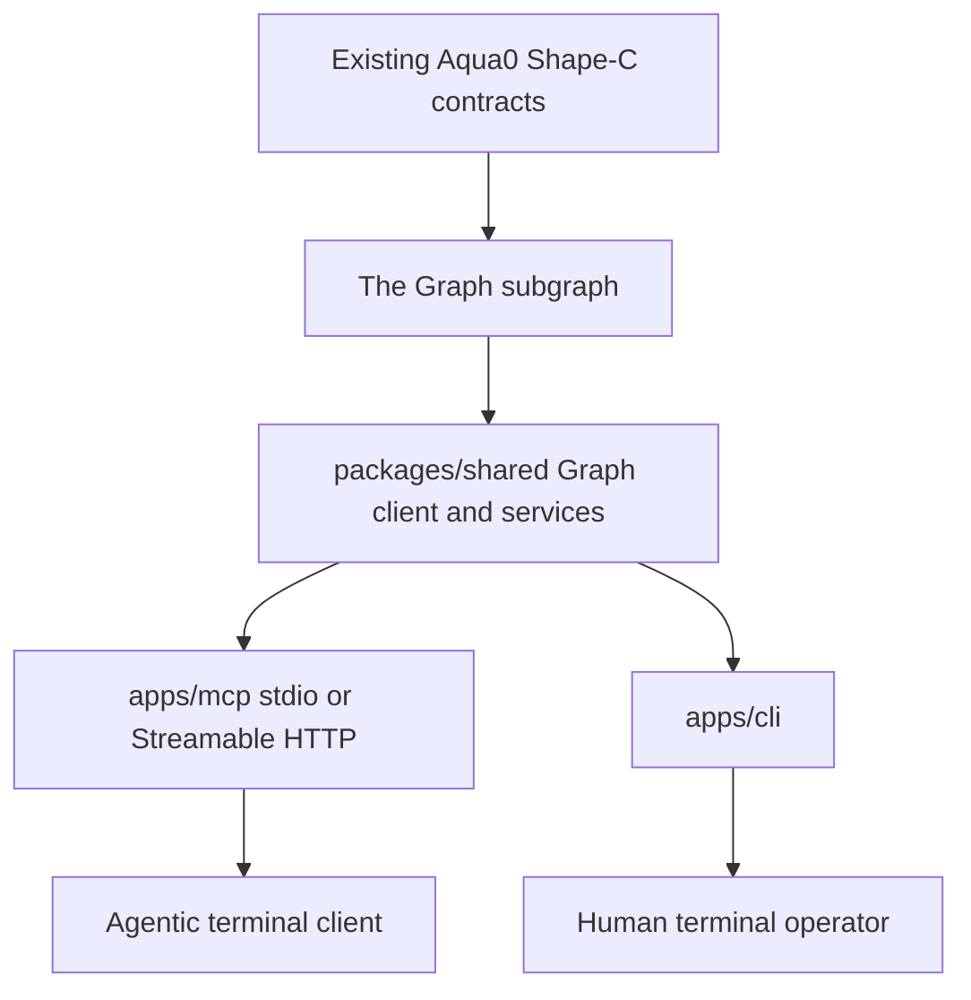

# Architecture

Aqua0's terminal layer is built around Shape-C: shared-pool `AssetVault` liquidity coordinated through a `VaultRegistry` and indexed by The Graph.

## Load-Bearing Graph Boundary

Analytics flow only through the configured `GRAPH_ENDPOINT`.

The shared service queries current schema entities directly: `Vault`, `LPVaultPosition`, `LPStrategyPosition`, `StrategyVault`, `StrategyFeeAccruedEvent`, `V4SwapSettledEvent`, and Aqua lifecycle event entities. It returns raw integer strings plus indexed vault metadata. It does not infer decimals when the index does not know them.

## Write Boundary

Write preparation uses minimal ABIs and `viem` encoding. `prepare_create_strategy` reads `classForStrategy(strategyKey)` from `VAULT_REGISTRY_ADDRESS` over `WRITE_RPC_URL`; this read is required because class ids must come from the registry, not local inference.

Execution is optional and tightly scoped:

- default `MCP_WRITE_MODE=prepare`
- `create_strategy` and `authorize_strategy` are exposed only in execute mode
- execution still refuses unless chain id is Arc Testnet `5042002` or the RPC URL is local Anvil
- Ethereum mainnet `1` and Base mainnet `8453` are always refused
- `WRITE_PRIVATE_KEY` is never included in `info`, logs, or tool output
- deposit/withdraw remain prepare-only

## Runtime Layers

| Layer | Responsibility |
| --- | --- |
| `packages/shared` | Graph client, raw-unit analytics, strategy key derivation, calldata prep, execution guards. |
| `apps/mcp` | Typed MCP tools over stdio or Streamable HTTP. |
| `apps/cli` | Human CLI parity over the same shared service. |
| `packages/subgraph` | Shape-C schema, mappings, and ABI assets. |
