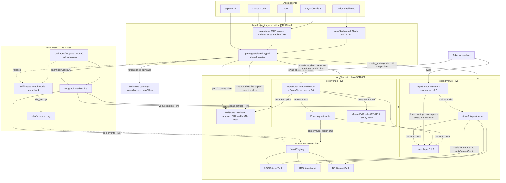
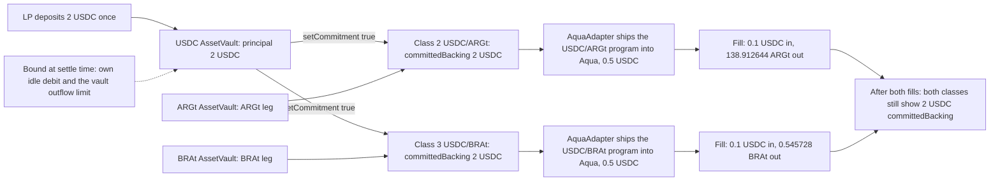
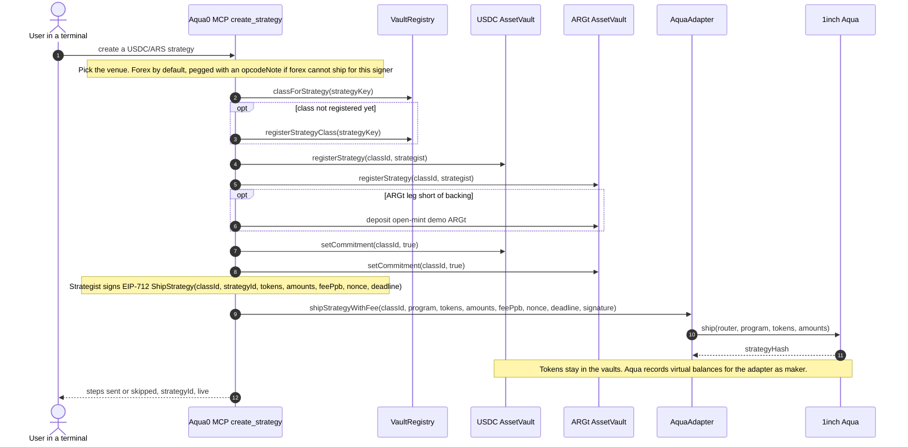
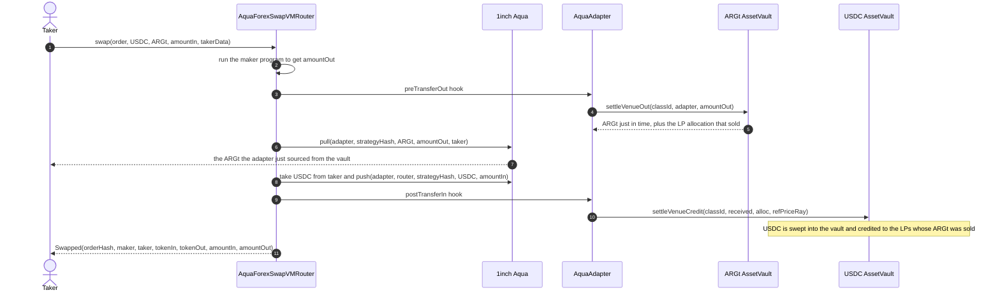

# Architecture

This file is also served by the judge dashboard at `/docs/ARCHITECTURE.md`. It holds the full system diagram, shared backing, strategy creation and a swap through the maker hooks; the [README](../README.md#how-it-works) has the short version, and the forex curve's per-swap flowchart is in [`packages/contracts/README.md`](../packages/contracts/README.md#forexcurve-maths). **Live** means running on Arc Testnet or the public endpoints.

## System

## Components

| Layer | Component | Location | Status |
| --- | --- | --- | --- |
| Agent interface | MCP server, 25 tools (26 in execute mode), stdio + Streamable HTTP; published as `@aqua0/mcp` on npm and as a Claude Code plugin; hosted prepare-only endpoint deployed from `main` after CI | [`apps/mcp`](../apps/mcp), [`.claude-plugin`](../.claude-plugin), [`deploy.yml`](../.github/workflows/deploy.yml) | **Live** |
| Agent interface | SwapVM tools: `create_strategy`, `deposit`, `quote_swap`, `swap`, `get_shared_backing` | [`packages/shared`](../packages/shared), [`apps/mcp`](../apps/mcp) | **Live** on Arc (pegged and forex venues, run through the CLI) |
| Agent interface | Forex tools: `opcode:"forex"` (the default), `get_fx_prices`, `set_fx_price` (ARS only), oracle and spread pricing in `quote_swap` and `swap`, RedStone payload push and quote state override for USDC/BRL | [`packages/shared`](../packages/shared), [`apps/mcp`](../apps/mcp) | **Live** on Arc; fills past the flat band, the halt band and `set_fx_price` also run in [`scripts/test-arc-fork-forex.sh`](../scripts/test-arc-fork-forex.sh) |
| Agent interface | CLI mirroring the MCP tools, plus `fx-prices`, `set-fx-price`, `--opcode` | [`apps/cli`](../apps/cli) | **Live** (drove the Arc run) |
| Agent interface | Agent skill | [`skills/aqua0/SKILL.md`](../skills/aqua0/SKILL.md) | **Live** |
| Autonomous agent | FX book keeper: wakes on router `Swapped` events and a heartbeat, buys signals with Circle Nanopayments, decides with an OpenAI model (`gpt-5-nano`) or deterministic rules inside limits enforced in code, rebalances from its own Circle wallet, ERC-8004 identity, JSONL journal | [`apps/keeper`](../apps/keeper) | **Live** on Arc Testnet (run recorded under `keeperRun` in [`arc-testnet-strategies.json`](../deployments/arc-testnet-strategies.json)) |
| Autonomous agent | Signals seller: `/v1/oracle`, `/v1/book`, `/v1/vault` behind Circle Gateway batched x402 on Arc Testnet | [`apps/signals`](../apps/signals) | **Live** locally (`aqua0 signals serve`, port 8402), not hosted |
| Agent interface | Keeper read tools: `get_signals` (free RPC read of the same signals) and `keeper_status` (journal summary) | [`packages/shared`](../packages/shared), [`apps/mcp`](../apps/mcp) | **Live** |
| Web MVP | Judge dashboard + JSON API, read-only and prepare-only | [`apps/dashboard`](../apps/dashboard) | **Live** |
| Service | Graph client, analytics, strategy keys, SwapVM programs (pegged and forex curve), calldata, execution guard | [`packages/shared`](../packages/shared) | **Live** |
| Read model | Aqua0 vault subgraph on Subgraph Studio | [`deployments/graph-studio-arc-testnet.json`](../deployments/graph-studio-arc-testnet.json) | **Live** (version `ethglobal-arc-3d0b9ef`) |
| Read model | Both Aqua venues: `AquaStrategy`, `AquaOrder`, `AquaFill` with a `venue` label, per-LP fill stats | [`packages/subgraph`](../packages/subgraph) | **Live** on Subgraph Studio |
| Indexing infra | Self-hosted Graph Node and Arc RPC topic-splitting proxy | [`infra/arc-rpc-proxy`](../infra/arc-rpc-proxy) | Development fallback |
| Contracts | Aqua0 vault core: registry, factory, composer, filler registry, three AssetVaults | Pre-existing Aqua0 source, deployed on Arc | **Live** |
| Contracts | Pegged venue: 1inch Aqua 0.1.0 + AquaSwapVMRouter (swap-vm v1.0.2, unmodified) + Aqua0 AquaAdapter, wired | [`packages/contracts`](../packages/contracts) | **Live** |
| Contracts | FX strategies on one USDC principal, shipped and filled on each venue | [`deployments/arc-testnet-strategies.json`](../deployments/arc-testnet-strategies.json) | **Live** (pegged and forex venues) |
| Contracts | RedStone price feeds: `AquaRedStoneMultiFeedAdapter` with BRL (USD per 1 BRL) and MXNe (MXN per 1 USD) `AquaRedStonePriceFeed`s, no owner | [`AquaRedStoneFeeds.sol`](../packages/contracts/src/oracles/AquaRedStoneFeeds.sol), [`DeployRedStoneFeeds.s.sol`](../packages/contracts/script/DeployRedStoneFeeds.s.sol) | **Live** (5 tests replay the real Arc update) |
| Contracts | Forex venue: `AquaForexSwapVMRouter` (ForexCurve, opcode 34) and its AquaAdapter, both verified on Arcscan, reading the RedStone BRL feed and the ARS/USD `ManualFxOracle` | [`packages/contracts/src`](../packages/contracts/src), [`deploy-arc-forex-venue.sh`](../packages/contracts/script/deploy-arc-forex-venue.sh) | **Live**, wired into the vaults (matches all 979 reference vectors) |

## Separation of concerns

- **The Graph is the read model for analytics.** `health`, `get_balance`, `get_strategies`, `get_fees`, `list_opportunities`, `protocol_snapshot` and `graph_query` read indexed subgraph entities from Subgraph Studio and never fall back to RPC when a Graph query fails.
- **On-chain reads are explicit.**
  - `classForStrategy` is read so a class id is never guessed.
  - Venue readiness (adapter allowlisted, `VENUE_SETTLER_ROLE`, `OPERATOR_ROLE`) is read before `create_strategy` picks forex, or pegged when the forex venue cannot ship for the signer.
  - `quote_swap` is an `eth_call` to the strategy's router. For a RedStone-priced strategy it carries a state override that places the latest signed price in the adapter's storage, so nothing is sent.
  - `get_fx_prices` reads the feeds and fetches the latest signed price from RedStone's gateways.
  - `get_shared_backing` reads vault state and both adapters directly, and labels its response as on-chain reads.
- **Indexed fees.** The AquaAdapter books the curve's embedded spread as swap proceeds, so `feesCredited` on indexed fills is a 1-wei remainder. LPs still receive the full input; `effectiveSpreadBps` from `quote_swap` and `swap` shows the real cost.
- **The Aqua0 vaults and the 1inch venues are the write model.** Write tools return ordered calldata and EIP-712 typed data by default. They send only with `MCP_WRITE_MODE=execute`, on Arc Testnet (`5042002`) or a local fork. The public MCP holds no signing key.
- **Two venues, one set of vaults.** Each AquaAdapter binds one router. The pegged adapter ships to `AquaSwapVMRouter`, and the forex adapter ships to `AquaForexSwapVMRouter`. Both settle against the same AssetVaults and strategy classes.
- **Feeds are a trust assumption.** Forex strategies trade at the feed price, bounded by their band and staleness window.
  - USDC/BRL reads RedStone's BRL feed. The adapter stores a value only if 3 of RedStone's 5 primary-prod signers agree, the data is newer than the stored value, and it is at most 3 minutes old. Reads revert after 30 hours without an update.
  - USDC/ARS reads an owner-set `ManualFxOracle`, because RedStone has no ARS feed. `set_fx_price` sends only when the signer is the owner, and refuses the RedStone feed.
- **The book keeper is a separate agent with its own wallet.** `apps/keeper` holds its own Circle developer-controlled wallet, pays for signals with Circle Nanopayments, and decides with a pluggable policy (an OpenAI model, or deterministic rules as default and fallback). The executor, not the policy, enforces every limit: data budget, max trade size, cooldown, allowed actions, top-up and model spend caps, dry-run. It acts only on mined state: it wakes on `Swapped` logs, re-reads the book right before trading and swaps with an on-chain minimum output. It records each tick in a JSONL journal that `keeper_status` reads. It cannot dock strategies; it recommends it.
- **No price keeper.** Anyone can push a signed RedStone payload. `swap` pushes the latest one (`updateDataFeedsValuesPartial`, about 130k gas) right before swapping; in prepare mode that push is the first prepared transaction.
- **MCP is the natural-language boundary.** The LLM interprets intent and calls typed tools. Loose pair names such as "usdc to brl" are resolved inside the tools.
- **The Arc RPC proxy is indexing infrastructure only**, for the self-hosted fallback node. Arc's public RPC rejects large topic-OR lists in `eth_getLogs`, so the proxy splits those requests. Every other method passes through unchanged, and the proxy neither fabricates nor caches chain data.
- **Secrets stay out of the repository.** Graph keys and signing keys come from environment variables and are never returned by `info`.

## Shared backing

An LP deposits once into a per-asset `AssetVault` and commits that principal to several strategy classes.

- **Commitments are non-subtractive.** `committedBacking(classId)` for each committed class equals the full principal, and committing to class A leaves class B unchanged.
- **Tokens stay in the vault** until a swap needs them:
  - the AquaAdapter's `preTransferOut` hook calls `settleVenueOut` to pull output just in time;
  - its `postTransferIn` hook calls `settleVenueCredit`, which sweeps the taker's input into the counter vault, credits the LPs that sold and books the spread as fees.
- **Outflow is bounded at settle time** by the class's own idle debit and the vault's outflow limit, so shared backing never lets a vault pay out more than it holds.

Figures from the live pegged run; the live forex run shows the same pattern, with one 1 USDC principal behind three classes. Class ids are assigned at registration, so they vary per strategist and chain.

Evidence:

- **Arc Testnet, live, forex:** with `SIGNER=circle`, the demo Circle wallet `0xb0c0…d952` ran `create_strategy` without an opcode, and it picked the forex curve for USDC/ARS (class 6) and USDC/BRL (class 7); the shared Circle operator sent the ships. 0.1 USDC → 139.58 ARGt at oracle 1400 (spread 29.99 bps). After a RedStone price push, 0.1 USDC → 0.513598 BRAt at oracle 5.15143 BRAt per USDC (spread 29.99 bps). The shared-backing read showed 1 USDC principal committed to three classes at once: class 4 (pegged USDC/BRL), 6 and 7. Hashes: [`deployments/arc-testnet-strategies.json`](../deployments/arc-testnet-strategies.json) (`forexLiveRun`).
- **Arc Testnet, live, pegged:** the demo wallet deposited 2 USDC and committed it to class 2 (USDC/ARS) and class 3 (USDC/BRL). Each class got a pegged strategy shipped with 0.5 USDC. The swaps filled 0.1 USDC → 138.912644 ARGt and 0.1 USDC → 0.545728 BRAt, and the shared-backing read showed 2 USDC principal counted once with 2 USDC committed to both classes. Hashes: [`deployments/arc-testnet-strategies.json`](../deployments/arc-testnet-strategies.json) (`liveVenueRun`).
- **Arc fork, forex curve regimes that small live swaps do not reach:** [`scripts/test-arc-fork-forex.sh`](../scripts/test-arc-fork-forex.sh) deploys the forex router and an adapter on the fork and prices from the deployed RedStone BRL feed and ARS/USD feed. One 2 USDC deposit backs forex USDC/ARS and USDC/BRL. Inside the flat band a swap costs 30 bps, a trade past it paid 666 bps, and a trade past the halt band reverts with `ForexCurveUpperHalt()`. A +5% ARS/USD move moves the quote by exactly 5%, and `swap` pushes a signed RedStone BRL price before swapping.
- **Arc fork, pegged:** [`packages/contracts/script/run-arc-fx-strategies.sh`](../packages/contracts/script/run-arc-fx-strategies.sh) (Foundry) and [`scripts/test-arc-fork-strategies.sh`](../scripts/test-arc-fork-strategies.sh) (MCP service path).
- **Base fork, commitment invariant:** [`scripts/test-shared-backing-fork.sh`](../scripts/test-shared-backing-fork.sh). One 100 USDC principal shows 100 USDC `committedBacking` and `availableFor` on two classes.

## Creating a strategy

A single idempotent `create_strategy` call walks the whole sequence and reports steps that are already done as skipped. No tokens move when a strategy ships.

- **Strategy key** is `keccak256(abi.encode(strategist, chainId, sorted token0/token1, keccak256(trimmed label)))`, so a class id is never guessed.
- **Program** is `maker = AquaAdapter` with maker traits `useAqua | postTransferIn | preTransferOut`, the only combination the adapter accepts. Forex ships a `[ForexCurve]` program, which charges its own fee, to `AquaForexSwapVMRouter`; pegged ships `[FlatFeeAmountIn][PeggedSwap]` to `AquaSwapVMRouter`.
- **Signature** uses EIP-712 domain `AquaAdapter` v`1`, is ERC-1271-aware and nonce-protected. In prepare mode the tool returns the calldata and typed data instead of sending.
- **Forex by default, pegged on request.** Pass `opcode:"pegged"` for a `[FlatFeeAmountIn 30 bps][PeggedSwap]` program at a fixed FX price. If the forex venue cannot ship for a signer (for example it lacks `OPERATOR_ROLE`), `create_strategy` uses pegged and says why in `opcodeNote`.

## A swap through the maker hooks

The router runs the maker program, pulls the output just in time from the vault, and sweeps the taker's input into the counter vault, credited to the LPs that sold.

The adapter handles either transfer order; whichever hook runs second performs the counter vault's `settleVenueCredit`. The `swap` tool quotes first and enforces a minimum output on-chain (default 50 bps slippage). `quote_swap` and `swap` report the oracle price (or the fixed price for pegged), the execution price and the effective spread.
