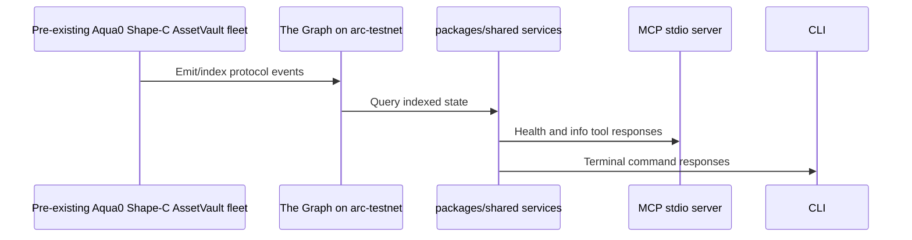

# Architecture

Aqua0's canonical architecture for this submission is Shape-C: a shared-pool AssetVault fleet. This repo scaffolds the Graph and terminal layers around that existing protocol design.

## Shape-C Shared-Pool AssetVault Fleet

Shape-C centers on shared liquidity pools coordinated across an AssetVault fleet. The Graph layer should index vault, asset, pool, and accounting events from the pre-existing Aqua0 contracts once the ABI and deployment inputs are added.

This scaffold intentionally uses Shape-C shared-pool AssetVault terminology and does not include subgraph mappings yet.

## Runtime Layers

- `packages/shared`: typed constants, public config types, and service objects used by every app.
- `apps/mcp`: stdio MCP server for agent clients.
- `apps/cli`: direct human terminal interface over the same services.
- `docs`: build and architecture context for the ETHGlobal Continuity submission.

## Public Networks

- Arc Testnet chain ID: `5042002`
- Arc Testnet RPC: `https://rpc.testnet.arc.network`
- The Graph network identifier: `arc-testnet`
- USDC ERC20 interface: `0x3600000000000000000000000000000000000000`

## Data Flow

