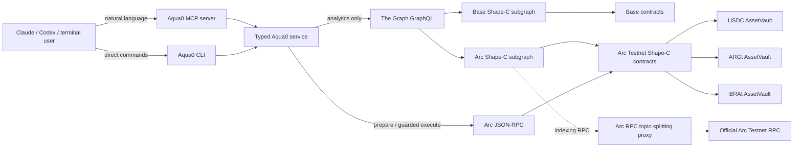

# Architecture

## Separation of concerns

- **The Graph is the read model.** Agent analytics never silently switch to RPC when a Graph query fails.
- **Shape-C contracts are the write model.** Typed tools prepare exact current contract calls; guarded execution is restricted to Arc Testnet or local Anvil.
- **MCP is the natural-language boundary.** The LLM performs intent interpretation and calls typed tools; Aqua0 does not ship another brittle text parser.
- **The Arc RPC proxy is indexing infrastructure only.** It preserves full canonical event coverage while adapting the official Arc RPC's `eth_getLogs` topic-OR limit. It does not fabricate or cache chain data.
- **Secrets stay out of the repository.** Graph query keys and signing keys are environment variables. The AWS MCP currently runs prepare-only.

## Demo state

The Arc Testnet core is deployed with one registry/factory/composer/filler stack and three Shape-C vaults: USDC, ARGt, and BRAt. The same USDC vault can participate in multiple strategy classes, which is the onchain form of the shared-backing demo.

The local Base-fork test in `scripts/test-shared-backing-fork.sh` deterministically proves the central invariant: a single 100 USDC principal position can commit to both an ARS strategy and a BRL strategy at 100 USDC backing each without splitting the principal into two isolated pools.
