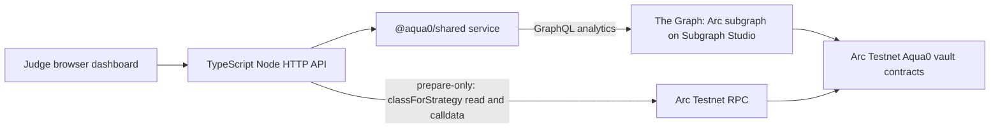

# Circle / Arc track notes

For prize-by-prize criteria and checklists, see [README: Prize tracks](../README.md#prize-tracks). This page is the Arc-specific product inventory and a short guide to the web MVP.

<!-- TODO: add demo video link -->

## What Aqua0 uses on Arc today

| Circle / Arc product | Used? | How |
| --- | --- | --- |
| Arc (chain `5042002`) | Yes | The Aqua0 vault core, three AssetVaults and both 1inch Aqua venues (pegged and forex) are **Live**, with strategies shipped and filled on each. RedStone BRL and MXNe price feeds are **Live**. See [`ARC_DEPLOYMENT.md`](ARC_DEPLOYMENT.md). |
| USDC | Yes | Arc's native USDC (ERC-20 interface `0x3600…0000`, 6 dp) is the shared quote asset. One 2 USDC deposit backs a USDC/ARS and a USDC/BRL strategy at once: **Live**. |
| Circle Wallets (developer-controlled) | Yes | A person signs in with Privy from the terminal (`login`) and gets a Circle EOA wallet on Arc. Deposits, strategy creation and swaps run through Circle's API; a shared Circle operator wallet sends the strategies users sign and tops up new wallets with testnet USDC: **Live**. See [Agent transactions on Arc](#agent-transactions-on-arc). |
| Nanopayments (Circle Gateway batched x402) | Yes | The keeper buys oracle, book and vault signals per request ($0.0005 to $0.001) from the Aqua0 signals seller; each payment is an EIP-3009 authorization signed by the keeper's Circle wallet and settled in batches by Circle Gateway on Arc Testnet: **Live**. See [Autonomous FX book keeper](#autonomous-fx-book-keeper). |
| App Kit (`send`) | Yes | Funded the keeper's Circle wallet with 3 USDC from the operator wallet (`@circle-fin/app-kit` with the Circle Wallets adapter); the keeper tops itself up the same way, capped per day: **Live** |
| ERC-8004 (Identity and Reputation registries on Arc Testnet) | Yes | The keeper is agent 894559; the operator recorded feedback after its rebalance: **Live** |
| Circle Contracts, CCTP, StableFX | Not yet | **Planned**, see below |
| Paymaster, Agent Stack starter kits | No | Paymaster is not available on Arc. The starter kits were not used. |

Arc is testnet-only for Aqua0 today.

## FX market data on Arc

Forex-curve USDC/BRL strategies price from real FX market data on Arc: RedStone prices signed by 3 of its 5 primary-prod signers and verified on-chain by the RedStone adapter.
- **Feeds:** BRL (USD per 1 BRL) and MXNe (MXN per 1 USD, from Etherfuse's MXNe stablecoin), **Live** on Arc Testnet. No Aqua0 MXN vault exists yet.
- **Why RedStone:** its gateways are free and need no API key. Pyth's free tier excludes FX feeds, Chainlink Data Feeds are on Arc mainnet only, StableFX covers only USDC/EURC, and RedStone has no ARS feed, so USDC/ARS stays on a hand-set feed.
- **Status:** forex USDC/BRL on these feeds is **Live** on Arc: `swap` pushed a signed RedStone price, then filled 0.1 USDC → 0.513598 BRAt at oracle 5.15143 BRAt per USDC.

Addresses and mechanics: [`ARC_DEPLOYMENT.md`](ARC_DEPLOYMENT.md#6-redstone-price-feeds-live).

## Arc prize requirements checklist

| Requirement | Evidence | Status |
| --- | --- | --- |
| Functional MVP: frontend | Judge dashboard at `https://ethglobal-demo.18-207-103-187.nip.io/` ([`apps/dashboard`](../apps/dashboard)): Arc vault cards, live Graph health, indexed data, strategy classes, ARS/BRL presets, prepare-only strategy calldata. The primary interface is the agentic terminal via MCP. | **Live** (read-only and prepare-only) |
| Functional MVP: backend | Dashboard Node API, MCP server ([`apps/mcp`](../apps/mcp)), typed service ([`packages/shared`](../packages/shared)), subgraph on Subgraph Studio, Arc contracts | **Live** |
| Architecture diagram | [README: How it works](../README.md#how-it-works), [`ARCHITECTURE.md`](ARCHITECTURE.md) | **Live** |
| Video demo of core functions and use of Circle developer tools | Link added at submission | **In progress** |
| Detailed documentation | README, `docs/`, [`skills/aqua0/SKILL.md`](../skills/aqua0/SKILL.md) | **Live** |
| GitHub repository | `https://github.com/Aqua0-fi/aqua0-ethglobal` | **Live** |
| Arc Mainnet deployment (mainnet-conditional share of each prize) | Not deployed | **Planned** |

## Web MVP architecture



Dashboard routes:

| Path | Purpose |
| --- | --- |
| `/` | Judge-facing dashboard |
| `/api/config` | Sanitized public Arc deployment and ARS/BRL preset config from `deployments/*.json` |
| `/api/health` | Graph-backed health |
| `/api/snapshot` | Protocol snapshot |
| `/api/opportunities` | Live strategy vaults and recent lifecycle events |
| `/api/live` | One raw Graph query for `_meta`, `vaults`, `strategies`, `strategyVaults` |
| `/api/prepare-strategy` | POST, prepare-only `prepareCreateStrategy` |
| `/docs/ARCHITECTURE.md`, `/docs/ARC_DEPLOYMENT.md`, `/docs/THE_GRAPH_TRACK.md` | Raw docs |

The dashboard backend has no execute endpoint and never reads `WRITE_PRIVATE_KEY`.

## Agent transactions on Arc

A local MCP or CLI started with `MCP_WRITE_MODE=execute` sends `deposit`, `create_strategy` and `swap` transactions itself, and `set_fx_price` when the signer owns the ARS/USD feed. For a RedStone-priced strategy, `swap` first pushes the latest signed price on-chain. This is limited to Arc Testnet or a local fork.

- **Live on Arc Testnet:** the demo wallet ran deposit → two pegged strategies → one swap each → shared-backing read through the `aqua0` CLI, which calls the same service functions as the MCP tools. Hashes: [`deployments/arc-testnet-strategies.json`](../deployments/arc-testnet-strategies.json).
- **Live on Arc Testnet, forex venue:** with `SIGNER=circle`, the demo Circle wallet `0xb0c0…d952` created forex USDC/ARS and USDC/BRL strategies with the default opcode (the shared Circle operator sent the ships) and swapped 0.1 USDC on each, with a RedStone price push before the BRL swap. Hashes: `forexLiveRun` in [`deployments/arc-testnet-strategies.json`](../deployments/arc-testnet-strategies.json).
- **Fork-proven:** the forex curve's inventory fee and halt band, and an ARS feed move and re-quote, which the small live run does not reach ([`scripts/test-arc-fork-forex.sh`](../scripts/test-arc-fork-forex.sh)).
- The first live run signed with a locally configured key (`WRITE_PRIVATE_KEY`). `SIGNER=circle` signs with a Circle developer-controlled EOA wallet instead, one per user.
- **Live on Arc Testnet, Circle wallets:** a person signed in with Privy (`aqua0 login`), which created their Circle wallet `0x34f9…450f`. The Aqua0 operator wallet `0xcdbd…d404` topped it up with 5 testnet USDC. With no role of its own, the wallet then deposited 2 USDC, created a USDC/BRL strategy (it signed the ship, the operator sent it, tx `0xea960df6…4c8b1a`) and swapped 0.1 USDC → 0.547 BRAt against it (tx `0x586c0105…3b49e4`). Every transaction went through Circle's API.
- The MCP and CLI act on user instructions. The FX book keeper below acts on its own.
- The public endpoint is prepare-only and holds no key.

## Autonomous FX book keeper

[`apps/keeper`](../apps/keeper) is an agent with its own Circle developer-controlled wallet (`0x5214…4d87`, refId `aqua0-keeper`) that keeps the live forex books near an even split, so traders get the flat oracle price (about 30 bps) instead of the inventory fee.

- **What is autonomous.** The loop, what it buys and what it decides. It wakes on the forex router's `Swapped` logs for the live strategies (polled every few seconds; the public RPC has no subscriptions) and on a heartbeat. It buys only the signals its policy asks for, then chooses one action from a closed set: rebalance, wait, recommend_dock, top_up_usdc or top_up_gateway.
- **Who decides.** An OpenAI model (`gpt-5-nano` by default, the cheapest model this key sees with structured outputs, about $0.0001 per decision) returns one action and a reason as schema-checked JSON. The model is called only when something happened (a swap, a tilted book, an oracle problem, a balance floor), never on quiet heartbeats, and within a daily cap ($0.50). Invalid output, errors, timeouts, out-of-limit choices and the cap fall back to the deterministic rules policy. Without `OPENAI_API_KEY` the rules policy decides.
- **Limits enforced in code, outside the policy.** Data budget per hour, max trade size, per-strategy cooldown, allowed actions, daily top-up and Gateway deposit caps, dry-run. Circle wallet spending caps are mainnet-only, so these guards are the safety on Arc Testnet.
- **Acting on mined state.** The book is read right before trading (unpaid RPC), and the trade aborts if the tilt is gone or reversed. The swap goes through the same `executeFxSwap` as the MCP tool, with a fresh quote and an on-chain minimum output. For an FX-in rebalance the keeper mints the open-mint demo token it pays with.
- **Circle products used, live on Arc Testnet.**
  - Nanopayments: signals seller [`apps/signals`](../apps/signals) behind `createGatewayMiddleware` (testnet facilitator). `/v1/oracle` $0.0005, `/v1/book` $0.001, `/v1/vault` $0.0005, paid to the operator wallet; the keeper signs with `registerBatchScheme` over its Circle wallet's `signTypedData`.
  - Circle developer-controlled wallets: the keeper's wallet signs every transaction and payment.
  - App Kit `send`: operator → keeper funding and capped top-ups.
  - ERC-8004: agent 894559; the operator rates each executed rebalance.
- **Not done.** Paymaster is not on Arc. The Agent Stack starter kits were not used. The keeper recommends docking a strategy with a stale or out-of-band oracle but cannot dock it (that needs the strategist's signature). The keeper and seller run locally, not hosted.
- **Live run.** A 0.1 USDC swap from the demo wallet tilted USDC/BRL to 265.53 bps. Within one poll the keeper bought the book signal (settlement `603b9149…5809`), the model chose to rebalance 0.100082 USDC of BRAt, and the keeper swapped ([tx](https://testnet.arcscan.app/tx/0xa3a786f86937bb03ab6f5bc6dbb5745b7f22ab3cbf03a8dca164362a4ea165e4)): spread 29.99 bps after. All hashes are under `keeperRun` in [`deployments/arc-testnet-strategies.json`](../deployments/arc-testnet-strategies.json); the runbook is [DEMO.md: Two-session demo](DEMO.md#two-session-demo-autonomous-keeper).

## Run

```bash
GRAPH_ENDPOINT=https://api.studio.thegraph.com/query/1760183/aqua-0-ethglobal-arc-testnet/version/latest \
WRITE_RPC_URL=https://rpc.testnet.arc.network \
WRITE_CHAIN_ID=5042002 \
VAULT_REGISTRY_ADDRESS=0x9E094b21C4263e0BE5BEffa0f8296B3fd982fFFf \
pnpm --filter @aqua0/dashboard dev
```

AWS loopback compose: `docker compose -f deploy/aws/dashboard.compose.yml up -d --build`. It binds `127.0.0.1:8400->3000`, attaches `graph-node_default`, and pins `MCP_WRITE_MODE=prepare`.

## Next steps toward the Circle stack (Planned, not built)

- **Circle Wallets / Agent Stack:** give the agent its own wallet to sign the strategy, deposit and swap transactions it already builds. Keep policy limits (chain, tokens, max notional) in the wallet layer, not in the prompt.
- **Nanopayments:** built and live for the keeper's signals (see above). Next: host the seller and price `quote_swap` for third-party agents the same way.
- **Paymaster:** not available on Arc; revisit if it ships there.
- **StableFX:** it covers only USDC/EURC today, so the forex curve's BRL price comes from RedStone. Evaluate StableFX for a USDC/EURC pair or as a comparison venue.
- **CCTP / Gateway:** bring USDC in from other chains before depositing into the shared vault.
- **Arc Mainnet:** deploy after a security review of the contracts and the ForexCurve instruction.
