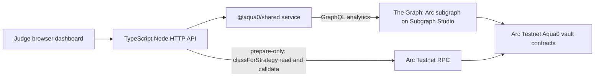

# Circle / Arc track notes

For prize-by-prize criteria and checklists, see [README: Prize tracks](../README.md#prize-tracks). This page is the Arc-specific product inventory and a short guide to the web MVP.

<!-- TODO: add demo video link -->

## What Aqua0 uses on Arc today

| Circle / Arc product | Used? | How |
| --- | --- | --- |
| Arc (chain `5042002`) | Yes | The Aqua0 vault core, three AssetVaults and the pegged 1inch Aqua venue are **Live**, with two strategies shipped and filled. The FXSwap venue is **Deployed, awaiting wiring**. See [`ARC_DEPLOYMENT.md`](ARC_DEPLOYMENT.md). |
| USDC | Yes | Arc's native USDC (ERC-20 interface `0x3600…0000`, 6 dp) is the shared quote asset. One 2 USDC deposit backs a USDC/ARS and a USDC/BRL strategy at once: **Live**. |
| App Kits, Circle Wallets, Circle Contracts, CCTP, Gateway, StableFX | Not yet | **Planned**, see below |
| Agent Stack, Nanopayments, Paymaster | Not yet | **Planned**, see below |

Arc is testnet-only for Aqua0 today.

## Arc prize requirements checklist

| Requirement | Evidence | Status |
| --- | --- | --- |
| Functional MVP: frontend | Judge dashboard at `https://ethglobal-demo.18-207-103-187.nip.io/` ([`apps/dashboard`](../apps/dashboard)): Arc vault cards, live Graph health, indexed data, strategy classes, ARS/BRL presets, prepare-only strategy calldata. The primary interface is the agentic terminal via MCP. | **Live** (read-only and prepare-only) |
| Functional MVP: backend | Dashboard Node API, MCP server ([`apps/mcp`](../apps/mcp)), typed service ([`packages/shared`](../packages/shared)), subgraph on Subgraph Studio, Arc contracts | **Live**; FXSwap venue **Deployed, awaiting wiring** |
| Architecture diagram | [README: How it works](../README.md#how-it-works), [`ARCHITECTURE.md`](ARCHITECTURE.md) | **Live** |
| Video demo of core functions and use of Circle developer tools | Link added at submission | **In progress** |
| Detailed documentation | README, `docs/`, [`skills/aqua0/SKILL.md`](../skills/aqua0/SKILL.md) | **Live** |
| GitHub repository | `https://github.com/Aqua0-fi/aqua0-ethglobal` | **Live** |
| Arc Mainnet deployment (mainnet-conditional share of each prize) | Not deployed | **Planned** |

## Web MVP architecture



Dashboard routes:

| Path | Purpose |
| --- | --- |
| `/` | Judge-facing dashboard |
| `/api/config` | Sanitized public Arc deployment and ARS/BRL preset config from `deployments/*.json` |
| `/api/health` | Graph-backed health |
| `/api/snapshot` | Protocol snapshot |
| `/api/opportunities` | Live strategy vaults and recent lifecycle events |
| `/api/live` | One raw Graph query for `_meta`, `vaults`, `strategies`, `strategyVaults` |
| `/api/prepare-strategy` | POST, prepare-only `prepareCreateStrategy` |
| `/docs/ARCHITECTURE.md`, `/docs/ARC_DEPLOYMENT.md`, `/docs/THE_GRAPH_TRACK.md` | Raw docs |

The dashboard backend has no execute endpoint and never reads `WRITE_PRIVATE_KEY`.

## Agent transactions on Arc

A local MCP or CLI started with `MCP_WRITE_MODE=execute` sends `deposit`, `create_strategy` and `swap` transactions itself, and `set_fx_price` when the signer owns the feed. This is limited to Arc Testnet or a local fork.

- **Live on Arc Testnet:** the demo wallet ran deposit → two pegged strategies → one swap each → shared-backing read through the `aqua0` CLI, which calls the same service functions as the MCP tools. Hashes: [`deployments/arc-testnet-strategies.json`](../deployments/arc-testnet-strategies.json).
- **Fork-proven:** the FXSwap flow, including a feed move and re-quote ([`scripts/test-arc-fork-fxswap.sh`](../scripts/test-arc-fork-fxswap.sh)).
- The signer is a locally configured key (`WRITE_PRIVATE_KEY`), not a Circle wallet.
- The agent acts on user instructions; it is not an autonomous agent.
- The public endpoint is prepare-only and holds no key.

## Run

```bash
GRAPH_ENDPOINT=https://api.studio.thegraph.com/query/1760183/aqua-0-ethglobal-arc-testnet/version/latest \
WRITE_RPC_URL=https://rpc.testnet.arc.network \
WRITE_CHAIN_ID=5042002 \
VAULT_REGISTRY_ADDRESS=0x9E094b21C4263e0BE5BEffa0f8296B3fd982fFFf \
pnpm --filter @aqua0/dashboard dev
```

AWS loopback compose: `docker compose -f deploy/aws/dashboard.compose.yml up -d --build`. It binds `127.0.0.1:8400->3000`, attaches `graph-node_default`, and pins `MCP_WRITE_MODE=prepare`.

## Next steps toward the Circle stack (Planned, not built)

- **Circle Wallets / Agent Stack:** give the agent its own wallet to sign the strategy, deposit and swap transactions it already builds. Keep policy limits (chain, tokens, max notional) in the wallet layer, not in the prompt.
- **Nanopayments:** charge per quote or per strategy-management action in USDC.
- **Paymaster:** sponsor strategist and LP transactions.
- **StableFX:** evaluate it as an FX price source for FXSwap, or as a comparison venue.
- **CCTP / Gateway:** bring USDC in from other chains before depositing into the shared vault.
- **Arc Mainnet:** deploy after a security review of the contracts and FXSwap.
