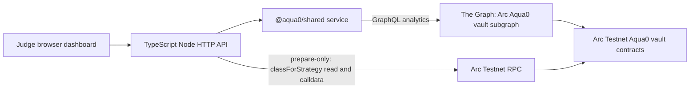

# Circle / Arc track notes

For prize-by-prize criteria and how Aqua0 addresses each, see [README: Prize tracks](../README.md#prize-tracks). This page is the Arc-specific checklist and a short guide to the web MVP.

## What Aqua0 uses on Arc today

| Circle / Arc product | Used? | How |
| --- | --- | --- |
| Arc (chain `5042002`) | Yes, **Live** | Aqua0 vault core and three AssetVaults live; 1inch Aqua + AquaSwapVMRouter + Aqua0 AquaAdapter deployed and awaiting admin wiring. See [`ARC_DEPLOYMENT.md`](ARC_DEPLOYMENT.md). |
| USDC | Yes, **Live** | Arc's native USDC (ERC-20 interface `0x3600…0000`, 6 dp) is the shared quote asset. One USDC deposit backs several FX strategies at once. |
| App Kits, Circle Wallets, Circle Contracts, CCTP, Gateway, StableFX | Not yet | Planned, see below. |
| Agent Stack, Nanopayments, Paymaster | Not yet | Planned, see below. |

## Arc prize requirements checklist

| Requirement | Evidence | Status |
| --- | --- | --- |
| Functional MVP: frontend | Judge dashboard at `https://ethglobal-demo.18-207-103-187.nip.io/` ([`apps/dashboard`](../apps/dashboard)). Shows Arc vault cards, live Graph health, raw indexed data, strategy classes, ARS/BRL presets, and prepare-only strategy calldata. The primary interface is the agentic terminal via MCP. | Live |
| Functional MVP: backend | Dashboard Node API, MCP server ([`apps/mcp`](../apps/mcp)), typed service ([`packages/shared`](../packages/shared)), subgraph, and the Arc contracts | Live (venue awaiting wiring) |
| Architecture diagram | [README: How it works](../README.md#how-it-works), [`ARCHITECTURE.md`](ARCHITECTURE.md) | Done |
| Video demo of core functions and use of Circle developer tools | Link added at submission | Pending |
| Detailed documentation | README + `docs/` | Done |
| GitHub repository | `https://github.com/Aqua0-fi/aqua0-ethglobal` | Done |
| Arc Mainnet deployment (mainnet-conditional share of each prize) | Not deployed | Planned |

<!-- TODO(coordinator): add the demo video link and confirm the public repository URL. -->

## Web MVP architecture



Dashboard routes:

| Path | Purpose |
| --- | --- |
| `/` | Judge-facing dashboard |
| `/api/config` | Sanitized public Arc deployment and ARS/BRL preset config from `deployments/*.json` |
| `/api/health` | Graph-backed health |
| `/api/snapshot` | Protocol snapshot |
| `/api/opportunities` | Live strategy vaults and recent lifecycle events |
| `/api/live` | One raw Graph query for `_meta`, `vaults`, `strategies`, `strategyVaults` |
| `/api/prepare-strategy` | POST, prepare-only `prepareCreateStrategy` |
| `/docs/ARCHITECTURE.md`, `/docs/ARC_DEPLOYMENT.md`, `/docs/THE_GRAPH_TRACK.md` | Raw docs |

The backend has no execute endpoint and never reads `WRITE_PRIVATE_KEY`.

## Run

Local:

```bash
GRAPH_ENDPOINT=https://your-subgraph-endpoint \
WRITE_RPC_URL=https://rpc.testnet.arc.network \
WRITE_CHAIN_ID=5042002 \
VAULT_REGISTRY_ADDRESS=0x9E094b21C4263e0BE5BEffa0f8296B3fd982fFFf \
pnpm --filter @aqua0/dashboard dev
```

AWS loopback compose: `docker compose -f deploy/aws/dashboard.compose.yml up -d --build` binds `127.0.0.1:8400->3000`, attaches `graph-node_default`, and pins `MCP_WRITE_MODE=prepare`.

## Next steps toward the Circle stack (Planned, not built)

- **Circle Wallets / Agent Stack:** give the agent its own wallet so it can sign the strategy, deposit and swap transactions it prepares today. Keep policy limits (chain, tokens, max notional) in the wallet layer, not in the prompt.
- **Nanopayments / x402-style metering:** charge per quote or per strategy-management action in USDC.
- **Paymaster:** sponsor strategist and LP transactions.
- **StableFX:** evaluate it as an FX price source for FXSwap, or as a comparison venue.
- **CCTP / Gateway:** bring USDC in from other chains before depositing into the shared vault.
- **Arc Mainnet:** deploy once the contracts and FXSwap are reviewed.
