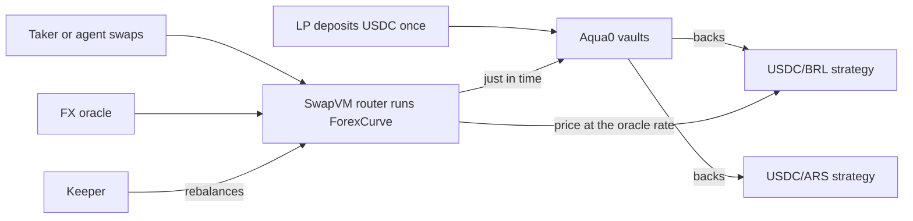

# FX opcode handoff: pitch context

Everything needed to present the problem, the solution, how it works and the maths behind the `ForexCurve` SwapVM opcode, before the live demo takes over. Every number here is sourced at the bottom of the page.

**Suggested running order.** Problem → solution → how it works → the maths → hand over to the demo (a second person runs [`DEMO.md`](DEMO.md)).

## One line

One USDC deposit makes markets in many local currencies at the live FX rate, and any AI agent can run it.

## 1. The problem

- **FX liquidity onchain is thin, except for euros.** A benchmark over The Graph's standardized DEX subgraphs (12 subgraphs, 4 protocols, 6 chains) found:
  - **EUR is liquid:** $3M+ pools at 5 bps.
  - **BRL is thin:** the deepest pool holds $118k, so a $100k trade is 85% of it.
  - **MXN and ARS have no standardized pool at all.**
- **Capital gets split.** A market maker in several currencies must put separate capital in every pool, so each new currency needs new money.
- **Fixed-price curves leak value on FX.** A pegged curve holds liquidity at one ratio, but exchange rates move. When the rate moves, the pool still quotes the old price and arbitrageurs take the difference from LPs.
- **Agents cannot act on it easily.** An agent would have to stitch together an indexer, a trading venue and a wallet on its own.

## 2. The solution

- **Shared liquidity (Aqua0).** An LP deposits once into a vault, and that one principal backs many strategies at the same time. Tokens stay in the vault until a swap needs them.
- **An FX-native pricing opcode (`ForexCurve`).** A new 1inch SwapVM instruction, opcode 34, that prices every swap from a live FX oracle instead of a fixed ratio.
- **Agent-native.** An MCP server lets Claude Code, Codex or any MCP client read Aqua0 from The Graph, create strategies and swap, signing through Circle wallets.
- **Self-maintaining.** An autonomous keeper with its own Circle wallet pays for market signals with Nanopayments and rebalances the books when a trade tilts them.

## 3. How it works

1. An LP deposits USDC once into an Aqua0 vault.
2. A strategy per currency pair is shipped into 1inch Aqua, all backed by that same USDC. Aqua records virtual balances only.
3. A taker swaps. The router runs `ForexCurve`, which reads the FX oracle and prices the trade.
4. The Aqua0 adapter pulls the output from its vault and sweeps the input into the other vault, all in the same transaction.
5. If the trade tilts the book, the keeper notices, buys a signal, decides and swaps it back.

## 4. The maths

`ForexCurve` is Tomás's forex curve: the Shell v1 curve with an oracle, as DFX v2 runs it in production for EURC, CADC and XSGD against USDC. It is stateless: the price depends only on the two balances and the oracle.

**Value the book at the oracle rate.** With `x` the USDC balance, `y = p · FX balance` (p is the oracle price), the book is worth `g = x + y`, and the ideal is an even split, `I = g / 2`.

**Three zones, measured from that even split:**

| Zone | Rule | What the taker sees |
| --- | --- | --- |
| Flat band, within `±β` of `I` | Price = oracle | The live FX rate plus the fee `ε` (about 30 bps), no slippage |
| Past the flat band | Each side past the band pays `μ = min(δ · m / I, maxFee) · m`, where `m` is its distance past the band | A growing inventory fee that discourages draining one side |
| Past the halt band `±α` | Swap reverts | No fill: the book cannot be emptied |

**Who pays the fee.** Let `ψ` be the total inventory fee. A trade that makes `ψ` bigger pays the increase to the pool. A trade that makes it smaller, one that rebalances the book, gets back a share `λ` of the reduction. The curve therefore pays traders to fix an imbalance.

**Closed form, built for an opcode.** DFX finds the trade by iterating 32 times, and that loop failed to converge on large trades in the live pool. Here each case reduces to a quadratic that is solved exactly, and rounding always favours the pool.

**Oracle safety.** Every swap checks the oracle's age against the strategy's staleness window and its value against a min/max price band. A stale or out-of-band price reverts the swap.

**Parameters (the MCP defaults):**

| Parameter | Default | Plain meaning |
| --- | --- | --- |
| `β` flat band | 0.15 | The book can drift 15% from an even split and still trade at the oracle price |
| `α` halt band | 0.5 | Beyond this imbalance, swaps that make it worse stop |
| `δ` fee slope | 0.5 | How fast the inventory fee grows past the flat band |
| `maxFee` | 0.25 | Cap on the inventory fee rate (must be below 0.5) |
| `λ` rebate | 0.3 | Share of a shrinking fee paid back to the trader who rebalances |
| `ε` fee | 30 bps | The proportional fee on every swap |

**Why these defaults.** In 30-day simulations of a $5k USDC/BRL book, these settings earned +2.6% against holding, versus +1.6% for DFX's production settings, and halted 4 times a month instead of 11. The narrower band and a partial rebate stop giving value away to rebalancing trades.

## 5. Proof points for the screen

- **Correct:** matches all 979 reference vectors (Tomás's 968 plus the live DFX EURC/USDC pool) within a few wei.
- **Live on Arc Testnet:** fills inside the flat band at 29.99 bps; a tilted book quoted 265.53 bps, and the keeper brought it back to 29.99 bps with no human involved.
- **Every regime tested on an Arc fork:** 30 bps in the band, 666 bps past it, a revert past the halt band, and a +5% oracle move that moves the quote by exactly 5%.
- **Cheap enough:** about 108k gas per swap inside the flat band, 133k leaving it.
- **Built on the official stack:** 1inch aqua 0.1.0 and swap-vm v1.0.2, with `ForexCurve` added as opcode 34.

## 6. Handing over to the demo

A cue line: *"That's the maths. Now let's watch an agent use it: one USDC, two currencies, and a keeper that fixes the book on its own."*

The demo then shows: an agent creates USDC/ARS and USDC/BRL strategies on the same USDC, swaps 0.1 USDC to BRL, the keeper rebalances the tilted book in the other terminal, and the agent confirms what happened. Runbook: [`DEMO.md`](DEMO.md#two-session-demo-autonomous-keeper).

## 7. Say this, not that

| Say | Avoid |
| --- | --- |
| "Tomás's forex curve", "`ForexCurve`, SwapVM opcode 34" | "FXSwap" (an earlier design, removed) |
| "Live on Arc Testnet" | "Live on mainnet" (not deployed to Arc Mainnet) |
| "BRL prices from RedStone signed market data" | "Live ARS rate": the ARS feed is set by hand for the demo, because RedStone has no ARS feed |
| "ARGt and BRAt, testnet tokens standing in for ARS and BRL stablecoins" | Calling them real stablecoins |
| "Simulations earned +2.6% against holding" | Promising LP returns |
| "The keeper runs on its own" | "Hosted keeper" (it runs locally) |

## Sources

- Curve and simulations: [`FX_CURVES.md`](FX_CURVES.md), reference implementation [`scripts/fxforex_math.py`](../scripts/fxforex_math.py).
- Contract maths and program layout: [`packages/contracts/README.md`](../packages/contracts/README.md#forexcurve-maths), [`ForexCurveMath.sol`](../packages/contracts/src/libs/ForexCurveMath.sol).
- Market benchmark: [`THE_GRAPH_TRACK.md`](THE_GRAPH_TRACK.md#composable-and-standardized-graph-products).
- Live runs and hashes: [`deployments/arc-testnet-strategies.json`](../deployments/arc-testnet-strategies.json) (`forexLiveRun`, `keeperRun`); fork proof [`scripts/test-arc-fork-forex.sh`](../scripts/test-arc-fork-forex.sh).
- Links, on-chain proof and prize text: [`ETHGLOBAL_SUBMISSION.md`](ETHGLOBAL_SUBMISSION.md).
