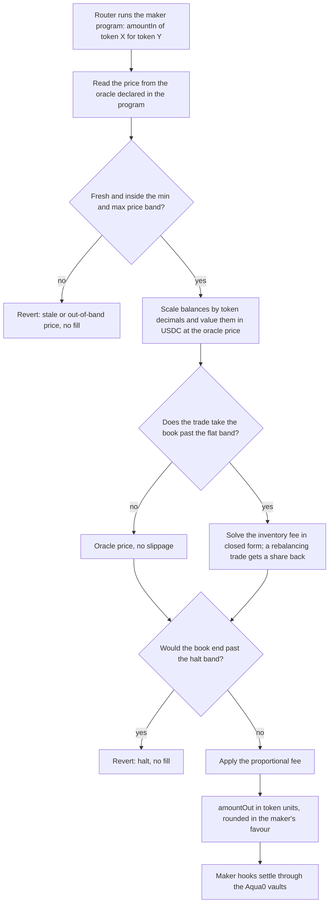

# @aqua0/contracts

Foundry package that puts 1inch Aqua + SwapVM on Arc Testnet and connects them to the live Aqua0 vault core
recorded in [`deployments/arc-testnet.json`](../../deployments/arc-testnet.json).

- `lib/swap-vm`: 1inch swap-vm **v1.0.2** (git submodule). Pinned because it is the build 1inch's own router
  runs elsewhere and the one Aqua0's `AquaAdapter` is tested against. It pins `@1inch/aqua` 0.1.0.
- `script/DeployAquaVenue.s.sol`: deploys `AquaRouter` (Aqua) and a stock `AquaSwapVMRouter`.
- `script/deploy-arc-aqua-venue.sh`: step 1, venue + Aqua0 `AquaAdapter` + wiring + verification.
- `script/ArcFxStrategies.s.sol`, `script/run-arc-fx-strategies.sh`: step 2, one USDC deposit backing a
  USDC/ARGt and a USDC/BRAt strategy, each shipped through the adapter and filled once.
- `script/DeployForexVenue.s.sol`, `script/deploy-arc-forex-venue.sh`: the forex venue, an
  `AquaForexSwapVMRouter` (ForexCurve, opcode 34) and a second `AquaAdapter` bound to it.

## Setup

```bash
git submodule update --init packages/contracts/lib/swap-vm
(cd packages/contracts/lib/swap-vm && npm install --ignore-scripts)
(cd packages/contracts && forge build)
```

`AquaAdapter` is pre-existing Aqua0 code and is compiled from a local Aqua0 contracts checkout
(`AQUA0_CONTRACTS_DIR`).

## Step 1: venue and adapter

```bash
# Dry run on a local fork (impersonates the core admin for the wiring)
anvil --fork-url https://rpc.testnet.arc.network --port 8577
MODE=fork AQUA0_CONTRACTS_DIR=../../../Aqua0/contracts DEPLOYER=0x... ./script/deploy-arc-aqua-venue.sh

# Arc Testnet (deploys, records addresses, prints the admin wiring calldata)
MODE=arc AQUA0_CONTRACTS_DIR=... DEPLOYER=0x... \
KEYSTORE_ACCOUNT=<keystore-name> KEYSTORE_PASSWORD_FILE=<path-to-password-file> \
./script/deploy-arc-aqua-venue.sh
```

The wiring (`VaultRegistry.setAdapterAllowed` and `VENUE_SETTLER_ROLE` on each vault) needs the core admin, so
on Arc it is printed rather than sent. The adapter is inert until it lands.

The deployer also turns off the adapter's `oneStrategyPerToken` knob. Left on, a token that backs one live
strategy cannot back a second, which is precisely the shared-backing property the demo shows. The vault's
settle-time debit and venue outflow limit remain the capital bound.

## Step 2: two FX strategies on one USDC deposit

```bash
MODE=fork DEPLOYER=0x... KEYSTORE_ACCOUNT=<keystore-name> KEYSTORE_PASSWORD_FILE=<path-to-password-file> \
AQUA_ADAPTER=0x... AQUA_SWAPVM_ROUTER=0x... ./script/run-arc-fx-strategies.sh

MODE=arc DEPLOYER=0x... KEYSTORE_ACCOUNT=<keystore-name> KEYSTORE_PASSWORD_FILE=<path-to-password-file> ./script/run-arc-fx-strategies.sh
```

Tunables (env): `USDC_DEPOSIT`, `USDC_SHIP`, `USDC_SWAP_IN`, `FEE_PPB` (1e9 = 100%), `LINEAR_WIDTH` (1e27 scale),
`ARS_PER_USDC_E2`, `BRL_PER_USDC_E2`.

Each strategy is `[FlatFeeAmountIn][PeggedSwap]`. USDC's pegged-curve rate multiplier carries both the 12-decimal
gap and the FX price, so the flat zone sits at the configured price. It is a fixed-price stable strategy: it does
not follow a moving FX rate.

## Forex venue

`src/instructions/ForexCurve.sol` is Tomás's forex curve (Shell v1 as DFX v2 runs it) as a SwapVM instruction,
with the closed-form math in `src/libs/ForexCurveMath.sol`. `src/routers/AquaForexSwapVMRouter.sol` adds it at
opcode 34 and keeps every other swap-vm v1.0.2 `AquaOpcodes` index; XYCConcentrate, Decay and the protocol-fee
opcodes are no-ops so the router fits EIP-170 (24,418 bytes).

Each swap reads the feed the program names, rejects a stale or out-of-band answer and values both Aqua balances in
the quote token. Inside the flat band `beta` the price is the oracle; past it an inventory fee applies (slope
`delta`, capped at `maxFee`), and a share `lambda` of a shrinking fee goes back to the taker. A swap that pushes the
book past the halt band `alpha` reverts. `epsilon` is a proportional fee on every swap. `maxFee` must be below 0.5
(so each quote has one solution); `delta` is capped only by its `uint64` field (about 18.45).

```bash
# Local fork: deploy the router and adapter, wire the adapter as the impersonated core admin
MODE=fork AQUA0_CONTRACTS_DIR=../../../Aqua0/contracts DEPLOYER=0x... ./script/deploy-arc-forex-venue.sh

# Arc Testnet: deploy, record addresses, print the admin wiring calldata; OPERATOR, if set, gets OPERATOR_ROLE
MODE=arc AQUA0_CONTRACTS_DIR=... DEPLOYER=0x... OPERATOR=0x... \
KEYSTORE_ACCOUNT=<keystore-name> KEYSTORE_PASSWORD_FILE=<path-to-password-file> \
./script/deploy-arc-forex-venue.sh
```

No feeds are deployed: forex strategies read the RedStone BRL feed below and the ARS/USD `ManualFxOracle`. On Arc
Testnet the router is `0x475d0E487779743Fb52c8E7729A1718934D4187e` and the adapter
`0xc9cD056FCF2EF46116259fb094BD897c7E7C0EfB`, both verified on Arcscan. The adapter is wired: allowlisted in the `VaultRegistry` and holding `VENUE_SETTLER_ROLE`
on the USDC, ARGt and BRAt vaults, so forex strategies trade live on Arc.

Tests: `test/ForexCurve.t.sol`, `test/ForexCurveInvariants.t.sol`, `test/ForexCurveVectors.t.sol` (all 979 reference
vectors in `test/fixtures/fxforex-vectors-wad.json`, matched within a few wei of a 100-digit re-solve) and
`test/fork/ForexCurveArcFork.t.sol` (skipped with `FOREX_SKIP_FORK=true` or `FXSWAP_SKIP_FORK=true`). 41 Foundry
tests pass without the fork test.

## ForexCurve maths

```text
x = USDC balance,  y = p · FX balance        p = USDC per 1 FX unit, from the oracle
g = x + y,  ideal I = g / 2

distance past the band:  m = I(1 − β) − b  (below)   or   m = b − I(1 + β)  (above)
inventory fee per asset: μ = min(δ · m / I, maxFee) · m,  0 inside the band
ψ = μ_x + μ_y,  ω = ψ before the trade

retained by the pool:    s = ψ' − ω         if the fee grows (the taker pays it)
                         s = λ · (ψ' − ω)   if it shrinks (the taker gets λ of it back)
```

- **Balances** are scaled to 18 decimals (`rate = 10^(18 − decimals)`) and valued in USDC at the oracle price, so the curve sits at the live FX rate.
- **Solver.** Multiplying by `g + s` makes `s` a quadratic in each piece (each asset's regime, and `c` = 1 or `λ`), solved exactly instead of DFX's 32-step iteration. Inside the band `s = 0` and the price is the oracle. Rounding always favours the maker.
- **Halt and invariant.** As in DFX: a balance may end beyond `±α` of the new ideal only if it already was and the excursion does not grow, and the utility `g − ψ` may not drop.
- **Fee.** `ε` applies to the output (exact in) or the input (exact out). The strategy declares it to the adapter as `feePpb`; no SwapVM flat fee is stacked on it.
- **Oracle kind.** Only `0`, a Chainlink-style `latestRoundData` feed: the RedStone BRL feed or the ARS `ManualFxOracle`.



### Program arguments (123 bytes)

Big-endian and packed. Source: `src/instructions/ForexCurve.sol`.

| Offset | Size | Field | Meaning |
| --- | --- | --- | --- |
| 0 | 1 | `oracleKind` | `0` = Chainlink-style feed, the only kind accepted |
| 1 | 1 | `flags` | bit 0 = invert price (the feed quotes FX units per 1 USDC); bit 1 = the quote token (USDC) is the greater address |
| 2 | 20 | `oracle` | Price feed address |
| 22 | 1 | `oracleDecimals` | Feed decimals; `0` = read `decimals()` every swap |
| 23 | 4 | `maxStaleness` | Max answer age in seconds, `> 0` |
| 27 | 16 | `minPrice` | Lowest accepted answer, WAD, in the feed's orientation |
| 43 | 16 | `maxPrice` | Highest accepted answer, WAD |
| 59 | 8 | `alpha` | Halt band, WAD, `0 < α < 1` |
| 67 | 8 | `beta` | Flat band half-width, WAD, `0 ≤ β < α` |
| 75 | 8 | `delta` | Inventory fee slope, WAD |
| 83 | 8 | `maxFee` | Inventory fee cap, WAD, below 0.5 |
| 91 | 8 | `lambda` | Share of a shrinking fee returned to the taker, WAD, `≤ 1` |
| 99 | 8 | `epsilon` | Proportional fee, WAD, `< 0.1` |
| 107 | 8 | `rateLt` | Decimals multiplier of the lower-address token |
| 115 | 8 | `rateGt` | Decimals multiplier of the greater-address token |

## RedStone FX feeds

Forex strategies price from RedStone `redstone-primary-prod` data: free signed prices from RedStone's public
gateways, no API key and no keeper of our own.

- `src/oracles/AquaRedStoneFeeds.sol`: `AquaRedStoneMultiFeedAdapter` stores the values, and one
  `AquaRedStonePriceFeed` per symbol exposes Chainlink-style `latestRoundData` for ForexCurve (oracle kind 0). `BRL`
  quotes USD per 1 BRL, the curve's own orientation, so the invert flag stays off; `MXNe` quotes MXN per 1 USD. Both
  use 8 decimals.
- Anyone refreshes a feed by calling `updateDataFeedsValuesPartial(bytes32[])` with a signed payload appended to
  the calldata. A value is stored only when 3 of the 5 primary-prod signers agree and the data is newer than the
  stored value and at most 3 minutes old. Reads revert after 30 hours without an update.
- `script/DeployRedStoneFeeds.s.sol` deploys the adapter and both feeds. There is no owner and nothing to wire.
- `test/AquaRedStoneFeeds.t.sol` replays the update sent on Arc (`test/fixtures/redstone-arc-update.json`), so the
  signature, threshold and median checks run without a fork.
- RedStone sources are vendored under `lib/redstone` (see its README).

```bash
forge script script/DeployRedStoneFeeds.s.sol --rpc-url https://rpc.testnet.arc.network \
  --account <keystore-name> --password-file <path-to-password-file> --broadcast
```

## Wire facts (swap-vm v1.0.2 `AquaSwapVMRouter`)

| Item | Value |
| --- | --- |
| `FlatFeeAmountIn` opcode | 21 (args: `uint32` fee, 1e9 = 100%) |
| `PeggedSwap` opcode | 31 (args: `x0, y0, linearWidth, rateLt, rateGt`, 5 × `uint256`) |
| `ForexCurve` opcode (`AquaForexSwapVMRouter` only) | 34 (args: 123 bytes packed, see `ForexCurveArgsBuilder`) |
| Maker traits accepted by `AquaAdapter` | `useAqua (1<<254) \| postTransferIn (1<<251) \| preTransferOut (1<<250)` |
| Taker data for an exact-in swap | 22-byte header: `uint160(0) ++ uint16(0x0041)` (isExactIn \| transferFrom + Aqua push) |
| Taker approval target | the router (it pulls tokenIn and pushes it into Aqua) |

## Fork caveat

Arc's USDC ERC-20 interface calls native precompiles that anvil does not implement, so USDC transfers revert on
a local fork. `run-arc-fx-strategies.sh` with `MODE=fork` stands a plain ERC-20 in at the USDC address for the
fork only. Everything else on the fork is the real Arc bytecode and state.
